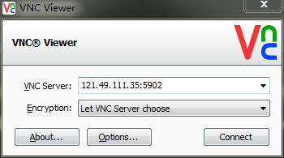

安装完成之后的配置
===

我一直在使用windows，所以在刚开始使用centos的时候，会觉得很多地方不太舒服，当然，在桌面端，windows的用户体验应该是要比linux更好的，但是从研究来说，开源的linux肯定是要比windows更好的。为了使得使用linux时轻松一点，下面是安装了之后的一些要做的配置。

## 更改软件源
centos默认的软件源是官方的，其服务器在国外，直接访问的话非常慢。所以使用国内的源很重要。国内做的最好的应该是[中科大的源](http://mirrors.ustc.edu.cn/)，具体的使用方法其也说了的。


## 添加中文输入法
linux在国内不受欢迎的另外一个原因就是国内的互联网公司太少开发其下的软件了，连最基本的输入法都很少，只有最近搜狗开发了一个版本，但是都是给ubuntu开发的，在centos中也使用不了。

centos自代了一个拼音输入法可以使用，但是在7中需要开启。

使用tweak tool >> typing >> show all installed input types, 打开这个选项.

在region and language >> input source 中找到 chinese(intelligent pinying),开启就可以了。

但是使用之后，会发现其还是不能和windows下面的各种输入法相提并论。

## 安装chrome浏览器
centos自带的是firefox浏览器，其版本也是较低的，我还是更加喜欢chrome浏览器，但是现在google不能被访问，所以可以在windows下面将chrome的RPM包下载下来安装。

`yum install xxx.rpm`就可以了。

## 在grub中添加win7启动项目
安装了centos后，grub会将MBR给覆盖了，导致启动的时候没有了win7的启动项（当然，在ubuntu中，安装的时候会grub会自动的在磁盘上面搜索windows安装项，或者是实用`update-grub`命令来找到windows安装）。在centos中，其没有提供这些功能，所以需要自己在`grub.cfg`中去添加启动项。


```
menuentry 'Windows 7 (loader) (on /dev/sda1)' {
insmod ntfs
set root=(hd0,1)
chainloader +1
}
```
注意这个是grub2，所以其语法是上面的。

## 自动挂载windows下面的磁盘
一般情况下，我们都会在电脑上同时安装一个windows和一个linux，在使用linux的时候，我们会想要访问win下的磁盘。

### 安装`ntfs-3g`
在我的win7中，使用的是ntfS的分区格式。默认情况下，centos是不认识ntfs的分区的，就像windows不认识ext的分区一样。所以要安装ntfs-3g，具体的安装方法在网上有

### 修改/etc/fstab来自动挂载
为了让系统启动的时候自动挂载win分区，可以在`/etc/fstab`中添加相应的命令。

```
/dev/sda5     /mnt/E                    ntfs-3g    defaults        0 0
/dev/sda3     /mnt/D                    ntfs-3g    defaults        0 0 
```
在上面的命令中，`/dev/sdax`是通过`sudo fdisk -l`得到的。

为了方便访问，可以在`/home/cxy`中创建D和E的链接。

## 远程访问centos主机

### 文字界面
要远程的访问linux主机，可以有几种方式，一个是直接通过文字方式，这种情况下，我们一般会使用SSH，因为这样访问才是安全的。

首先，要打开centos上的sshd.

在windows下面，可以使用secretCRT软件来访问。

### 图形界面
使用文字界面可以很快的访问，但是有时候操作起来不是很方便，在网速允许的条件下，使用图形界面访问会方便的多。

x window是有一个xcmdp的协议来支持远程访问的，但是我配置了很久都没有成功，应该是centos使用gnome3的原因。当使用xcmdp的时候，可以使用xmanager来访问。

#### 使用VNC
我们还可以使用vnc来访问。vnc协议是一个贝尔实验室单独开发的协议，其在各个主流的操作系统上面都有实现,在centos中，使用如下的命令来安装vnc的client和server。

```
sudo yum install tigervnc-server tigervnc
```

vnc会使用从590x[x=0-9]的这几个端口号，每使用`vncserver`打开一个server，就会使用一个端口号，所以要在防火墙中将590x打开。

在windows中，有很多的VNC的实现，我下载的是realvnc,打开其连接图如下。



其中的5902表示连接到第二个vncserver上面去。

需要注意的是，要保证此时centos上的防火墙要么是关了的，要么是允许了相应的端口，为了简单，我直接关了防火墙。
```
sudo systemctl disable firewall.service
sudo systemctl stop firewall.service
```

## 安装ftp服务器

这个[百度经验](http://jingyan.baidu.com/article/adc815133476bdf723bf7393.html)基本已经说了怎么做了。

我需要做的是将路由器的端口进行映射，使得20,21端口到centos主机。

还需要关闭防火墙。

还需要关闭selinx

打开`/etc/selinux/config`文件
  #SELINUX=enforcing     #注释掉
  #SELINUXTYPE=targeted  #注释掉
加上
  SELINUX=disabled 
重启电脑。
