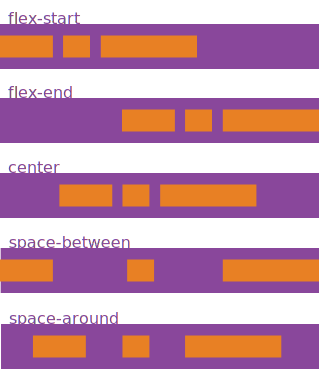
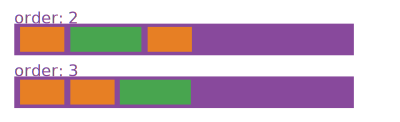

CSS的一些知识
===

作为WEB前端的三大技术中的一个，用于表达样式的CSS一直都在发展。


## flex布局
在早期的CSS中，对于一个元素的display属性，我们可以使用的就是block,inline，然后加上一个float属性，对于一般的布局，使用它们就可以简单的完成，但是对于复杂的布局，我们会用用上很多的trick才可以，非常的不方便。

flex布局是一种更加灵活的布局方式，在现在的主流的现代的浏览器中都是实现了的。

flex布局有两个基本的对象，一个是flex container，一个是flex items（其实是一组对象）。


一个flex就像一个盒子一样，里面转了一些东西，通过在对这个盒子本身和装在里面的东西进行样式的约束，可以得到我们想要的结果。

### container的样式

#### display
当然，第一个是display属性，这个属性必须是flex，这样就规定了装在这个盒子里面的东西是按照flex的方式放置的。

```CSS
.container {
  display: flex; /* or inline-flex */
}
```

#### flex-direction
规定盒子里面的东西的排列方向。


	.container {
	  flex-direction: row | row-reverse | column | column-reverse;
	}

可以的四个方向都给出了了，

* row就是横向排列，也就是从左到右。
* row-reverse也是横向排列，但是是从右到左。

column和column-reverse相似的。

要注意的是，flex的盒子是一个单向的盒子（除非下面的flex-wrap有其他的设置），放在里面的东西都**必须**放在一条线上。每个元素会根据设置的属性分配到在这条线上的特定的width或者height。如果这儿元素在分配到的width或者height中不能放得下，那么就只能根据直接overflow属性来显示了。如果放在里面的东西在这一条线上是放不开的话，那么这些放在里面的元素就只能根据自己的overflow属性来显示了。

而block盒子不是这样的，将一些东西装在一个block盒子中的是，其就是从左到右，从上到下的放置，如果一行不够了，那么就放到下面一行去，block盒子本身不会去限制里面的每个元素的宽度（里面的元素可以自己使用width来限制自己的宽度，这个和block盒子没有关系）
#### flex-wrap
上面说了，flex盒子是一个单向的盒子，这是因为默认的flex-wrap属性是nowrap.


	.container{
	  flex-wrap: nowrap | wrap | wrap-reverse;
	}

nowrap说了，就是不会wrap，flex盒子中的所有元素必须放到一条线上。

wrap就是允许wrap，其wrap的方向和block盒子是一样的，就是和flex-direction的一样，原来ltr的，wrap的行也是ltr。

wrap-reverse就是要wrap，但是wrap的方向和flex-direction是相反的，原来ltr的，wrap的行是rtl.

#### justify-content
flex盒子中有两条虚拟的线，一条是main axis，就是沿着flex-direction方向的线，一条是cross axis，就是垂直于flex direction方向的线。

justify-content规定了在main axis上，flex items是怎样排列的。



注意这个属性定义的是当在这条线上放置完了所有的flex items之后，然后这些flex items都不会扩展或者是已经扩展到了最大空间，都还有剩余的空间的时候，这些剩余的空间怎么分配。

* flex-start是`默认`的，就是这些剩下的空间就剩下了，不用管它
* flex-end就是说，将所有的这些flex items放到最后面去，让剩余的空间出现在最前面。
* center就是让剩余的空间出现在两边，这些items放在中间。
* space-between就是，让第一个item在在start line,最后一个item在end line，其他的items依次等间距的放下去。
* space-around，所有的items等间距的放在这条线上。

需要注意的是，这些多出来的空间是被**插入**到这些flex items的两边或者一边的，其并没有让这些items的margin出现变化，这一点通过浏览器的控制台就可以看得出来。

#### align-items


同样的，在cross axis上面，也需要进行规定多出来的空间怎么处理。

以row的direction为例，因为放在一条线上面的flex items的height各不相同，height最大的将flex的高度全部占据了，那么对于其他的items，在竖直方向，都有了剩余的空间。
	
	.container {
	  align-items: flex-start | flex-end | center | baseline | stretch;
	}

* flex-start，margin,border,padding都不变，将这些items放在最上面。
* flex-end,margin,border,padding都不变，就是将这些items放到最下面。
* center，margin,border,padding都不变，将这些items放在中间。
* baseline,margin,border,padding都不变，让它们的baseline对其就是了。
* stretch，默认值，就是延伸的意思，注意延伸的是height，不是padding和margin.(这儿应该是延伸height，如果延伸margin,padding的话，那么应该延伸上面还是下面呢？)

### items的样式

#### order
默认情况下，放在flex box中的items都是安装顺序一个一个放的，第一个放进去的order为1，第二个为2，以此类推。

但是，我们可以人为的改变其order值，从而让其出现的位置为放进去的时候不一样。



	.item {
	  order: <integer>;
	}
比如在下的代码中

```
<div  layout horizontal>	
	<span >
		first one
	</span>
	<span >
		second one
	</span>
	<span >
		third one
	</span>
	<span >
		fourth one
	</span>
</div>
```

`layout horizontal`会让其div变成一个flex row的盒子。	
在默认情况下，它们就是按照上面给出的顺序出现在盒子中的。

但是如果改成下面的代码

```
<div  layout horizontal>	
	<span style="order: 2;">
		first one
	</span>
	<span style="order: 3;">
		second one
	</span>
	<span style="order: 1;">
		third one
	</span>
	<span style="order: 1;">
		fourth one
	</span>
</div>
```

出现的顺序是third one, fourth one,first one,second one.
它们出现的顺序就是按照order和出现的先后顺序给出的，首先按照order排，如果order相同，则按照出现的顺序排。

#### flex-grow
这个属性和前面container的 justify-content是有关系的。因为它们都是说的是如果在main axis上面有剩余的空间要怎么处理的问题。

justify-content表示的是，我不动每一个item的大小，只是将它们以不同间隔分布放到main axis上面。

flex-grow的处理方法是，将当前的item的width（height）变大来填充满剩余的空间。

所以这两个属性是冲突的，当同时出现的时候，flex-grow占优，也就是justify-content的设置不再有效。


```
.item {
  flex-grow: <number>; /* default 0 */
}
```
设置的值是一个比值，比如
```
<div  layout horizontal>	
	<span style="flex-grow: 0;">
		first one 
	</span>
	<span style="flex-grow: 2;">
		second one
	</span>
	<span style="flex-grow: 1;">
		third one
	</span>
	<span style="flex-grow: 3;">
		fourth one
	</span>
</div>
```
那么对于所有的剩余的空间，first one的width不变，second,third,fourth的width会增加，增加的值按照2:1:3的比例将剩余的空间分掉。

#### flex-shrink
shrink是缩小的意思，所以其设置的属性表示当窗口（浏览器的窗口）缩小导致flex box的width（height）变小的时候，如果必须的话，这个元素的width变小的幅度。

	.item {
	  flex-shrink: <number>; /* default 1 */
	}
默认值是1，表示所有的元素按照等幅度的变小自己的width。

一个典型的应用就是将flex-shrink设置为0，这样的话，这个item就不会变小自己的width

```html
<span style="flex-grow: 0;flex-shrink: 0;">
	first one 
</span>
<span style="flex-grow: 2;flex-shrink: 1;">
	second one
</span>
<span style="flex-grow: 1;flex-shrink: 2;">
	third one
</span>
<span style="flex-grow: 3;flex-shrink: 3;">
	fourth one fourth onefourth one
</span>
```