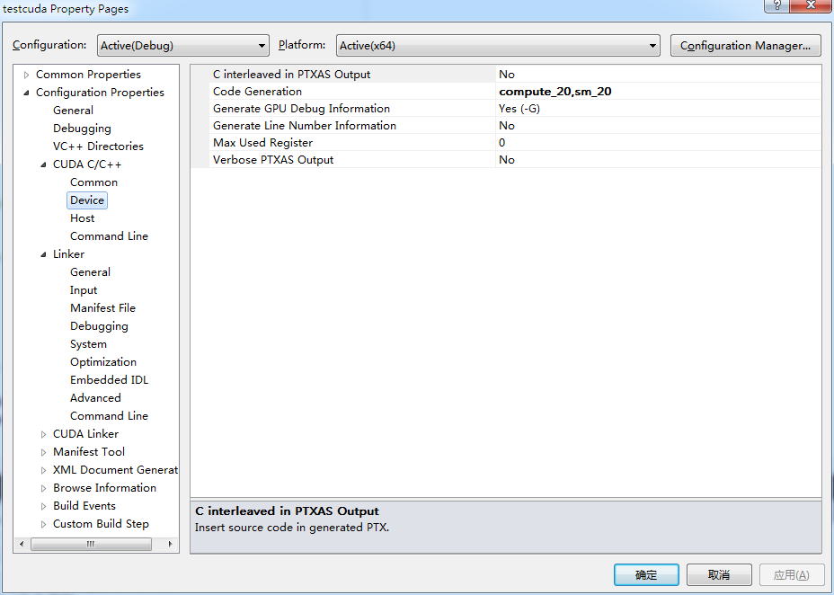
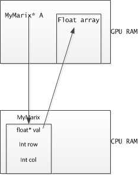

编程的时候要注意的地方
===
CUDA C编程不同于传统的C编程，因为其需要有并行的特性，所以有些地方需要特别的注意

## 在kernel中使用printf的问题

CUDA编程的时候，调试很麻烦，我现在都还是没有搞清楚怎么开调试，不过应该是需要使用`Nsight Moniter`来做。

所以我就先想使用`printf`在kernel中打印出需要的信息。但是最开始总是说`printf`是`__host__`的，不能用在`kernle`中，然后google了一下，发现CUDA中是可以使用`printf`的，不过需要2.0及以上的运算能力的。我使用的显卡有3.5的能力，所以可以使用。

我使用的VS2010,对编译选项做如下的设置。



就是将nvcc编译的时候的时候让其生成可以在2.0将其以上的device跑的代码。设置的时候要注意将`inherit from parent and project default`给去掉，因为默认的是1.0的。

## 传入kernel的struct的问题
这个问题我弄了很久才搞明白。

一般情况下，我们传入kernel的参数都是一些基本的数据类型或者是这些基本数据类型的指针，比如说`double,double*`之类的,但是这样传参数的一个问题就是要传入的参数的个数有时候会太多了，比如我们需要完成一个矩阵的乘法，那么多半就需要使用如下的kernel，其中`A`是`M*P`的，`B`是`P*N`的，结果是`M*N`的。

```CUDA
__global__ void gpuMM(float *A, float *B, float *C, int N,int P,int M)
```

可以从上面看出，这样传递太麻烦了。

使用在C中编程的经验，我们可以定义个`struct MyMatrix`，这个struct中包含了一个matrix的所有信息，这样就只需要传递三个参数就可以了。

	struct MyMatrix {
		double* val;
		int row,col;
	};
	
函数定义就是

	__global__ void MatMul(MyMatrix* A,MyMatrix* B,MyMatrix* C)
	
注意这儿就是我们定义的方式，也就是**错误的地方**,这个错误就是这个kernel在运行的时候，其是在一个thread上面的，此时`A,B,C`都是这个thread的局部变量。但是要注意到`A,B,C`是三个指针，它们指向的地址都是CPU的RAM地址，然后我们会通过`A->val`的方式来访问GPU RAM中的数据。这个显然是会有错误的，具体的访问过程如下。



**kernel的程序在gpu中，所以保证其所有的访问都是在GPU中进行的，不然当然是不行的**

正确的函数原型应该如下的。

	__global__ void MatMul(MyMatrix A,MyMatrix B,MyMatrix C)
	
这下在调用这个kernel的时候，就能保证所有的访问都是在GPU中的了。
