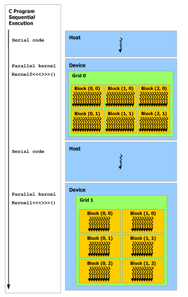

# cuda中的基本概念

## 编程模型

由于GPU是天生的支持并行运算，其编程模型和我们对于CPU这种重控制的处理器的编程模型是很不一样的。

### kernel,thread,block,grid

在CPU中，处理任务的时候，我们会将各个任务变成一个函数，然后调用这个函数来完成这个任务，要特别注意的是，为了完成这个任务，这些函数同时都是被一个CPU调用的。

在CUDA中，使用相似的概念，但是我们需要完成一个任务的时候，使用的是并行的算法。所以C中的函数被扩展成了CUDA中的kernel,比如下面的定义，注意到前面的`__global__`，我们知道在标准C中，肯定是没有这个关键字的，但是CUDA的源程序也不是使用标准C编译器编译的，其使用的NVIDIA自己写的一个叫做NVCC的编译器，所以其是对标准C的一个扩展。

    // Kernel definition
    __global__ void VecAdd(float* A, float* B, float* C)
    {
    int i = threadIdx.x;
    C[i] = A[i] + B[i];
    }

对于上面的这个kernel，需要使用下面的调用方法

    int main()
    {
    ...
    // Kernel invocation with N threads
    VecAdd<<<1, N>>>(A, B, C);
    ...
    }

可以看到，这个也是对C的一个扩展语法。`VecAdd <<<blocksPerGrid, threadsPerBlock>>>(A, B, C)`,`<<< >>>`中间的参数中的第一个是blocksPerGrid,表示在一个grid中有多少个block,而第二个参数threadsPerBlock表示在一个block中有多少个thread。

上面的调用的结果就是在每个thread中都安装了一个vecAdd这个kernel去运行。

也就是说，其基本的处理单元是一个thread，然后每个thread都有相同的输入，然后这些thread相互独立的并行的运行，最后得到我们想要的结果。

那么一个问题就是，既然每个thread都运行完全相同的kernel，那么它们做的工作不就是完全的一个重复工作么，应该有一个机制让它们独立的并行的工作，但是最后可以完成一件事情啊？

为了完成这个事情，在每个thread运行的kernel中，都有几个由CUDA编译器插入的局部变量，为`threadIdx,blockIdx,blockDim`。

threadIdx为一个1维，2维，或者是3维的变量。要理解这个变量，可以想想在一个block就想是一个盒子，这个盒子里面装了一些thread，这个盒子的外观是可以变化的，其要么是一个像管道一样的形状，这样这些thread就只需要一维就可以得到了，即threadIdx.x；这个盒子也可以是一个矩形的平面，这样要的到这个thread就需要两个坐标，即threadIdx.x，threadIdx.y;同样的，这个盒子也可以是一个立方体，这样就还需要threadIdx.z来定位。

上面的代码中，因为调用这个kernel的时候，传入的threadsPerBlock是一个int，也就是只给了一维的大小，所以就只需要threadIdx.x来定位到它。

所以上面的代码的工作方式就好理解了，每个thread中的kernel运行的代码是一样的，但是因为threadIdx.x是不同的，这样它们就可以完成向量加法中的一个元素的。

从上面可以得到一点点关于怎样使用GPU并行运行，我们首先要把我们想解决的问题给并行化，然后将并行化后的算法用到这些thread中去

但是应该架构和资源限制的原因，每个block中的thread的个数现在最多只有1024个。

但是我们要处理的问题通常的规模都不是只有1024的，所以我们需要不止一个block。

类似的，为了处理一个问题，这些block会被放到一个grid中，上面的参数blocksPerGrid就表示了为了处理这个问题所使用的一个grid中的block的数量.

需要注意的是，一个GPU上面的block的数量肯定是有限的，所以一个grid中的block的数量是有界限的。如果我们的问题中有好几个需要并行处理的算法，那么每个算法都需要有一个grid。

### 异构的编程模型 Heterogeneous Programming

在CUDA中，编程模型是异构的，也就是说，我们的GPU实际上是一个CPU的co-processor（协处理器）。在上图中的host就是CPU,而device就是GPU,一般情况下，C程序运行在CPU中，C程序要运行，那么就需要有memory，包括heap,stack,static,text之类的，这些都是从DRAM中分配到的（DRAM通过PCI总线和CPU连接起来的）。

同样的，对于运行在thread中的kernel，我们知道stack是由其自己提供了的，但是global constant texture还是需要DRAM提供的（这个就是我们说的显存）。

也就是说，对于一个应用程序，其有两块相互独立的内存空间，一块是HOST(CPU)的串行程序执行的时候要使用的，而在这块DRAM中进行内存分配和释放的操作通过C的API（比如说动态内存分配malloc）和C编译器自身（就是C的运行时）完成（比如说对stack，static的）。

另外一块是CUDA程序运行时使用的global空间，在这个空间和中进行内存的分配和释放就完全需要我们自己调用cuda提供的API了，当然，kernel运行在thread中时的局部变量涉及到的内存分配和释放（相当于C中的stack）CUDA的运行时也是自己就完成了的。

### Memory 结构

下图表示的是CUDA中memory的结构。

对于每一个thread，都有其local memory,然后对于一个block中的所以thread，有一个shared memory。
这个地方要说一下关于kernel调用的问题了，我们知道，在C中，当调用一个函数的时候，会有一个stack frame(栈帧)建立，函数中的所有的局部都在这个栈帧里面，当函数调用返回的时候，这个栈帧被撤销了。
因为CUDA中的kernel实际上就是C中的函数一个扩展，那么，将一个kernel放到一个thread中去运行的时候，也必须有一个类似于栈帧的存储空间来放这个kernel执行所需要的局部变量的，这个就是local memory了。
并行运算中每个thread之间需要进行通信，而这个通信就可以使用block shared memory。要注意的是，local memory和shared memory的life time（实际上其中存储的变量的life time）是相同的，也就是对于个kernel的调用结束之后，在调用这个kernel期间创建的局部变量和shared memory中创建的变量都没有了。这个和C中函数调用完了之后stack被撤销（局部变量不能再被访问）是一个意思。

在C中，还有全局变量，也就是存储在static memory中的变量，它们存在的时间是从它们被创建到程序运行结束，它们可以被程序中的（定义在其之后的）任何函数访问到。

类似的，CUDA中有global memory，它们是被每个thread都可以访问得到的变量（实际上是thread中运行的kernel），在global memory中定义的变量，其lifetime为整个程序，也就是任何的kernel调用中都可以访问得到。

