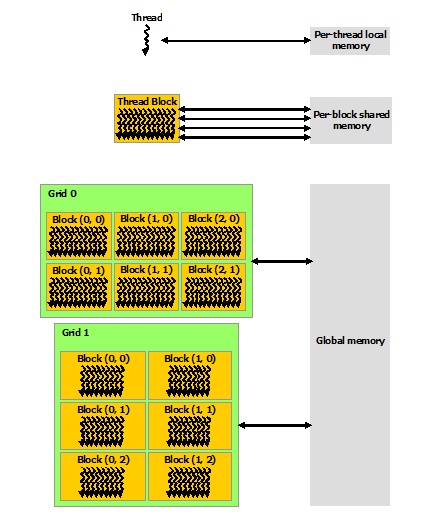

Nvidia gpu computation
===
在并行计算里面，使用GPU进行并行计算是一个比较好的方向。
Nvidia作为领先的独立显卡厂商，其从06开始推出的有cuda运算功能的各种显卡成为了并行计算领域的一个热点研究方向，而后有很多的算法都开发出了并行的运行的库。

NVIDIA的显卡有三条不同的线。

第一条就是Geforce，这个是我们经常用到的，因为其就是用于entertainment的，比如说高端的游戏玩家。

第二条是Quadro，这个是专业GPU，也就是用在一些专业的电脑上，比如那些很强大的绘图软件需要强大的渲染功能，就会使用到。

第三条是Tesla，这类GPU就是专们为了做并行运算为设计的，其并不是用于图形处理的，也就是其设计的初衷就不是为了用来做显卡，而是一个十分强大的并行处理平台，其一个很大的特点就是没有视频的输出接口。

上面的三条线的产品只要支持CUDA运算，都可以用来进行CUDA并行运算。
当然，它们的能力是从弱到强的。

## 编程模型
由于GPU是天生的支持并行运算，其编程模型和我们对于CPU这种重控制的处理器的编程模型是很不一样的。
 
### Kernel,Thread,block,grid
在CPU中，处理任务的时候，我们会将各个任务变成一个函数，然后调用这个函数来完成这个任务，要特别注意的是，为了完成这个任务，这些函数同时都是被一个CPU调用的。

在CODA中，使用相似的概念，但是我们需要完成一个任务的时候，都是使用并行的算法。所以C中的函数被扩展成了CUDA中的kernel,比如下面的定义，注意到前面的`__global__`，我们知道在标准C中，肯定是没有这个关键字的，但是CUDA的源程序也不是使用标准C编译器编译的，其使用的NVIDIA自己写的一个叫做NVCC的编译器，所以其是对标准C的一个扩展。

```
// Kernel definition
__global__ void VecAdd(float* A, float* B, float* C)
{
int i = threadIdx.x;
C[i] = A[i] + B[i];
}
对于上面的这个kernel，需要使用下面的调用方法
int main()
{
...
// Kernel invocation with N threads
VecAdd<<<1, N>>>(A, B, C);
...
}
````

可以看到，这个也是对C的一个扩展语法。`VecAdd <<<blocksPerGrid, threadsPerBlock>>>(A, B, C)`,<<< >>>中间的参数中的第一个是blocksPerGrid,表示在一个grid中有多少个block,而第二个参数threadsPerBlock表示在一个block中有多少个thread。

上面的调用的结果就是在每个thread中都安装了一个vecAdd这个kernel去运行。

也就是说，其基本的处理单元是一个thread，然后每个thread都有相同的输入，然后这些thread相互独立的并行的运行，最后得到我们想要的结果。

那么一个问题就是，既然每个thread都运行完全相同的kernel，那么它们做的工作不就是完全的一个重复工作么，应该有一个机制让它们独立的并行的工作，但是最后可以完成一件事情啊？

为了完成这个事情，在每个thread运行的kernel中，都有几个由CUDA编译器插入的局部变量，为`threadIdx,blockIdx,blockDim`。

threadIdx为一个1维，2维，或者是3维的变量。要理解这个变量，可以想想在一个block就想是一个盒子，这个盒子里面装了一些thread，这个盒子的外观是可以变化的，其要么是一个像管道一样的形状，这样这些thread就只需要一维就可以得到了，即threadIdx.x；这个盒子也可以是一个矩形的平面，这样要的到这个thread就需要两个坐标，即threadIdx.x，threadIdx.y;同样的，这个盒子也可以是一个立方体，这样就还需要threadIdx.z来定位。

上面的代码中，因为调用这个kernel的时候，传入的threadsPerBlock是一个int，也就是只给了一维的大小，所以就只需要threadIdx.x来定位到它。

所以上面的代码的工作方式就好理解了，每个thread中的kernel运行的代码是一样的，但是因为threadIdx.x是不同的，这样它们就可以完成向量加法中的一个元素的。
【从上面可以得到一点点关于怎样使用GPU并行运行，我们首先要把我们想解决的问题给并行化，然后将并行化后的算法用到这些thread中去】

但是应该架构和资源限制的原因，每个block中的thread的个数现在最多只有1024个。

但是我们要处理的问题通常的规模都不是只有1024的，所以我们需要不止一个block。

类似的，为了处理一个问题，这些block会被放到一个grid中，上面的参数blocksPerGrid就表示了为了处理这个问题所使用的一个grid中的block的数量【需要注意的是，一个GPU上面的block的数量肯定是有限的，所以一个grid中的block的数量是有界限的】。如果我们的问题中有好几个需要并行处理的算法，那么每个算法都需要有一个grid。

### Memory 结构

下图表示的是CUDA中memory的结构。


对于每一个thread，都有其local memory,然后对于一个block中的所以thread，有一个shared memory。这个地方要说一下关于kernel调用的问题了，我们知道，在C中，当调用一个函数的时候，会有一个stack建立（就是在现有的stack上面进行生长），函数中的所有的local variable都在这里面，当函数调用返回的时候，这个stack被撤销了。因为CUDA中的kernel实际上就是C中的函数一个扩展，那么，将一个kernel放到一个thread中去运行的时候，也必须有一个类似于stack的存储空间来放这个kernel执行所需要的局部变量的，这个就是local memory了。并行运算中每个thread之间需要进行通信，而这个通信就可以使用block shared memory。要注意的是，local memory和shared memory的life time（实际上其中存储的变量的life time）是相同的，也就是对于个kernel的调用结束之后，在调用这个kernel期间创建的局部变量和shared memory中创建的变量都没有了。这个和C中函数调用完了之后stack被撤销（局部变量不能再被访问）是一个意思。
 
在C中，还有全局变量，也就是存储在static memory中的变量，它们存在的时间是从它们被创建到程序运行结束，它们可以被程序中的（定义在其之后的）任何函数访问到。

类似的，CUDA中有global memory，它们是被每个thread都可以访问得到的变量（实际上是thread中运行的kernel），在global memory中定义的变量，其lifetime为整个程序，也就是任何的kernel调用中都可以访问得到。

### 异构的编程模型 Heterogeneous Programming
 
在CUDA中，编程模型是异构的，也就是说，我们的GPU实际上是一个CPU的co-processor（协处理器）。在上图中的host就是CPU,而device就是GPU,一般情况下，C程序运行在CPU中，C程序要运行，那么就需要有memory，包括heap,stack,static,text之类的，这些都是从DRAM中分配到的（DRAM通过PCI总线和CPU连接起来的）。

同样的，对于运行在thread中的kernel，我们知道stack是由其自己提供了的，但是global constant texture还是需要DRAM提供的（这个就是我们说的显存）。

也就是说，对于一个应用程序，在DRAM中，给其分配了两块相互独立的空间，一块是HOST(CPU)的串行程序执行的时候要使用的，而在这块DRAM中进行内存分配和释放的操作通过C的API（比如说动态内存分配malloc）和C编译器自身（就是C的运行时）完成（比如说对stack，static的）。另外一块是CUDA程序运行时使用的global空间，在这个空间和中进行内存的分配和释放就完全需要我们自己调用cuda提供的API了，当然，kernel运行在thread中时的局部变量涉及到的内存分配和释放（相当于C中的stack）CUDA的运行时也是自己就完成了的。

1.2 编程接口
1.2.1 CUDA C RUNTIME
CUDA的runtime（也就是提供cuda函数的一个library，要么是动态的DLL，要么是静态的,lib）包含了很多的用于不同目的的函数接口
在下面的目录中
C:\Program Files\NVIDIA GPU Computing Toolkit\CUDA\v6.0\bin
有如下的两个DLL文件，在程序被运行的时候，它们会被载入。
 
其对应的lib文件在
C:\Program Files\NVIDIA GPU Computing Toolkit\CUDA\v6.0\lib\Win32
和
C:\Program Files\NVIDIA GPU Computing Toolkit\CUDA\v6.0\lib\x64
两个文件夹中，在链接器链接的时候会载入。

 
如上，cudart.lib是动态链接库要使用的链接文件，大小很小。
Cudart_static.lib是使用静态链接的时候要使用的文件，比较大。
1.2.1.1 Runtime initialization
使用过其他库的都应该知道，要使用一个库的功能，这个库一般都会提供一个初始化函数，然后其他的所有函数都需要在调用了这个函数之后才被调用，当不使用这个库的功能了之后，然后要调用一个destroy函数来清除资源。
Cudart这个库不需要显式的调用这样一个函数，当第一个cudart提供的函数被调用的时候，其会自动的被初始化。
要注意的时候，初始化的时候每个device会被创建一个context，然后这个程序的所有的thread在访问这个device的时候都是用这个context。【这个和node-webkit中的情况有点类似，在nw中，每个页面都有一个js的context，但是Node 的context只有一个】
1.2.1.2 Page_locked host memory
我们知道在现代的操作系统中，为了更好的使用有限的内存服务于多个进程，所以将内存进行了分页,page.而 page_locked的host memory是强制的让OS将一块内存不进行分页然后给我们的应用使用。对于这个不分页的内存，在某些device中，可以使用一个叫做mapped momory的技术，让这部分内存和device的global memory完成一个双向的binding，这样的话就免去了先将host memory中的数据copy到device memory中，完成了算法之后又copy回来的这种操作。
但是一个不幸的事情是，OS能分配给一个应用的page_locked memory是有限的，因为系统为了保证其他的应用和自身的运行，必须让大部分的内存变成page的（因为page的内存可以被缓存，而且可以在内存不够的时候交换到硬盘上），所以说，虽然这是一个很好的技术，但是在当前的OS架构上面，其应用只能是有限的。
在提供的API中，cudaHostAlloc和cudaFreeHost是用来完成page locked memory的操作的。
1.2.1.3 异步的并发执行
在host中的代码执行是串行的，然后在这些代码中，会有对kernel的调用，这样device就也要开始执行代码了。要注意的是，对于kernel的launch，其不是等到分配给device的代码运行完了才返回，而是在调用了之后的某个时刻就返回了。
一个特例就是对于page locked memory，当其和device memory之间传输数据的时候，kernel在thread上面的执行也可以是同步进行的。
1.2.2 Multi-device system
为了增加运算能力，我们可以使用了GPU的阵列，这样在一个系统上面就有了多个device，使用下面的代码可以知道系统上面有多少个device。
int deviceCount;
cudaGetDeviceCount(&deviceCount);
使用cudaGetDeviceProperties可以得到一个device的属性。
cudaDeviceProp deviceProp;
cudaGetDeviceProperties(&deviceProp, device);

device memory的分配和释放已经kernel的launch都是在当前的device中进行的，使用cudaSetDevice()函数，可以设置当前使用的device。
1.2.3 Compute mode
对于tesla的GPU，其可以运行在不同的模式下面。
默认模式：OS上面的所有线程都可以使用这个device，也就是他们都可以创建一个context
Exclusive-process模式：OS上只能有一个进程可以在这个device上新建一个context，但是这个进程的所有线程都可以同时对这个context进行操作。
Exclusive-process-and-thread: OS上只能有一个进程可以在这个device上新建一个context，当在一个时刻，只能有一个线程操作这个context。
1.2.4 Function type qualifiers
因为程序可以运行在host和device中，所以需要指定一个函数运行的地方和被调用的地方。
1.2.4.1 __global__
__global__是用来声明一个函数是kernel的，其表示这个函数是运行在device中，然后要从host中调用的。
使用global声明的函数的返回值必须是void，所以如果我们想要返回值的话，那么就以指针的方式传入要返回的值。要注意的是，所有的输入参数都是从global memory中传入的，也就是说我们必须先将要交给device处理的数据从host的memory中传入device的global memory中先。
1.2.4.2 __device__
__device__表示这个声明的函数运行在device中，然后从device中调用这个函数。这个意思就是从global函数中可以调用device的函数，从device中也可以调用device函数。
其用处就是当我们要运行在device中的并行算法比较大的时候，可以分成多个部分，每个部分写成一个device声明的函数，这样就看起来结构比较清楚了。
1.2.4.3 __host__
使用host声明的函数表示其运行在host中，也要从host中调用，这个其实就是我们的C的函数。这个是默认的声明方式。也就是如果都没有给出来的话，那么就是__host__了。

还有一个就是从device调用然后在host中运行的函数，当是CUDA的架构是不支持这种调用的。

1.2.5 Variable type qualifier
1.2.5.1 __shared__
前面已经说过了，在一个block中的所有thread有一个shared memory，这个memory可以被所有的thread访问，其中定义的变量的life time只有这个block的。


1.3 API reference

cudaError_t cudaGetDeviceCount (int *count)
很直观的，这个函数返回的是系统上面的device的个数，也就是那些可以进行CUDA运算的GPU的个数，注意count实际是一个输出参数。
函数返回了一个cudaError_t，看了其定义之后，发现其是一个enum，这个enum中包含了很多个域，也就是所有的那些调用之后需要看到其调用时候成功的函数都会返回中数据类型的。

cudaError_t cudaGetDeviceProperties(cudaDeviceProp *prop, int device)
也是很直观的一个函数，device表示要得到哪一个device的属性，返回的属性存入*prop中，cudaDeviceProp是一个struct，里面包含了很多个域。表示这个device的属性，同样的，调用也会返回一个是否成功的标识。

cudaError_t cudaMalloc (void **devPtr, size_t size)
在device的global memory中分配size个byte大小的内存，是Linear memory，分配好的内存可以通过*devPtr访问到，这个地方感觉是可以使用一次指针的，但是使用了二次指针，具体的原因就不清楚了。
cudaError_t cudaFree (void *devPtr)
和上面的函数对应的，用于释放cudaMalloc申请到的内存

cudaError_t cudaHostAlloc (void **pHost, size_t size, unsigned int flags)
让OS给host分配一个size大小page-locked memory，具体的信息在上面已经给出来了。注意后面的flags用来指名这个内存具有的一些性质
？？
cudaError_t cudaMallocHost (void **ptr, size_t size)
和上面的函数类似，实际上，当上面的函数flag没有给（也就是default的时候），调用的就是这个函数。
cudaError_t cudaFreeHost (void *ptr)
对于上面的两个函数申请到的page locked memory，使用这个函数来释放


cudaError_t cudaMemcpy (void *dst, const void *src, size_t count, cudaMemcpyKind kind)
在使用标准C的时候，我们会使用memcpy函数来将内存中一部分的内容copy到另外一个地方去。Copy的大小是size个byte，kind表示哪儿到哪儿去，比如hosttohost,hosttodevice,devicetodevice,devicetohost。

template < class T > cudaError_t cudaFuncSetCacheConfig (T *func, cudaFuncCache cacheConfig)
这个函数用来设置在一个device function（在device上面运行的function）的preferred Cache，也就是使用L1 CACHE还是shared memory。要注意第一个参数虽然是template，但是我们一定要传一个函数指针才可以。还有注意这个函数必须是使用__global__声明的，也就是必须是一个kernel
比如下面的函数调用
checkCudaErrors(cudaFuncSetCacheConfig(*func1,cudaFuncCachePreferShared));

cudaError_t cudaFuncGetAttributes (cudaFuncAttributes *attr, const void *func)
得到一个function的attribute，这个function也必须是一个__global__声明的，也就是一个kernel。cudaFuncAttributes这个struct中的各个域表示这个kernel的一些属性

1.3.1.1 cudaDeviceReset 
cudaError_t cudaDeviceReset (void)
对于当前的process，将（当前指定的）device Reset了，也就是下一次的调用将重新初始化一个device context。
需要注意的是，这个函数是立即执行的，而一个process可能有多个thread，如果当前的thread Reset了这个device，那么这个process中的其他thread还在操作的话，那么可以肯定这是会出问题的。
还有就是硬件上可能只有过一个gpu,但是每个进程都可以有一个自己的device context。就是说这个GPU被共用的。
1.3.1.2 cudaDeviceSynchronize
cudaError_t cudaDeviceSynchronize (void)
这个函数会block直到分配到device上运行的任务都完成了。
在一个应用中，要提出的时候，我们通过都会先调用cudaDeviceSynchronize，等到所有任务都完成，然后调用cudaDeviceReset，这样这个应用（进程）在GPU上面申请的所有资源都会释放。
checkCudaErrors(cudaDeviceSynchronize());
    checkCudaErrors(cudaDeviceReset());
