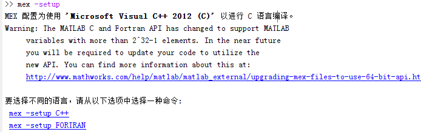
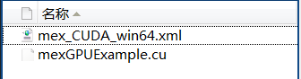
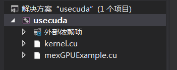
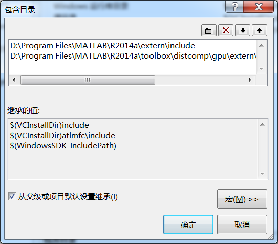
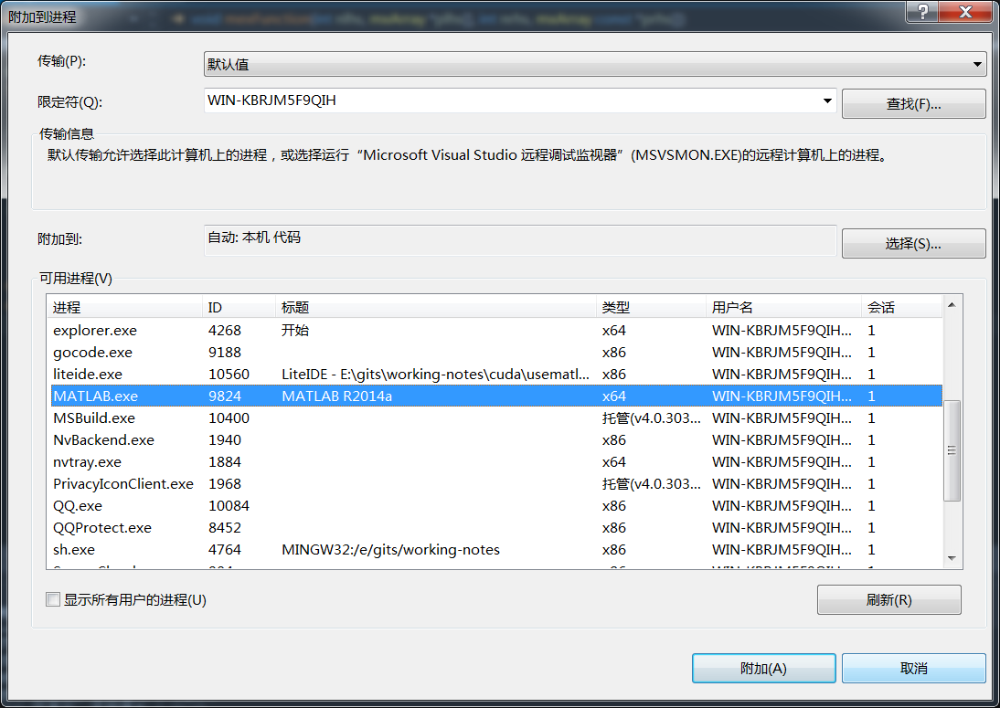

## 安装软件
要完成这些功能，需要安装三个软件.
### visual studio 2010(2012)

vs的安装包是iso文件，可以使用daemon tools来挂载，就不要解压了。

>如果不使用CUDA编程，只是使用matlab调用C，那么对vs和matlab的版本就没有要求了。

>如果要使用CUDA编程，因为nvcc需要使用vs2010来编译，而vs2010（不是sp1）在64位系统上面链接会有问题，所以我就同时安装了2010和2012。安装他们的时候要注意不要将其安装在C盘，因为其会占用很大的空间，而那些不需要的组件（除了C/C++编译器的组件）就可以不安装了。

### matlab 2014a
安装网上也有教程。

>如果不使用CUDA编程，只是使用matlab调用C，那么随便安装一个版本都可以，我安装的是最新的2014a

matlab提供了mex命令来编译C/C++文件，其使用的是安装在系统上的C/C++编译器，所以，要使用MEX，那么首先要保证系统上面安装了C/C++编译器。在matlab中执行

`mex -setup`

可以看到



matlab会自动找到系统中安装的C/C++编译器。如果系统中安装了多个C/C++编译器，那么就可以用鼠标选择一个。

>如果使用cuda编程,上面找到的C/C++编译器是针对标准的C/C++使用的，在CUDA中，使用的是nvcc编译器，所以需要其他的设置。

### cuda sdk
> 不使用cuda的跳过。
下载安装最新版本的cuda sdk,安装的时候一路默认就可以了。

其会将nvcc编译器的路径加入到PATH中。

## 使用配置
### mex使用nvcc编译器

>不使用cuda编程的跳过

这儿是参考matlab的帮助文件，Parallel Computing Toolbox >> GPU Computing >> Run MEX-Functions Containing CUDA Code。

这里只说一下要注意的地方，mex编译的时候，要使用nvcc，同时也要使用vc++，而且对vc++的版本也是有要求的。我使用的是matlab 2014a，最开始的时候安装的是vs2012(也就vs11),发现使用mex编译的时候找不到SDK，打开那个xml文件之后发现，其要使用的是vs10，也就是vs2010，所有又安装了vs2010.



>我最开始的时候要安装vs2012是因为我使用的是64位操作系统，安装的vs2010连接的时候通不过，而2012可以。

其它的所有步骤按照帮助文件就可以了。

---

编译的时候要使用

`mex -largeArrayDims -g mexGPUExample.cu`

中间的-largeArrayDims是64位版本必须用的选项。
-g选项是为了调试使用的。

### visual studio中的设定
交叉开发的时候，matlab端的代码在matlab中写，mex代码就在VS中写。

在调试的时候，还要使用到VS来调试mex代码。

在写mex代码的时候，我们可以不断的使用matlab的mex指令来编译，然后排除错误，但是更好的办法是在vs中完成编译工作。为了使得VS能编译通过，需要注意下面的设置。

+ 在VS中新建一个cuda工程，这样在编译的时候就会使用到nvcc和vc2010,可以看到，此时有一个`kernel.cu`文件,这个文件对我们没有用，因为我们不会连接，只会编译
> 如果mex使用的是传统的C/C++，那么就新建一个空的工程项目

+ 将我们的mex函数所在的.cu文件添加进来（使用添加已有项目）
> 如果mex使用的是传统的C/C++，那么就将.c（.cpp）文件添加进来，最好使用.c文件，因为matlab提供的API是C的。



为了编译通过，必须将matlab的头文件加入搜索路径，也就是下面的两个文件
```
#include "mex.h"
#include "gpu/mxGPUArray.h"
```

>使用C/C++的时候，只需要添加第一个`mex.h`



这样在vs中，使用`Ctrl+F7`就可以完成编译了，如果有错误的话，那么就可以直接改。

### visual studio调试mex文件
程序写完了之后要要调试，matlab代码部分可以使用matlab自带的调试功能，mex文件部分可以使用手动pirintf的方式，但是这样很不方便。所以使用visual studio attach到matlab进程上面调试的方式。

>要成功调试，一定要在编译的时候加上-g选项，我刚开始调试不成功，就是因为没有加-g选项来编译。

步骤如下：
+ 在VS中，选择 调试 >> 附加到进程，选择matlab.exe


+ 在需要的地方加上断点，等待matlab调用到这个mex函数

+ matlab开始运行，在mex函数有断点的地方其会停下来。