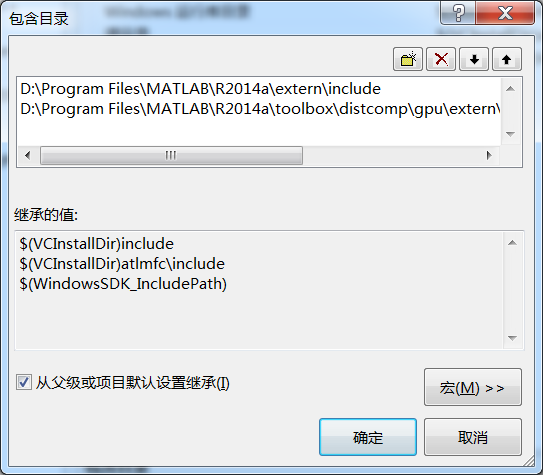

matlab提供了对于cuda gpu编程的接口,可以在matlab中通过mex来调用使用mex编译出来的dll文件. 但是我一般都是直接使用cuda c进行编程,这样效率会高了很多.

## 安装Matlab

首先,参考上一节,将cuda toolkit和visual studio安装好,因为matlab使用mex命令编译.cu文件的时候,是调用的nvcc和msvc.

然后安装最新版本的matlab,因为更新版本的MATLAB对于cuda gpu编程的支持是更好的.


matlab提供了mex命令来编译C/C++文件，其使用的是安装在系统上的C/C++编译器，所以，要使用MEX，那么首先要保证系统上面安装了C/C++编译器。在matlab中执行

`mex -setup`

可以看到


matlab会自动找到系统中安装的C/C++编译器。如果系统中安装了多个C/C++编译器，那么就可以用鼠标选择一个。

如果使用cuda c编程,上面找到的C/C++编译是用来编译.cu代码中的C/C++部分的,而我们实际要使用的是nvcc编译器.看下面一节.

## 使用配置
### mex使用nvcc编译器

这儿是参考matlab的帮助文件，`Parallel Computing Toolbox >> GPU Computing >> Run MEX-Functions Containing CUDA Code`.

这里只说一下要注意的地方，mex编译的时候，要使用nvcc，同时也要使用msvc.


上图中的那个.xml文件需要放到和我们要编译的.cu文件放到同一个目录下面. 这个.xml文件就像使用vs的时候的那个工程文件一样,其指定了要使用那个版本的nvcc和那个版本的msvc,如果其默认值和主机上面安装的版本是不一样的,那么可以自己修改一下这个文件的内容.

当我们在MATLAB的command line窗口中使用

`mex -largeArrayDims -g mexGPUExample.cu`

的时候,mex程序就会先根据这个.xml文件找到nvcc编译器和msvc编译,然后根据里面指定的选项进行编译,从MATLAB的命令行窗口输出的内容我们可以知道具体使用了什么命令来编译链接.

其中的`-largeArrayDims`是64位版本必须用的选项,`-g`选项是为了调试使用的.

### visual studio中的设定

交叉开发的时候，matlab端的代码在matlab中写，mex代码就在VS中写。

在调试的时候，还要使用到VS来调试mex代码。

在写mex代码的时候，我们可以不断的使用matlab的mex指令来编译，然后排除错误，但是更好的办法是在vs中完成编译工作。为了使得VS能编译通过，需要注意下面的设置。

+ 在VS中新建一个cuda工程，这样在编译的时候就会使用到nvcc和vc2010,可以看到，此时有一个`kernel.cu`文件,这个文件对我们没有用，因为我们不会连接，只会编译
> 如果mex使用的是传统的C/C++，那么就新建一个空的工程项目

+ 将我们的mex函数所在的.cu文件添加进来（使用添加已有项目）
> 如果mex使用的是传统的C/C++，那么就将.c（.cpp）文件添加进来，最好使用.c文件，因为matlab提供的API是C的。


为了编译通过，必须将matlab的头文件加入搜索路径，也就是下面的两个文件
```
#include "mex.h"
#include "gpu/mxGPUArray.h"
```

>使用C/C++的时候，只需要添加第一个`mex.h`



这样在vs中，使用`Ctrl+F7`就可以完成编译了，如果有错误的话，那么就可以直接改。

### visual studio调试mex文件

程序写完了之后要要调试，matlab代码部分可以使用matlab自带的调试功能，mex文件部分可以使用手动pirintf的方式，但是这样很不方便。所以使用visual studio attach到matlab进程上面调试的方式。

>要成功调试，一定要在编译的时候加上-g选项，我刚开始调试不成功，就是因为没有加-g选项来编译。

步骤如下：
+ 在VS中，选择 调试 >> 附加到进程，选择matlab.exe


+ 在需要的地方加上断点，等待matlab调用到这个mex函数

+ matlab开始运行，在mex函数有断点的地方其会停下来。
