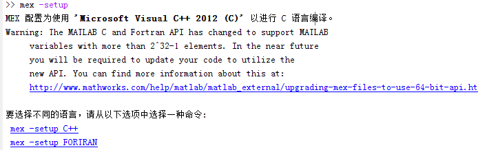

使用matlab来调用GPU进行并行运行
========

我们使用cuda要完成的是通信系统中的并行算法研究，matlab中有很多的其他的函数，用这些函数可以很好的建立起算法运行的环境，然后matlab提供了MEX接口，这样可以用CUDA实现核心算法，然后用matlab来调用这个算法。

## 环境建立
matlab提供了mex命令来编译C/C++文件，其使用的是安装在系统上的C/C++编译器，所以，要使用MEX，那么首先要保证系统上面安装了C/C++编译器，在我使用的windows上面，安装了VS2012，在matlab中运行

`mex -setup`

可以看到



matlab会自动找到系统中安装的C/C++编译器。

但是要注意的是，上面找到的C/C++编译器是针对标准的C/C++使用的，在CUDA中，使用的是nvcc编译器，所以需要其他的设置

### mex使用nvcc编译器
这儿是参考matlab的帮助文件，Parallel Computing Toolbox >> GPU Computing >> Run MEX-Functions Containing CUDA Code

这里只说一下要注意的地方，mex编译的时候，要使用nvcc，同时也要使用vc++，而且对vc++的版本也是有要求的。我使用的是matlab 2014a，最开始的时候安装的是vs2012(也就vs11),发现使用mex编译的时候找不到SDK，打开那个xml文件之后发现，其要使用的是vs10，也就是vs2010，所有又安装了vs2010.


>我最开始的时候要安装vs2012是因为我使用的是64位操作系统，安装的vs2010连接的时候通不过，而2012可以。


其它的所有步骤按照帮助文件就可以了。

要注意的是编译的时候要使用

`mex -largeArrayDims mexGPUExample.cu`

中间的-largeArrayDims是64位版本必须用的选项。

## 开始使用

### 初始化GPU
GPU在被使用之前，需要进行初始化，matlab中有几个函数可以初始化一个gpu，其中最简单的就是使用`gpuDevice`，这句话执行了之后，默认的gpu会被选择到，如果其是第一次被选择到，那么其就会被初始化。

### 在matlab和GPU中相互传递数据 
一个算法有输入和输出，所以我们要将一个算法放到gpu中去运行，那么首先要将这个算法的输入放到gpu的global memory中去，在CUDA C API中，有专门的函数接口将C中的数据（存放在RAM中的）copy到GPU中去（GPU的显存），通用的，算法执行完了之后，又反过来copy。使用C代码，这两个调用过程还是比较复杂的。

在matlab中，这个过程就比较简单了，只需要使用`gpuArray`和`gather`两个函数

#### `gpuArray`
`G = gpuArray(x)`

其中x的数据类型是numeric（也就是基本的数据类型）

````
X = rand(10, 'single');
G = gpuArray(X);
````

执行上面的代码后，在workspace中可以看到


X的数据类型是single，其是存在于matlab中的（也就是RAM中，也就是JVM中）.

G的数据类型是gpuArray,其是一个reference的数据类型，也就是说，其相当于一个指针，**其本身是存在于RAM中的，其指向的数据是存在于GPU中的（显存中）**。

这个函数就完成了将数据从RAM传到显存中的功能。

#### `gather`
````
X = gather(A)
````

完成的功能和gpuArray相反
````
gx = gather(G);
````
那么此时x和gx的内容就是完全一样的了。

### 调用CUDA编写的核心算法
当数据被传入了GPU之后，就可以调用CUDA C编写的核心算法了

````
x = ones(4,4,'gpuArray');
y = mexGPUExample(x)
````

`y = mexGPUExample(x)`就是对算法的调用，可以看到，和传统的matlab调用C是完全相同的，这儿要注意的是，**传入的参数一定要是gpuArray,而不是其他的数据类型**，因为在mex函数中，一般的matlab数据的类型是`mxArray`，而存在GPU中的数据的类型是`mxGpuArray`。

## matlab提供的GPU编程接口
`mexGPUExample.cu`是一个CUDA程序，里面会使用到matlab提供的GPU编程接口。