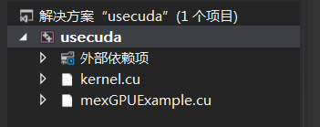
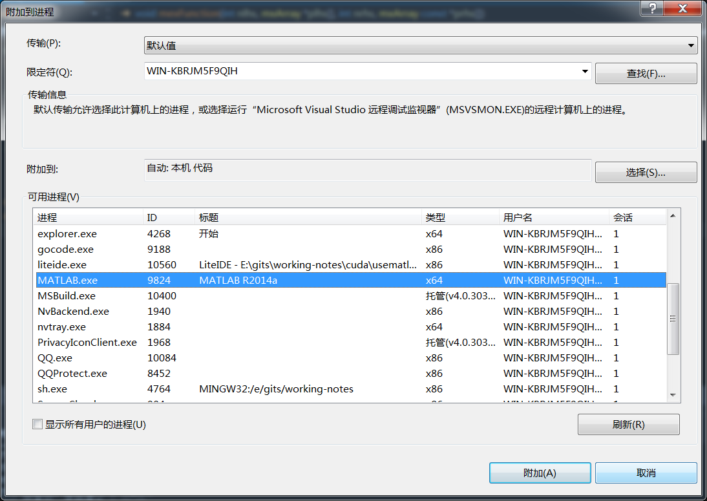

使用matlab来调用GPU进行并行运行
========

我们使用cuda要完成的是通信系统中的并行算法研究，matlab中有很多的其他的函数，用这些函数可以很好的建立起算法运行的环境，然后matlab提供了MEX接口，这样可以用CUDA实现核心算法，然后用matlab来调用这个算法。

## 安装软件
要完成这些功能，需要安装三个软件.
+ visual studio 2010
+ matlab 2014a
+ cuda SDK

安装的时候最好按照上面给出的顺序来安装，特别是vs一定要安装2010版本，因为matlab 2014a的cuda mex的编译要使用到2010的VC。

>如果不使用CUDA编程，只是使用matlab调用C，那么对vs和matlab的版本就没有要求了。

>安装vs2012的时候要注意不要将其安装在C盘，因为其会占用很大的空间，而那些附加的程序就可以不要安装了。

matlab提供了mex命令来编译C/C++文件，其使用的是安装在系统上的C/C++编译器，所以，要使用MEX，那么首先要保证系统上面安装了C/C++编译器。在matlab中执行

`mex -setup`

可以看到


matlab会自动找到系统中安装的C/C++编译器。如果系统中安装了多个C/C++编译器，那么就可以用鼠标选择一个。

但是要注意的是，上面找到的C/C++编译器是针对标准的C/C++使用的，在CUDA中，使用的是nvcc编译器，所以需要其他的设置。

### mex使用nvcc编译器

>不使用cuda编程的跳过

这儿是参考matlab的帮助文件，Parallel Computing Toolbox >> GPU Computing >> Run MEX-Functions Containing CUDA Code。

这里只说一下要注意的地方，mex编译的时候，要使用nvcc，同时也要使用vc++，而且对vc++的版本也是有要求的。我使用的是matlab 2014a，最开始的时候安装的是vs2012(也就vs11),发现使用mex编译的时候找不到SDK，打开那个xml文件之后发现，其要使用的是vs10，也就是vs2010，所有又安装了vs2010.


>我最开始的时候要安装vs2012是因为我使用的是64位操作系统，安装的vs2010连接的时候通不过，而2012可以。

其它的所有步骤按照帮助文件就可以了。

---

编译的时候要使用

`mex -largeArrayDims -g mexGPUExample.cu`

中间的-largeArrayDims是64位版本必须用的选项。
-g选项是为了调试使用的。

### visual studio中的设定
交叉开发的时候，matlab端的代码在matlab中写，mex代码就在VS中写。

在调试的时候，还要使用到VS来调试mex代码。

在写mex代码的时候，我们可以不断的使用matlab的mex指令来编译，然后排除错误，但是更好的办法是在vs中完成编译工作。为了使得VS能编译通过，需要注意下面的设置。

+ 在VS中新建一个cuda工程，这样在编译的时候就会使用到nvcc和vc2010,可以看到，此时有一个`kernel.cu`文件,这个文件对我们没有用，因为我们不会连接，只会编译
> 如果mex使用的是传统的C/C++，那么就新建一个空的工程项目

+ 将我们的mex函数所在的.cu文件添加进来（使用添加已有项目）



为了编译通过，必须将matlab的头文件加入搜索路径，也就是下面的两个文件
```
#include "mex.h"
#include "gpu/mxGPUArray.h"
```

>使用C/C++的时候，只需要添加第一个`mex.h`


这样在vs中，使用`Ctrl+F7`就可以完成编译了，如果有错误的话，那么就可以直接改。

### visual studio调试mex文件
程序写完了之后要要调试，matlab代码部分可以使用matlab自带的调试功能，mex文件部分可以使用手动pirintf的方式，但是这样很不方便。所以使用visual studio attach到matlab进程上面调试的方式。

>要成功调试，一定要在编译的时候加上-g选项，我刚开始调试不成功，就是因为没有加-g选项来编译。

步骤如下：
+ 在VS中，选择 调试 >> 附加到进程，选择matlab.exe


+ 在需要的地方加上断点，等待matlab调用到这个mex函数

+ matlab开始运行，在mex函数有断点的地方其会停下来。


## 开始使用

### 初始化GPU
GPU在被使用之前，需要进行初始化，matlab中有几个函数可以初始化一个gpu，其中最简单的就是使用`gpuDevice`，这句话执行了之后，默认的gpu会被选择到，如果其是第一次被选择到，那么其就会被初始化。

### 在matlab和GPU中相互传递数据 
一个算法有输入和输出，所以我们要将一个算法放到gpu中去运行，那么首先要将这个算法的输入放到gpu的global memory中去，在CUDA C API中，有专门的函数接口将C中的数据（存放在RAM中的）copy到GPU中去（GPU的显存），通用的，算法执行完了之后，又反过来copy。使用C代码，这两个调用过程还是比较复杂的。

在matlab中，这个过程就比较简单了，只需要使用`gpuArray`和`gather`两个函数

#### `gpuArray`

`G = gpuArray(x)`

其中x的数据类型是numeric（也就是基本的数据类型）

```
X = rand(10, 'single');
G = gpuArray(X);
```

执行上面的代码后，在workspace中可以看到


X的数据类型是single，其是存在于matlab中的（也就是RAM中，也就是JVM中）.

G的数据类型是gpuArray,其是一个reference的数据类型，也就是说，其相当于一个指针，**其本身是存在于RAM中的，其指向的数据是存在于GPU中的（显存中）**。

这个函数就完成了将数据从RAM传到显存中的功能。

#### `gather`
```
X = gather(A)
```

完成的功能和gpuArray相反
```
gx = gather(G);
```
那么此时x和gx的内容就是完全一样的了。

### 调用CUDA编写的核心算法
当数据被传入了GPU之后，就可以调用CUDA C编写的核心算法了

```
x = ones(4,4,'gpuArray');
y = mexGPUExample(x)
```

`y = mexGPUExample(x)`就是对算法的调用，可以看到，和传统的matlab调用C是完全相同的，这儿要注意的是，**传入的参数一定要是gpuArray,而不是其他的数据类型**，因为在mex函数中，一般的matlab数据的类型是`mxArray`，而存在GPU中的数据的类型是`mxGpuArray`。

## matlab提供的GPU编程接口
`mexGPUExample.cu`是一个CUDA程序，里面会使用到matlab提供的GPU编程接口。

通过matlab的帮助文件可以得到那些函数的用法。

下面是MEX的文件的标准定义，`mexFunction`为函数的名字，nlhs是返回的参数的个数，nrhs是传入的参数的个数,`mxArray *plhs[]`表示plhs是一个数组，其中的每个元素是一个mxArray*,mxArray数据类型是matlab中对数据的表示；同理，prhs也是一个数组，里面的元素每一个是一个const 指针，因为输入的参数不能被改变，所以加上了const

```
void mexFunction(int nlhs, mxArray *plhs[],
                 int nrhs, mxArray const *prhs[])
```
### API函数


#### `int mxInitGPU()`

初始化GPU，要注意的是，在使用其他的函数之前，必须先将GPU初始化，其实是初始化GPU 的runtime library。有几个地方可以初始化


+ Call mxInitGPU at the beginningof your MEX file before any CUDA code.


+ Call gpuDevice(deviceIndex) inMATLAB before running any MEX code.


+ Create a gpuArray inMATLAB before running any MEX code.

#### `int mxIsGPUArray(mxArray const * const mp)`
判断一个mxArray是不是mxGpuArray,从mexFunction的原型可以看出，传过来的数据是被声明成mxArray的，但是实际上其中包含可能是一个mxGpuArray。（注意这儿传入的都是指针，所以可以随便赋值，其真实指向的数据可能是matlab中的，也可能是gpu中的）

#### `mxGPUArray const * mxGPUCreateFromMxArray(mxArray const * const mp)`
#### `mxGPUArray* mxGPUCopyFromMxArray(mxArray const * const mp)`

这两个函数实现的功能是相似的，都是要从已有的mxArray弄出一个mxGpuArray,

mxGPUCreateFromMxArray中，如果mp已经是一个mxGpuArray，那么就新建一个mxGpuArray，其指向和mp相同的GPU data，如果其是一个mxArray，那么将这个数据赋值到GPU中，然后创建一个mxGpuArray,让其指向GPU中的那块数据。两种情况下得到的mxGpuArray都是只读的。

mxGPUCopyFromMxArray中，如果mp是mxGpuArray，那么会将mp指向的gpu data复制一份，然后新建一个mxGpuArray，并让其指向该GPU data;如果是mxArray，那么将这个数据赋值到GPU中，然后创建一个mxGpuArray,让其指向GPU中的那块数据。两种情况下得到的mxGpuArray都是可读写的。

#### `void const* mxGPUGetDataReadOnly(mxGPUArray const * const mgp)`
#### `void* mxGPUGetData(mxGPUArray const * const mgp)`
从mxGpuArray中得到一个raw pointer（就是C中使用的pointer），其指向了在GPU中的data(显存中的数据)。

mxGPUGetData得到的是可读写的。

这儿提取出raw pointer，因为在CUDA C中调用kernel要使用raw pointer。

#### `mxGPUCreateGPUArray`

函数原型

```

mxGPUArray* mxGPUCreateGPUArray
(mwSize const ndims,
mwSize const * const dims,
mxClassID const cid,
mxComplexity const ccx,
mxGPUInitialize const init0)
 	
```	

在GPU中创建一个data，在CPU中创建一个gpuArray，让这个gpuArray指向那个data。

后面的参数表示这个data的属性。

+ ndims是一个整数，表示其维数
+ dims是一个指针，表示每一维的大小。

比如创建了3*4的矩阵那么ndims=2,dims[0]=3,dims[1]=4.

+ cid表示其class，mxClassID是一个enum,其每个域表示一个matlab中的class，比如mxDOUBLE_CLASS表示创建的时候double的。

+ ccx表示创建的是real还是complex的，mxComplexity是一个enum
+ init0表示是不是要初始化为全0

这个函数创建的mxGpuArray一般是为了返回值的。


#### `mwSize const * mxGPUGetDimensions(mxGPUArray const * const mgp)`
得到mxGpuArray中每个维数的大小。

#### `mwSize mxGPUGetNumberOfDimensions(mxGPUArray const * const mgp)`
得到mxGpuArray的总的维数。

#### `mwSize mxGPUGetNumberOfElements(mxGPUArray const * const mgp)`
得到mxGpuArray中的总的元素的个数。

从上面的两个函数得到的结果可以得到这个值。

#### `mxArray* mxGPUCreateMxArrayOnGPU(mxGPUArray const * const mgp)`
**将mxGpuArray变成一个mxArray**，用于返回到matlab。

在matlab中，观察workspace，会发现返回的数据的类型是gpuArray.
GPU上面的data不会被改变。完成之后，原来的mxGpuArray就可以被删除了,因为其指向的东西有新的mxArray指向了。

#### `mxArray* mxGPUCreateMxArrayOnGPU(mxGPUArray const * const mgp)`
把mxGpuArray中的GPU DATA copy到CPU中，函数完成的功能和gather类似。

这样在返回到matlab中后，得到的是一个mxArray(指向的数据在RAM中)

#### `void mxGPUDestroyGPUArray(mxGPUArray const * const mgp)`
完成两件事情
+ CPU中删除mxGpuArray
+ 其指向的的gpu data如果没有其他的mxArray指向的话，就会被删除，如果还有其他的mxArray指向的话，就会被保留。

这个函数一般在mex函数的最后要调用，因为其他的API函数会创建好些mxGPUArray,它们都指向了一个GPU DATA，在mex函数结束的时候，有些GPU DATA是不需要了的（比如中间需要的），有些还是需要的（就是作为输入输出的mxGPUArray对应的GPU DATA），这些输入输出的在mxGPUDestroyGPUArray的时候就不会从显存中删除掉。

**所有的mxGPUArray在mex函数退出之前都要使用这个函数清除**


