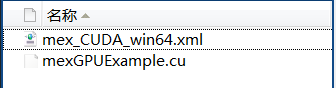

使用matlab来调用GPU进行并行运行
========

我们使用cuda要完成的是通信系统中的并行算法研究，matlab中有很多的其他的函数，用这些函数可以很好的建立起算法运行的环境，然后matlab提供了MEX接口，这样可以用CUDA实现核心算法，然后用matlab来调用这个算法。

## 环境建立
matlab提供了mex命令来编译C/C++文件，其使用的是安装在系统上的C/C++编译器，所以，要使用MEX，那么首先要保证系统上面安装了C/C++编译器，在我使用的windows上面，安装了VS2012，在matlab中运行

`mex -setup`

可以看到

matlab会自动找到系统中安装的C/C++编译器。

但是要注意的是，上面找到的C/C++编译器是针对标准的C/C++使用的，在CUDA中，使用的是nvcc编译器，所以需要其他的设置

### mex使用nvcc编译器
这儿是参考matlab的帮助文件，Parallel Computing Toolbox >> GPU Computing >> Run MEX-Functions Containing CUDA Code

这里只说一下要注意的地方，mex编译的时候，要使用nvcc，同时也要使用vc++，而且对vc++的版本也是有要求的。我使用的是matlab 2014a，最开始的时候安装的是vs2012(也就vs11),发现使用mex编译的时候找不到SDK，打开那个xml文件之后发现，其要使用的是vs10，也就是vs2010，所有又安装了vs2010.

>我最开始的时候要安装vs2012是因为我使用的是64位操作系统，安装的vs2010连接的时候通不过，而2012可以。

其它的所有步骤按照帮助文件就可以了。

要注意的是编译的时候要使用

`mex -largeArrayDims mexGPUExample.cu`

中间的-largeArrayDims是64位版本必须用的选项。

## 开始使用

### 创建`gpuArray`
