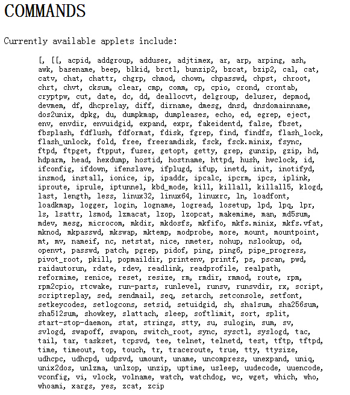

# de1-soc

## busybox

在嵌入式设备上,一般都是使用busybox这一个可执行文件来装下大部分发行版中的核心的命令.
busybox是一个程序,这个程序本身完成了很多程序的功能. 使用链接来完成对这些功能的区分. 具体的实现方式可以看一些博文.

上面的列表就是busybox中实现的程序的功能. 可以看出这些程序在一般的桌面版的Linux中都是一个单独的程序,而且这些程序是Linux系统中
