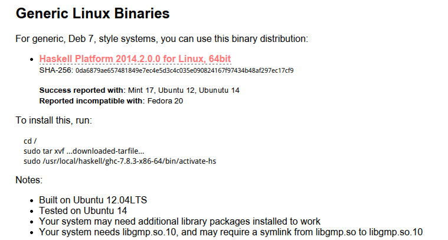

# install-ubuntu

安装haskell的时候,都会安装`haskell-platform`,因为如果只是安装ghc编辑器,会有很多的包都是没有的,使用的时候会比较麻烦.

可以使用`apt-get`来安装,但是和大部分的软件一样,apt-get的更新速度太慢了,官网现在已经是`2014.2.0.0`了,其中包含的ghc是`7.8.3`,但是apt-get得到的是`7.6.3`.

在官网将下面的文件下载下来.

按照说明运行命令就安装好了.

运行

    cabal update
更新cabal的本地软件原.
将`$HOME/.cabal/bin`放到PATH中去.

## 使用idea的插件进行开发
