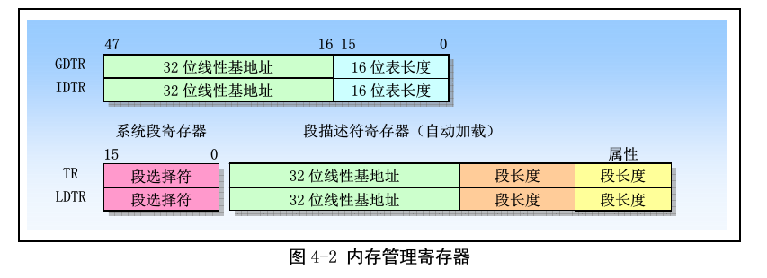
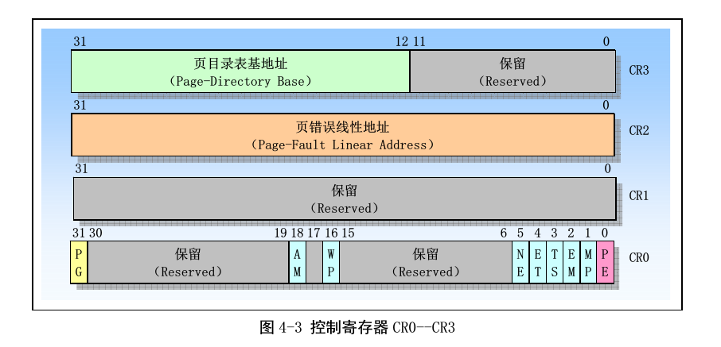
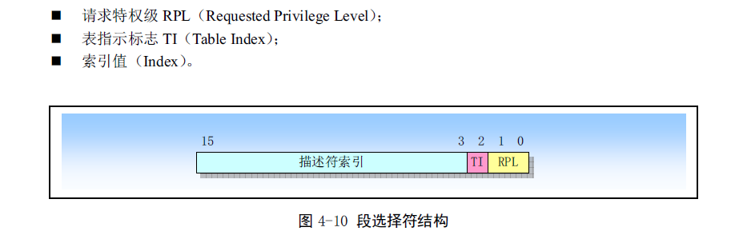

# mem-manage

## 保护模式中的内存访问
在实模式(兼容8086的16位模式)和保护模式中,对内存访问的方式是不同的.

这里说的内存访问,主要是指当一个指令需要使用的内存中的操作数(比如movl指令将内存中的一个数移动到eax中)的时候,cpu怎样通过自己的各个寄存器的值,计算出一个物理地址,将这个物理地址放到其地址线上面去,最终从内存中得到这个值的过程.

cpu中的寄存器不多,除了通用寄存器,其他的存在的寄存都是对cpu有特殊的用处的.
下面的这些寄存器就是cpu中对内存访问有影响的寄存器.

在x86中,使用了分段和分页的内存管理.上面一个图中主要是分段管理要使用的寄存器.下面一个图中主要为分页要使用的寄存器.

在启用了分段模式,就是cr0中的pe开启了,也就是保护模式打开了(所以包含模式下面下一定会启用分段)的情况下,程序(汇编代码中)给出的地址都是`逻辑地址`,它们会转换为`线性地址`.

逻辑地址包含一个段选择符和一个段内偏移地址,段选择符为16位,段内偏移地址为32位.

>在实模式中,只有cs,ds,ss,es这四个段寄存器,在保护模式中,才有了fs,gs. 实际上,在实模式中才应该把它们叫做`段寄存器`.在保护模式中,应该叫它们`段选择符寄存器`了.

逻辑地址在汇编代码中是怎么给出来呢?
在att汇编中,逻辑地址的表达形式为

    section:disp(base,index,scale)
其中的section部分就是段选择符,后面的那一堆会计算处一个段内偏移地址. section部分不能随便给出一个值,而必须使用cpu的段寄存器(cs,ds,ss,es,fs,gs).
base被称为是基址寄存器,其也必须是一个寄存器,index为变址寄存器,当然其和必须是寄存器.
之所以要给它们取这么一些名字,是因为在使用中,上面的几个参数很多的都是可以不给出的,特别是section部分.

在8个通用寄存器中,所有的都可以作为基址寄存器.除了esp,所有的都可以作为变址寄存器.

当基址寄存器为`ebp,esp`的时候,默认的段寄存器就是ss,否则,默认的段寄存器就是ds. 所以,对于`es,fs,gs`这三个附加的段寄存器,除非显示的给出,那么是不会被默认使用的.

    movl 0x12345678,%eax #注意,前面没有加$,不是立即数.所以是取内存中的数,没有给出基址寄存器,那么会使用默认的ds段寄存器,偏移为0x12345678
    movl (%ebx,%ebp),%eax #基址寄存器为ebx,那么使用默认的段寄存器`ds`,偏移为ebx+ebp*1
    movl (%ebp,%ebx),%eax #基址寄存器为ebp,那么使用的默认寄存器为`ss`,偏移为ebp+ebx*1
    movl 100(%eax),%edx #基址寄存器为eax,那么使用默认的段寄存器`ds`,偏移为eax+100
    movl (%esp,%edx,2) #基址寄存器为esp,那么使用的默认寄存器为`ss`,偏移为esp+edx*2,这是典型的访问数组元素的方法

当然,如果在指令中显示的给出了要使用的段寄存器,那么当然就会使用给出的段寄存器了.

    movl es:0x200(%eax) #段寄存器为es,地址偏移为eax+200h
    movl cs:0x200(%eax) #段寄存器为cs,地址偏移为eax+200h

使用cs作为访问操作数时使用的段寄存器也是会看到的.比如写汇编代码的时候,将数据定义在了`.text`段.
那么有两种方式来访问.
1. 直接让ds和cs相同(就是段选择符中的段描述符索引相同),这样访问内存的时候不用显示的给出段寄存器.
2. 访问内存的时候显示的给出使用cs寄存器.

上面说的是一个指令要访问内存的时候发生的情况.再讨论cpu取指令的时候.
cpu去取下一条要执行的指令的时候,**一定会**使用`cs:(%eip)`的形式来得到要取的指令在内存中的地址.

在代码中,我们一般会显式的操作几个数据段寄存器的值.比如

    mov %cs,%ax
    mov %ax,%ds
    mov %ax,%es
    mov %ax,%fs
上面的代码就是经常会出现在linux的源代码中.因为在linux中,一个任务的代码段和数据段的线性地址都是一样的,上面的代码就是在进行了一个`ljmp,iret`之类的指令之后,让数据段和代码段的基地址相同.

对于cs,汇编代码中**都不会**显示的为其赋值,因为其值会被各种长跳转指令改变.比如上面看到的`ljmp,iret`.实际上,这些长跳转指令会同时改变`cs:eip`.

对于ss寄存器,也**不会**显示修改其值,一般会使用`lss`指令直接设置号`ss:esp`.

----

在保护模式下,对于内存地址的访问,变得更麻烦了一些.

在实模式下的段寄存器,在32位下面已经不能够表达这个段的基址值了(因为段的基地址有32位,其只有16位).

在32位保护模式下,这些段的基地址被放到了内存中的一个表中,这个表就是gdt表(全局描述符表).这个表在内存中的线性地址保存在cpu中的gdtr寄存器中.
实际上,gdtr寄存器不止32位,其一共有48位,剩余的16位表示这gdt表的长度,所以gdt表的长度最多可以达到**64kB**.
对于gdt中的每一项,如果按照实模式中的设计方式,那么只需要存放一个32位的线性基地址,但是实际上,其一共有64位,多出的32位中的信息,就是用于**保护**这个段中的数据的,这也是为什么其叫做**保护模式**.

所以,在gdt中,一共可以存放***8k=8192**个描述符. 但是cpu中一种只有6个段寄存器,所以在同一个时候,其中最多只有6个是被使用的. 那么多出来这么多有什么用呢? 其主要是给多任务系统使用的,在多任务系统中,系统中同时可以有多个任务,每个任务有自己的代码段,数据段,那么它们的描述符就可以保存在gdt中了.

----

在gdt中,除了会存放数据段,代码段的描述符.

还会存放ldt描述符和tr描述符. 一般的,一个任务的私有的代码和数据会放在自己的ldt表中, 而这个任务会有一个任务描述(tss).这两个东西都是存放在内存中的一个位置的,而这个位置需要通过gdt表中的一个入口来得到.

在linux0.11中,gdt中的安排是:

第0个是Null,也就是全0,因为这个是intel规定了的.

第1个是内核的代码段描述符,第2个是内核的数据段描述符.

第3个没有使用(linus当时设计的时候没有考虑清楚)

第4个是任务0的tss描述符,第5个任务0的ldt描述符.

第6个是任务1的tss描述符,第7个任务1的ldt描述符.

.....

注意,gdtr中其长度为16位的,总共可以有`2^13`个描述符.在`段寄存器(cs,ds,...),ldtr,tr`中的高13位给出的是相应段在gdt中的索引.如果要算出其偏移的字节,需要将这13位的值`<<3`

