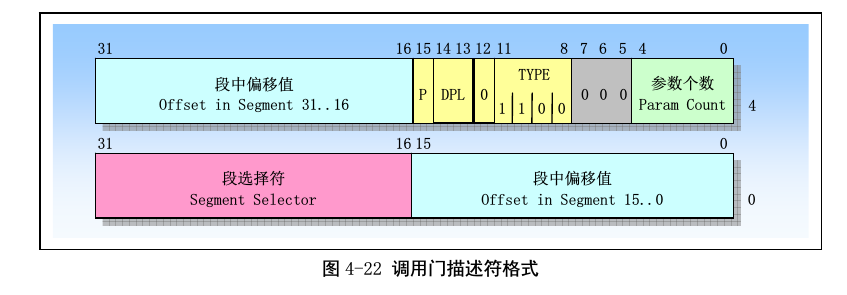

# x86-gate

在x86中,为了对具有不同特权级的代码提供受控的访问(就是有权限的进程才可以调用这些代码,程序),其提供了被称为门描述符的特殊描述符.
这些描述符的TYPE如下:

* 调用门(call gate),type=12
* 陷阱门(trap gate),type=15
* 中断门(interrupt gate),type=14
* 任务门(task gate),type=5

调用门描述符存在于gdt,ldt中,**不能**在idt中.
在Linux中,并没有使用调用门.

>需要特别注意的是,在gdt中,还可以存放,`系统段,代码段,数据段`的描述符,但是它们的格式和门描述符的格式就完全不一样了.

陷阱门,中断门,任务门存在于idt表中.

中断门和陷阱门的段选择符和偏移值就可以确定一个中断发生的时候,cpu应该跳转到那个物理地址去运行一段程序(也就是中断处理程序).

中断号(中断向量)和这个处理程序则使用idt中的下标来关联.
比如idt中的第0个描述符(就是idt到idt+7)这8个字节表示的描述符中指定的物理地址,就是中断0(除0操作)发生的时候cpu会去执行的代码的起点位置.

注意这个8个字节除了段选择符和偏移值还有一个`P`和`DPL`.
`P`表示这描述符是否有效,如果没有特殊的原因,总是会将P设置为1.
`DPL`表示这个门的特权级.
根据当前CPU运行的代码级别和门描述符的级别是否相同,那么CPU调用这个中断(陷阱)之前,需要做的事情是有所不同的.

