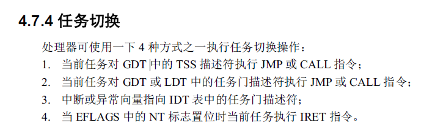
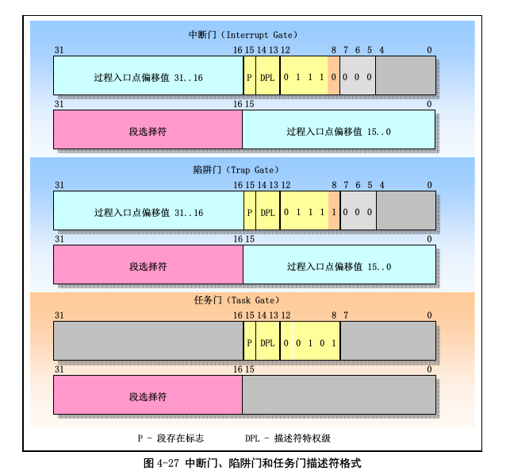

# x86-task

在x86的保护模式中,会有任务管理的东西. x86开发的是就是想让cpu本身就支持多任务,所以在其加入了tss,tr寄存器等等的东西到cpu中去.

gdt中可以包含一个任务的描述符,这个描述符指向内存中的一个tss结构. 在linux0.11中,使用了x86自己提供的这个任务管理能力来实现自己的多进程. 但是x86自带的这个多任务管理方式太消耗资源,所以后linux自己**用软件**实现了一个多任务管理.

上面是会导致x86进行任务切换的所以指令.

* 对gdt中的tss描述符进行jmp和call指令.

这个其实是在ljmp中会触发的,使用ljmp的时候,会给出48位的长地址,也就是`段描述符:段内偏移`的格式的地址.其中段描述符16位,如果其中的ti=0,也就是在gdt中找,然后其高13位的索引在gdt中又是一个tss描述符.那么cpu会认为现在要进行一个任务切换,而不是简单的加载`cs:eip`.

这样,cpu就会自动的当前任务的tss内容保存到tr寄存器(16位,表示当前任务的tss描述符索引)对应的内存中的tss中去.也就是完成现场包含.
然后将ljmp后面给出的段描述符(tss描述符)对应的内存中的tss加载到cpu的各个寄存器中来.也就是切换到另外一个任务.加载进来的包含了`cs:eip`寄存器,所以cpu就会运行新的任务了.

* 对gdt或者是ldt中的任务门进行了jmp和call指令.

如上图所示,任务门描述符中只包含了一个段选择符.如果这个段选择符指向的是一个tss描述符,那么跳转到这任务门上面也就和上面奕扬的了.

* 中断或异常向量指向的是一个任务门描述符

在idt中,每一个入口存放的是上图中的一个.如果一个中断向量对应的idt中的描述符是一个任务门描述符,而且这个任务门描述符中的的段选择符就是指向的gdt中的一个tss描述符,那么这个中断发送的时候,就会发送任务的切换.

linux0.11中使用了其中的第一种来进行任务切换.
从上面的解释可以看出,后面的三种要达到任务的切换,其过程听起来都比较绕,只有第一种比较直观. 所以linux0.11中就使用了第一种.

在linux0.11中,对于idt中的门描述符,其只会使用中断门和陷阱门,这两个门直接给出了一个中断处理例程的线性地址.使用这两个门进行中断处理,消耗的资源比使用任务门小很多.

**总的来说,linux0.11在实现的时候,对于要实现的功能,尽可能的选择了更省资源的方式.**
