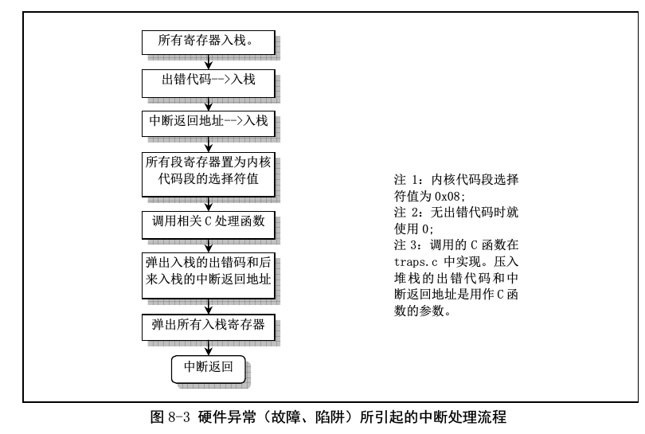
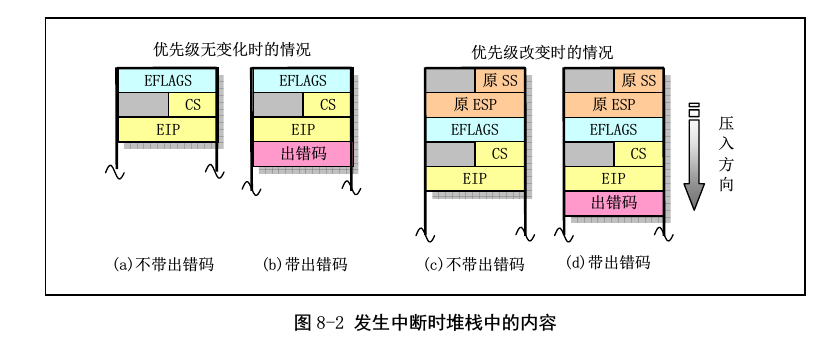
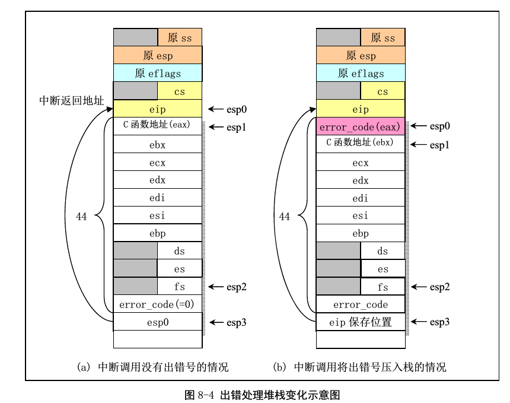

# x86中的中断处理

对于现代的处理器和操作系统,使用中断来处理外部突发的事件是一种常用的提高系统性能的方式.

一般的,在cpu收到一个中断的时候,这个中断可以是外部硬件产生的,比如定时器中断,也可以是CPU内部产生的,比如数进行除法的时候,除数是0,还可以是软件中断,也就是通过`int `指令自己产生的.

上面就是cpu处理一个中断的流程.
总的来说,就是完成`保护现场`然后`处理中断`然后`恢复现场`的过程.

在cpu检测到一个中断来了之后,在进入中断处理过程之前,其会将当前的现场进行保护.根据中断处理程序是不是需要转换优先级,保存的内容有所不同.如果优先级没有变化,那么就保存elfags,cs:eip,如果优先级有变化,那么还要保存当前的ss:esp.

因为Linux中,一个进程可以运行在用户态和内核态,当进程在用户态的时候,使用用户态的栈,在内核态的时候,使用内核态的栈. 所以,如果当前进程在用户态中,那么在进入中断的时候,就需要把用户态的ss:eip也保存了.

有些中断发生的时候,cpu还有有一个相关的错误码产生,如果有这个错误码,那么错误码也要被入栈.

还需要注意的是,所有的这些信息都是被压入到**中断处理例程所属的内核态栈中的**.

下图中的四个子图就显示了不同情况下cpu会压入内核态堆栈的内容.

cpu在包含了现场之后,就会进入到中断处理程序中了.

上图是Linux中的中断处理程序执行过程中内核态堆栈的变化.

1. 开始的时候,esp在esp0的地方,也就是刚刚cpu压入了所有的现场包含的信息的地方.
2. 开始运行真正的处理逻辑之前,把所有的通用寄存器和数据段寄存器都入栈(cs寄存器已经由cpu自己入栈了,ss寄存器现在是内核态所在的段了),因为这些寄存器在后面的中断处理逻辑中都是可能会被用到的. 在压入这些寄存器的时候,压入eax的时候使用了xch指令,所以eax的值被压入栈中后变成了处理中断逻辑的c函数的入口地址.
3. 调用一个c函数来完成中断逻辑的处理.从汇编中调用c函数的是,需要从又右向左(就是从最后一个到最前面一个)的压入这个函数需要的参数. 在实现中,这些函数需要的都是两个参数,第二个是cpu对这个中断压入堆栈中的error code(如果没有的话,就为0),第一个参数是这个中断程序完成处理之后,cpu会返回运行的地址.

实际上,这些中断大部分都会导致这个进程退出掉,在退出之前,其会打印出退出的时候,是那个中断导致这个进程退出的,退出的时候这个进程各个寄存器的内容.
