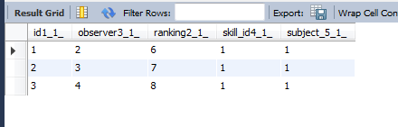

hibernate
========
作为Java中数据持久化事实上的标准，hibernate使用的是相当多的。

## 建立使用hibernate的环境

## 使用hibernate

### 一个样列

这个样例是一个评价的列子。
有三个类。`Person`表示一个人。`Skill`表示要被评价的技能。`Rinking`表示评价的值。

在下面的样列代码中，都不会给出getter和setter函数，以及默认的构造函数。

```Java
public class Person {
    @Id
    @GeneratedValue(strategy = GenerationType.IDENTITY)
    private Long id;
	@Column
    private String name;
}
```

生成的SQL代码

```sql
create table Person (
   id bigint not null auto_increment,
   name varchar(255),
   primary key (id)
)
```


如果上为`Person`，其除了用于持久化必须要的`id`属性，还有`name`属性，表示其名字。
```Java
@Entity
public class Skill {
    @Id
    @GeneratedValue(strategy = GenerationType.IDENTITY)
    private Long id;

    @Column
    private String name;
}
```
SQL代码

    create table Skill (
        id bigint not null auto_increment,
        name varchar(255),
        primary key (id)
    )
	
`Skill`也是一样的。

```java
@Entity
public class Ranking {
    @Id
    @GeneratedValue(strategy = GenerationType.IDENTITY)
    private Long id;

    @Column
    private Integer ranking;

    @ManyToOne
    private Person subject;
    // manytoone表示ranking和person是n:1的关系
    // subject是Ranking表中的一列，这一列中会有很多行的值是相同的，所以是n:1
    // 生成的sql代码是
    // foreign key (subject_id) references Person (id)

    @ManyToOne
    private Person observer;

    @ManyToOne
    private Skill skill;
}
```
`Ranking`比较复杂一些了。其中`subject`,`observer`,`skill`都是`ManyToOne`的，这个意思就是说在`Ranking`这个表中的`subject`这一列，其很多个值都可以是`Person`中的一个值。`subject`表示被评价的人，当然同一个人可以被多个人评价了。同理，`observer`和`skill`也是这样的。

SQL代码
```sql
create table Ranking (
	id bigint not null auto_increment,
	ranking integer,
	observer_id bigint,
	skill_id bigint,
	subject_id bigint,
	primary key (id)
)
```
	
上面是生成`Ranking`的各个域。其还需要一些FK的约束。

```sql
alter table Ranking 
    add constraint FK_j5b0b4anqw41odw0x6pxrbtr2 
    foreign key (observer_id) 
    references Person (id)

alter table Ranking 
    add constraint FK_8fc03wy4pr9ntrnt8ncfthr6w 
    foreign key (skill_id) 
    references Skill (id)

alter table Ranking 
    add constraint FK_ffv5e9op8w3qx3jeqaqbdcsno 
    foreign key (subject_id) 
    references Person (id)
```
从上面可以看出了，如果我们是自己手动写SQL代码，那么就不会使用后面的三个`alter table Ranking`语句，而是会在`create table Ranking`中就把外键的信息也一起写完了。

我们知道使用数据库的时候，合并更多的查询可以提高性能，但是hibernate的代码是生成的，其为了更好的生成代码，所以采用了这种策略。**使用hibernate会比使用直接的手写SQL有一定的性能损失(指的是对数据库的操作的性能损失)，但是其可以极大的减少代码的书写复杂度和维护的复杂度**。

下面看一个联合三个表的查询。

```Java
// 使用HQL语言来进行查询
Query query = session.createQuery("from Ranking r "
        + "where r.subject.name=:name "
        + "and r.skill.name=:skill");
query.setString("name", "J. C. Smell");
query.setString("skill", "Java");
// 找出被评价的人是J. C. Smell，被评价的技能是Java的所有结果
// 从上面插入数据库的东西可以知道，插入的三条记录都是评价J. C. Smell的
```	



现在`Ranking`表中的数据如上。也就是查询的结果上三行都会被输出。
注意上面使用的是HQL语言，是一种更适合于用户OO中的查询语言。
	
```sql	
=== begin query ranking ===
Hibernate: 
    select
        ranking0_.id as id1_1_,
        ranking0_.observer_id as observer3_1_,
        ranking0_.ranking as ranking2_1_,
        ranking0_.skill_id as skill_id4_1_,
        ranking0_.subject_id as subject_5_1_ 
    from #要得到完整的信息必须从三个表中提取
        Ranking ranking0_ cross 
    join
        Person person1_ cross 
    join
        Skill skill2_ 
    where
        ranking0_.subject_id=person1_.id  #这两个是保证选出的数据是有意义的
        and ranking0_.skill_id=skill2_.id
        and person1_.name=? #这两个是查询的时候给出的参数 "J. C. Smell"
        and skill2_.name=? #"Java"
				
#执行完了之后，observer_id skill_id subject_id都需要找到其真实的值
#从结果可以看出来，subject_id只有一个,需要一次查询才可以得到其值
#skill_id也只有一个
# observer_id有三个不同的
				
查询subject_id 只有一个				
Hibernate: 
    select
        person0_.id as id1_0_0_,
        person0_.name as name2_0_0_ 
    from
        Person person0_ 
    where
        person0_.id=?
				
查询skill_id 只有一个				
Hibernate: 
    select
        skill0_.id as id1_2_0_,
        skill0_.name as name2_2_0_ 
    from
        Skill skill0_ 
    where
        skill0_.id=?
				
查询observer_id，有三个				
Hibernate: 
    select
        person0_.id as id1_0_0_,
        person0_.name as name2_0_0_ 
    from
        Person person0_ 
    where
        person0_.id=?		
Hibernate: 
    select
        person0_.id as id1_0_0_,
        person0_.name as name2_0_0_ 
    from
        Person person0_ 
    where
        person0_.id=?
Hibernate: 
    select
        person0_.id as id1_0_0_,
        person0_.name as name2_0_0_ 
    from
        Person person0_ 
    where
        person0_.id=?
=== end query ranking ===
```

 
对这个语句的调用，会发现实际上会出现5句SQL代码。

* 因为要得到所有的信息，所以需要综合三个表，这个生成的SQL代码使用`cross join`，在mysql中，其就是`inner join`，注意这儿使用的是`where`来得到有意义的数据，而不是使用的`join`的`on/using`。注意到语句中有很多的`?`，实际上这些`?`会被替换的。 对于得到的结果，因为`subject_id`,`observer_id`,`skill_id`都是需要被解析出。

* `subject_id`只有一个取值`1`，所以需要在`Person`中进行一次查询。

* `skill_id`也只有一个取值`1`，所以需要在`Skill`中进行一次查询。

* `observer_id`有三个取值`2,3,4`，所以需要在`Person`中进行三次查询。

> 如果使用SQL语句，那么可以只需要一次查询就可以得到结果。就是将`Ranking,Skill,Person as ob,Person as sub``inner join`到一起，然后将`Ranking.ranking,Skill.name,ob.name,sub.name`取出来，然后将这些值放到Ranking的一个实例中就可以了。

从上面的分析可以看出，使用hibernate，我们可以完全不知道SQL是怎样使用的，但是了解SQL是怎样执行的可以清楚的知道其到底在做什么。
使用hibernate其数据库查询性能会降低，这个从上面的两个列子已经看出来了。当然，让编码更加方便也可以看出了，比如上面的列子，如果使用我上面提到的使用一句SQL，是可以让数据库的操作变少，但是我们还需要去处理JDBC中规定的一大堆东西，也是很麻烦的。不过**hibernate生成的SQL语句还可以不断的优化，以期能够达到和直接使用SQL相当的性能。**