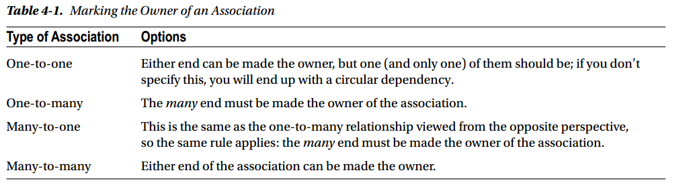

hibernate
========
作为Java中数据持久化事实上的标准，hibernate使用的是相当多的。

## 使用IDEA和MAVEN来新建hibernate工程


## 一个样列

这个样例是一个评价的列子。
有三个类。`Person`表示一个人。`Skill`表示要被评价的技能。`Rinking`表示评价的值。

在下面的样列代码中，都不会给出getter和setter函数，以及默认的构造函数。

```Java
public class Person {
    @Id
    @GeneratedValue(strategy = GenerationType.IDENTITY)
    private Long id;
	@Column
    private String name;
}
```

生成的SQL代码

```sql
create table Person (
   id bigint not null auto_increment,
   name varchar(255),
   primary key (id)
)
```


如果上为`Person`，其除了用于持久化必须要的`id`属性，还有`name`属性，表示其名字。
```Java
@Entity
public class Skill {
    @Id
    @GeneratedValue(strategy = GenerationType.IDENTITY)
    private Long id;

    @Column
    private String name;
}
```
SQL代码

    create table Skill (
        id bigint not null auto_increment,
        name varchar(255),
        primary key (id)
    )
	
`Skill`也是一样的。

```java
@Entity
public class Ranking {
    @Id
    @GeneratedValue(strategy = GenerationType.IDENTITY)
    private Long id;

    @Column
    private Integer ranking;

    @ManyToOne
    private Person subject;
    // manytoone表示ranking和person是n:1的关系
    // subject是Ranking表中的一列，这一列中会有很多行的值是相同的，所以是n:1
    // 生成的sql代码是
    // foreign key (subject_id) references Person (id)

    @ManyToOne
    private Person observer;

    @ManyToOne
    private Skill skill;
}
```
`Ranking`比较复杂一些了。其中`subject`,`observer`,`skill`都是`ManyToOne`的，这个意思就是说在`Ranking`这个表中的`subject`这一列，其很多个值都可以是`Person`中的一个值。`subject`表示被评价的人，当然同一个人可以被多个人评价了。同理，`observer`和`skill`也是这样的。

SQL代码
```sql
create table Ranking (
	id bigint not null auto_increment,
	ranking integer,
	observer_id bigint,
	skill_id bigint,
	subject_id bigint,
	primary key (id)
)
```
	
上面是生成`Ranking`的各个域。其还需要一些FK的约束。

```sql
alter table Ranking 
    add constraint FK_j5b0b4anqw41odw0x6pxrbtr2 
    foreign key (observer_id) 
    references Person (id)

alter table Ranking 
    add constraint FK_8fc03wy4pr9ntrnt8ncfthr6w 
    foreign key (skill_id) 
    references Skill (id)

alter table Ranking 
    add constraint FK_ffv5e9op8w3qx3jeqaqbdcsno 
    foreign key (subject_id) 
    references Person (id)
```
从上面可以看出了，如果我们是自己手动写SQL代码，那么就不会使用后面的三个`alter table Ranking`语句，而是会在`create table Ranking`中就把外键的信息也一起写完了。

我们知道使用数据库的时候，合并更多的查询可以提高性能，但是hibernate的代码是生成的，其为了更好的生成代码，所以采用了这种策略。**使用hibernate会比使用直接的手写SQL有一定的性能损失(指的是对数据库的操作的性能损失)，但是其可以极大的减少代码的书写复杂度和维护的复杂度**。

下面看一个联合三个表的查询。

```Java
// 使用HQL语言来进行查询
Query query = session.createQuery("from Ranking r "
        + "where r.subject.name=:name "
        + "and r.skill.name=:skill");
query.setString("name", "J. C. Smell");
query.setString("skill", "Java");
// 找出被评价的人是J. C. Smell，被评价的技能是Java的所有结果
// 从上面插入数据库的东西可以知道，插入的三条记录都是评价J. C. Smell的
```	


现在`Ranking`表中的数据如上。也就是查询的结果上三行都会被输出。
注意上面使用的是HQL语言，是一种更适合于用户OO中的查询语言。
	
```sql	
=== begin query ranking ===
Hibernate: 
    select
        ranking0_.id as id1_1_,
        ranking0_.observer_id as observer3_1_,
        ranking0_.ranking as ranking2_1_,
        ranking0_.skill_id as skill_id4_1_,
        ranking0_.subject_id as subject_5_1_ 
    from #要得到完整的信息必须从三个表中提取
        Ranking ranking0_ cross 
    join
        Person person1_ cross 
    join
        Skill skill2_ 
    where
        ranking0_.subject_id=person1_.id  #这两个是保证选出的数据是有意义的
        and ranking0_.skill_id=skill2_.id
        and person1_.name=? #这两个是查询的时候给出的参数 "J. C. Smell"
        and skill2_.name=? #"Java"
				
#执行完了之后，observer_id skill_id subject_id都需要找到其真实的值
#从结果可以看出来，subject_id只有一个,需要一次查询才可以得到其值
#skill_id也只有一个
# observer_id有三个不同的
				
查询subject_id 只有一个				
Hibernate: 
    select
        person0_.id as id1_0_0_,
        person0_.name as name2_0_0_ 
    from
        Person person0_ 
    where
        person0_.id=?
				
查询skill_id 只有一个				
Hibernate: 
    select
        skill0_.id as id1_2_0_,
        skill0_.name as name2_2_0_ 
    from
        Skill skill0_ 
    where
        skill0_.id=?
				
查询observer_id，有三个				
Hibernate: 
    select
        person0_.id as id1_0_0_,
        person0_.name as name2_0_0_ 
    from
        Person person0_ 
    where
        person0_.id=?		
Hibernate: 
    select
        person0_.id as id1_0_0_,
        person0_.name as name2_0_0_ 
    from
        Person person0_ 
    where
        person0_.id=?
Hibernate: 
    select
        person0_.id as id1_0_0_,
        person0_.name as name2_0_0_ 
    from
        Person person0_ 
    where
        person0_.id=?
=== end query ranking ===
```

 
对这个语句的调用，会发现实际上会出现5句SQL代码。

* 因为要得到所有的信息，所以需要综合三个表，这个生成的SQL代码使用`cross join`，在mysql中，其就是`inner join`，注意这儿使用的是`where`来得到有意义的数据，而不是使用的`join`的`on/using`。注意到语句中有很多的`?`，实际上这些`?`会被替换的。 对于得到的结果，因为`subject_id`,`observer_id`,`skill_id`都是需要被解析出。

* `subject_id`只有一个取值`1`，所以需要在`Person`中进行一次查询。

* `skill_id`也只有一个取值`1`，所以需要在`Skill`中进行一次查询。

* `observer_id`有三个取值`2,3,4`，所以需要在`Person`中进行三次查询。

> 如果使用SQL语句，那么可以只需要一次查询就可以得到结果。就是将`Ranking,Skill,Person as ob,Person as sub``inner join`到一起，然后将`Ranking.ranking,Skill.name,ob.name,sub.name`取出来，然后将这些值放到Ranking的一个实例中就可以了。

从上面的分析可以看出，使用hibernate，我们可以完全不知道SQL是怎样使用的，但是了解SQL是怎样执行的可以清楚的知道其到底在做什么。
使用hibernate其数据库查询性能会降低，这个从上面的两个列子已经看出来了。当然，让编码更加方便也可以看出了，比如上面的列子，如果使用我上面提到的使用一句SQL，是可以让数据库的操作变少，但是我们还需要去处理JDBC中规定的一大堆东西，也是很麻烦的。不过**hibernate生成的SQL语句还可以不断的优化，以期能够达到和直接使用SQL相当的性能。**

## hibernate的一些概念
### 一个object可以处于的状态
对于那些要被持久化到数据库中的object，就是java中的各种实例。其可以处于各种状态。主要下面的这些状态都是相对于其当前所处于的session的。

* transient,暂时态。当一个object才被java创建，其id整个域还没有值，同时数据库完全不知道有这个实例的时候，其就处于transient态。 hibernate不会管理transient态的object。 
* persistent，持续态。当将一个暂时态的object使用`save()`的时候，其就会被成持续态了，或者是当我们从数据库中query,load出来一个object，它也是处于持续态的。处于持续态的object的改变会写进数据库，也就是其保存在内存中的值和数据库这个object对应的行中的值是同步的。
* detached，分离态。对于一个处于持续态的object，如果其处于的session被close了，那么其就处于分离态。处于分离态的Object，在内存和数据库中都有，但是内存中的数据不会同步到数据库中了。对于一个detached的object，可以在另外一个session中调用load, refresh, merge, update() , or save()这些函数，这样其就又变成是这个新的session的持续态的object了。
* removed，删除态。 当一个object被使用session.delete(object)后，那么其就处于删除态了，表示数据库中这个object对应的行在这个transaction被commit之后就会不存在了。 删除态的object也是在hibernate的管理之下的。

### 连接的方式
hibernate是一个对于关联数据库的orm系统，其有一个直接的对应就是一个entity(class)对应着一个数据库中的表。
我们知道在数据库中需要使用外键来将各个表管理起来。

关联的时候有两种方式，一个是单向关联，一个是双向关联。

比如我们现在有两个entity,`Email`和`Message`。


如果使用单向关联，就是说一个`Email`中包含一个message，那么我们需要如下的定义
```java
public class Email {
    @Id
    @GeneratedValue(strategy = GenerationType.IDENTITY)
    Long id;
    @Column
    String subject;

    @OneToOne
    Message message;
}

public class Message {
    @Id
    @GeneratedValue(strategy = GenerationType.IDENTITY)
    Long id;

    @Column
    String content;

//    @OneToOne
//    Email email;
}
```
注意在Email的message上，标明其为OneToOne，意思是一个email中包含一个message，而在Message中，就不需要任何关于email的信息了。
在生成的表中，email表中会有一个`message_id`这个域。

如果只是设计两个表来完成这个问题，也就是我们是面向数据库编程，那么这个设计是最好的，也是最直观的。

但是如果使用面向java的编程，那么为了处理方便，我们一般会在message中也维护一个email变量，这样在编程的时候会轻松一些(因为我们知道这个Message是属于哪个Email的)。

```java
public class Email {
    @Id
    @GeneratedValue(strategy = GenerationType.IDENTITY)
    Long id;
    @Column
    String subject;

    @OneToOne
    Message message;
}

public class Message {
    @Id
    @GeneratedValue(strategy = GenerationType.IDENTITY)
    Long id;

    @Column
    String content;

    @OneToOne(mappedBy = "message")
    private Email email;
}
```

这样就是一个双向的关联了（这个双向的关联表示的是在java中的object的双向关联）。
对于这个java中的双向关联，在数据库中，我们其实需要的还是只需要在email中维护一个message_id。
所以在Message的email域加上了`@OneToOne(mappedBy = "message")`，其表示这个双向关联由Email表来维护，Email表使用Email.message来维护。

上面的代码生成的数据库的表的格式和第一个单向关联是是一样的，也是在Email表中有一个message_id。

在上面的例子中，Email叫做是这个关联的owner，可以看到，mappedBy语句应该写在被管理的那一方上面，列子中就是写在Message上。


下面是使用双向关联的时候，怎样指定Owner。



首先，确定owner是在java上的事情，也就是在java中考虑那个包含那个的问题。比如一个汽车Car包含四个轮子Wheel。
确定了这个包含关系后。

在Car这个entity中，需要指定为OneToMany，表示一个Car中有多个Whell。
在Wheel中，需要指定为ManyToOne，表示许多Wheel被包含在一个Car中。

```java
@Entity
public class Car {
    @Id
    @GeneratedValue
    private Long id;

    @Column
    private String name;

    @OneToMany(mappedBy = "car")
    private List<Wheel> wheels = new ArrayList<Wheel>();
}
```
```java
@Entity
public class Wheel {

    @Id
    @GeneratedValue
    private Long id;

    @Column
    private String name;

    @ManyToOne
    private Car car;
}
```
mappedBy指定了是使用`car`，表示在Wheel中的每一行会有一个`car_id`来指名其属于哪个Car。

按照图中规定的关联关系的owner和owned，那么需要让many端，也就是Wheel变成这个关系的owner。
那么需要在相反的位置来指名这个关系，也就是在Car上指名。

### object的相等（equality）和相同(identity)
java里面对相等性的判断是比较复杂的。使用`==`来做相同性的判断，使用`equals`来做相等性的判断。

在定义的时候，是先有一个`==`，也就是`==`是java语言就定义了的。对于值类型，`==`在两个值相等的时候为true，否则为false。
对于引用类型，当两个变量指向同一个实例的时候，`==`返回true，否则为false.

`equals`是在java所有类的父类object中定义的，其可以被重载，其定义如下
```java
public boolean equals(Object obj) {
    return (this == obj);
}
```
表示如果一个类没有重载`equals`的话，那么`equals`和`==`是一个功能，都是当指向同一个实例的时候为true，否则为false。

一般情况下，对一个类的两个实例进行相等性的判读应该是
* 如果这两个实例本来就是同一个实例，那么它们当然是相等的
* 如果它们不是同一个实例，如果它们的所以域的值都是相等的，那么他们是相等的

需要注意的是，如果要实现`equals`，那么同时也需要实现`hashCode`。

在Hibernate中，对于一个session中的处于persistent的实例，其在jvm中有一块内存，同时在数据库中相应的表中也有一行。

如果在这个session中再次得到这个id对于的实例，那么得到就是同一个实例。也就是使用`==`来判断的话，这两个是可以返回true的。
但是从两个不同的session中得到同一个id的实例，那么他们不是相同的，使用`==`来判断会返回false。
如果对这个类重载了上面描述的`equals`方法，那么其会返回true。

### session.get(),session.load
在一个session中，可以调用其load和get函数来从数据库中得到一个类的实例放到内存中去。

load会直接载入，如果一个`id`对应的那行在数据库中不存在，那么其会抛出异常。

get是类似的，不过如果其不存在，那么只会返回一个Null，而不会抛出异常。


### merge,reflesh
对一个处于detached状态的object，在一个新的session中，使用merge，其会变成一个persistent的实例，反应到数据库上，这个object的`id`对应的数据库中的那一行的值会被更新到和这个object的状态一样。  

这个类似于我们在编辑一个U盘上面的文件的时候，U盘被拔出来了，然后我们会改变了编辑器中的内容，然后我们又将U盘插回去了，此时U盘中这个文件的内容和文件编辑器（内存）中文件的内容是不一样的了，然后我们选择保存，让文件编辑器中的内容完全的保存到U盘中。

其和save是不同的，对于一个detached的object，在另外一个session中，如果使用save，其也会变成persistent的，但是在数据库中，其会插入一行新的数据，这一行的`id`会重新生成。

这个类似于上面的例子中，在保存文件编辑器中的内容的时候，我们选择了另存为另外一个文件。

reflesh是和merge相反的操作。使用Refresh的话，persistent实例的内容会被数据库中的内容覆盖。

上面的列子中，就是说舍弃当前文本编辑器中的内容修改，让它的内容和U盘中的文件的一样。

### update
对于一个session中的persistent的object，对其的update，也就是调用哥哥setter函数来改变其域的值，那么这些改变会自动同步到数据库中。

要注意的是，因为我们使用了transaction的方式，这些改变真的生效是在一个transaction被commit的时候。

### delete
我们可以删除一个object，需要注意的是我们在一个session中调用delete并不是要从内从中删除这个实例，而是说将数据库中这个persistent的object对应的行删除。
当然删除操作要在这个transaction被commit之后才会生效。

delete还有一个关联的复杂的操作。如果删除的行中没有外键，也就是要删除的这个实例和其他的没有关联，那么删除就十分直接了。但是一般情况下，其都是和其他的实例有关联的，在数据库中也就是有外键的存在。Hibernate可以配置各个entity，使得在数据库的对应表中删除一行的时候，与其关联的其他表中的行是不是也要被删除。

### cascade
cascade是hibernate中一个很重要的概念，因为有了cascade，使得jvm和数据库中的内容同步更加简单了。

比如一个简单的例子，有一个Library中有很多的Book。从Library端看，就是一个OneToMany的关联。使用的是在Book中有一个library_id来维护。

```java
    @OneToMany(mappedBy = "library",cascade = CascadeType.ALL)
    private List<Book> books = new ArrayList<Book>();
```
如果在建立关系的时候，没有使用上面给出的cascade来指名哪些操作会被级联起来，也就是使得关联的表处于一个有效的状态。

那么很多操作就需要使用额外的代码来进行了。

这个类似于使用apt-get来安装软件，如果直接使用dpkg的话，那么为了使得本地的软件库处于一个一致的状态，那么需要自己维护依赖。
首先，这些操作很麻烦，其次，手动的维护这些操作很可能出差。

对于上面的这个数据库，特别需要cascade的一个操作是Remove，也就是删除操作。
因为在Book表中，使用library_id这个外键来表明和library的关联。
如果要删除Library中的一行，那么安装SQL中的规定，必须保证其他表，也就是这而的book表中没有一行是引用到这个library_id的。
如果不给Hibernate配置为cascade Remove操作，那么调用`session.delete(library)`,其就只会生成一句`delete from library ....`的语句，如果现在book中却是有引用这个library，这个调用生成的SQL语句就是错误的，会触发异常。
如果给Hibernate配置为对book进行cascade Remove操作，也就是上面的样例代码所示，那么调用`session.delete(library)`的时候，其会生成很多句SQL代码。这些代码会先将BOOK中对这个library的引用的行删除，然后再删除LIBRARY中library这行。


### 使用`@Id`和`@Embeddable`来构造一个复合的主键
在数据库中，一个表可以使用复合的主键。也就是不止一列的主键。

一般情况下，我们还是喜欢使用一个Int或者是一个bigint（也就是java中的Integer和Long）来作为主键，因为这样操作起来更加的简单，但是有时候我们必须使用多列来作为主键。

一个可能的情况是我们要操作的数据库是已经有了很多的数据了，也就是数据库的结构已经固定了，我们现在要做的工作就是用Hibernate来适配这个数据库，而这个数据库中的某些表就是使用的复合主键。那就没有办法了。

比如对一个存放Book的表，我们可以使用一个id来作为主键，也可以使用这个书的ISBN来作为主键。

复合主键需要@Id和@Embeddable来完成。

首先，复合主键需要实现成一个类。如下

```java
// 要作为一个复合的primary key，需要这样标注
@Embeddable
public class ISBN implements Serializable {

    @Column(name = "group_number")
    private int group;
    private  int publisher;
    private int title;
    private int checkdigit;

    public ISBN() {

    }

    //需要实现equals和hashCode
	
}
```
比如ISBN，就需要上面的四个域来构成，这些域也需要getter和setter，需要特别注意的是，因为其要用来做主键，而主键要保证唯一性和不可以为Null的性质。
为了保证唯一性，所以必须实现其equals和hashCode方法。

这个类必须标注为@Embeddable，表示其会被嵌入到一个Entity中去。


```java
@Entity
public class CPKBook {

    @Id
    private ISBN id;

    @Column
    private String name;

}
```
在Entity中也使用@Id来标注，但是要注意这个地方就不能再使用@GeneratedValue了，因为数据库不可能生成这个PK。在使用session.save之前，这个id的值必须自己设置好。

hibernate中还提供了其他几个方法来使用复合的主键，但是都没有这个好用。

上面的代码生成的表如下
```sql
create table CPKBook (
    checkdigit integer not null,
    group_number integer not null,
    publisher integer not null,
    title integer not null,
    name varchar(255),
    primary key (checkdigit, group_number, publisher, title)
)
```

### @Basic和@Transient
对于一个entity中的域，默认情况下，如果使用annotation进行mapping的，那么每个域都对应着生成的表中的一列，如果想不生成到表中，那么需要指出来。而如果使用xml文件进行mapping，那么默认每个域都不被生成到表中，如果要生成到表中，需要显示的mapping.

在hibernate中，对于那些basic的类型，包括`String,BigInteger,BigDecimal,Date,Calendar,Date,Time,Timestamp,byte[],Byte[],char[],Charactor[],enum`,它们都不需要特别的标注就可以直接生成到数据库表中的一行中。因为这些数据类型和sql中的数据类型是有直接对应的。

对于其他的在java中定义的类，如果我们想将其放到表中的一列，那么需要其实现`Serializable`这个接口，实现了这个接口后，SQL代码会使用SQL中的blob数据类型来存储这个对象的二进制以后的数据。

有些时候我们会不想存储Entity中的某一个域，因为使用annotation的时候，如果不做任何的标注，那么这个域会被存到数据库中，这个时候就需要在这个域上加上`@Transient`这个标注。

### @Column
对于Entity中的每一个域，可以使用@Column来标注其生成的列的属性。反应到sql上就是对这些列加上各种constraint。比如说not null，unique之类的，看其文档就可以知道了。

### HQL的常用的语法
HQL和SQL的用处是一样的，都是用来操作数据库的，但是SQL是直接用来操作数据库的，其面向的是关系，而HQL是面向对象的一种查询语言。
使用HQL是用来操作entity中的entities的。
主要的操作有update,delete,insert,select这四个。

#### update
	UPDATE [VERSIONED]
	 [FROM] path [[AS] alias] [, ...]
	 SET property = value [, ...]
	 [WHERE logicalExpression]

update的语法如上，其和sql的update是类似的。
上面的语法中，[]中表示的是可选的，`,...`表示可以有多个重复的。

	Query query=session.createQuery("update Person set creditscore=:creditscore where name=:name");
	query.setInteger("creditscore", 612);
	query.setString("name", "John Q. Public");
	int modifications=query.executeUpdate();

语法中的`path`表示的是要更新的entity，`set`就是要更新的property的k/v对。使用`where`来限定要更新的Entity要满足的条件，如果没有where的话，所有的Entity都会被更新，就像sql中的update不使用where会更新所有的行一样。

#### delete
```hql
DELETE
 [FROM] path [[AS] alias]
 [WHERE logicalExpression]
```
delete用来删除一个entity，其中的`where`也还是用来限制要删除的entity应该满足的条件。
```java		
Query query=session.createQuery("delete from Person where accountstatus=:status");
query.setString("status", "purged");
int rowsDeleted=query.executeUpdate();
```
#### insert
	INSERT
	 INTO path ( property [, ...])
	 select

insert使用的时候需要和select一起使用。其用的并不是很多，因为要向数据库中加入一个entity，可以使用将这个object变成persistent的方法，而且那种方法更加直观好用。

#### select
select就使用数据库中得到一些满足条件的Entity。
其应该是用得最多的一个hql语句了。

	[SELECT [DISTINCT] property [, ...]]
	 FROM path [[AS] alias] [, ...] [FETCH ALL PROPERTIES]
	 WHERE logicalExpression
	 GROUP BY property [, ...]
	 HAVING logicalExpression
	 ORDER BY property [ASC | DESC] [, ...]
	
要注意的是，在select语句中,`select`这个关键字都是可以省略的，以为`select`是用得最多的语句，所以其才这样设计。
后面的几个语句和sql中的类似，都是用来限制选择出来的object要满足的条件，或者是排列选择出来的object。

在使用sql的时候，我们经常会使用`limit`来限制从数据库取回的数据的行数。
在mysql中，limit的语法为`limit m,n`，`m`表示从哪一条开始取，第一条的下标是`0`,`n`表示总共要取多少行。
如果使用的是`limit n`，也就是只是指名了要取多少行，那么此时的`m`就是`0`.

在Hibernate中，需要调用函数完成上面的事情，而不是直接在hql中写。

    Query query = session.createQuery("from Product p ");
    query.setFirstResult(1);
    query.setMaxResults(2);
	
如果上的setFirstResult和setMaxResults的组合就是`limit 1,2`