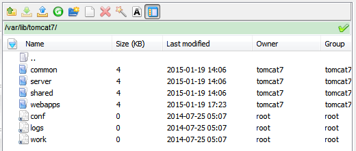

tomcat notes
====

## ubuntu安装tomcat

在ubuntu中安装tomcat有两种方式，一种是在tomcat官网下载一个，然后自己手动的进行配置，另外一个是直接使用apt-get来安装。

一般的，可以使用在官网下载，然后再自己手动配置，但是经过我的仔细研究之后，发现使用apt-get是一种更好的方法。

如果在官方下载，那么我们需要自己配置`CATALINA_HOME`,`CATALINA_BASE`这两个环境变量。要启动和关闭tomcat也需要使用其bin目录下的sh文件来完成。

按照
[阿里云中安装tomcat](../../aliyun/aliyun.md)的方法，可以使用apt-get将tomcat安装好。

### 在Ubuntu中找到tomcat7的文件

使用`dpkg -L tomcat7`可以看到tomcat7安装了哪些文件，使用`apt-cache depends tomcat7`，会发现tomcat7在安装的时候是依赖于`tomcat7-common`这个包的，使用`dpkg -L tomcat7-common`就可以看到所有被安装的文件了。

在这些被安装的文件中，很重要的一个是

	/etc/init.d/tomcat7

这个是systemv init系统中使用的启动服务的标准脚本。

我们知道要让tomcat7正确的运行起来，我们需要设置`CATALINA_HOME`,`CATALINA_BASE`这个两个环境变量，
通过仔细的读这个脚本，可以发现在这个脚本中有如下的设置

	CATALINA_HOME = /usr/share/tomcat7
	CATALINA_BASE = /var/lib/tomcat7

如上，CATALINA_HOME路径下会有bin和lib来那个文件夹，其表示的tomcat的可执行文件所在的地方。

如上，CATALINA_BASE路径下会好多个其他的文件夹，其中conf和webapps是我们平时关心的比较多个。
注意到后面的三个路径是链接,它们链接到的路径如下

注意到conf链接到了/etc/tomcat7，所以我们改东西的时候才会不断的在这个目录下面进行修改。

>从这里可以看出，deb包的一个特点就是其不会完全遵照软件开发者的文件组织的方式，而是会将这些文件安装deb喜欢的方式重新放到不同的目录中去，这个也是大家觉得deb包做得不好的一个地方。但是如果使用`dpkg -L xxx`和`apt-cache depends xxx`，我们还是可以知道deb包到底把软件原来的东西放到哪儿去了。

## windows下idea调试要注意的问题

在windows下，tomcat有一个msi安装包，可以一键安装tomcat，但是在开发的时候，我还是喜欢其zip包

解压出来之后，会发现如果我们要设置环境变量，那么需要将CATALINA_HOME和CATALINA_BASE需要设置的路径变成了一样的。

我使用的是idea来进行开发，发现不需要进行环境变量的设置，正确的配置了tomcat之后，启动对tomcat的调试之后，会有如下的信息

可以看出，CATALINA_HOME就是我解压出tomcat所在的地方，CATALINA_HOME_TMPDIR是idea自己设置的了，JRE_HOME是因为我安装了JDK，然后在idea中进行了设置，所以其能找到。CLASSPATH是idea设置的。

最重要的是CATALINA_BASE这个参数，idea并没有直接设置成我解压出的地方。我当前使用的工程名字为`usemvc`，所以idea生成了这样的一个目录。

在这个目录下面，有如下的结构，这就是一个CATALINA_BASE需要有的结构，其中的conf中的文件是从解压出的文件夹中的conf中复制过来的

最主要的是，在`C:\Users\Administrator\.IntelliJIdea14\system\tomcat\Unnamed_usemvc\conf\Catalina\localhost`中，有一个ROOT.xml文件。

根据tomcat的配置文件的结构，其表示Catalina这个Engine，localhost这个host下面的ROOT这个context的配置。
ROOT这个context和其他的又不一样，在访问的时候，其不需要在路径中出现ROOT这个部分。

	<?xml version="1.0" encoding="UTF-8"?>
	<Context path="" docBase="E:\spring\usemvc\target\usemvc" />

其中的内容为，这儿最重要的是其将docBase指向了我们正在开发的工程。

>这个地方的具体的关系学习了tomcat的文档就可以知道了。

## servlet和servletContext
使用servlet的时候，最让人疑惑的一个事情就是关于servlet和servletContex的关系。
有了tomcat的基本知识，我们就可以更加清楚的知道它们的关系了。

从上面的知识可以知道运行的每个web application都对应着tomcat架构中最底层的一个Context. 在servlet api中，使用了`javax.servlet.ServletContext`来代表这个Context.在同一个web application(Context)中定义的servlet会share这个ServletContext的内容。

在context的配置文件中，一般都会用docBase指向这个web application的根目录，在那个目录下面的`/WEB-INF/web.xml`中会定义一些servlet，这些servlet就会分享一个ServletContext的内容。这个ServletContext也就是我们一般说的root Context。

## 将tomcat绑定到80端口
在默认的情况下，tomcat使用的是8080，这个在开发的时候是没有问题的，但是如果要发布，那么需要把网站绑定在http默认8443端口，因为这样访问起来才更加的安全。

在linunx中，如果要将应用程序绑定到1024以下的端口，需要使用authbind这个包

	sudo apt-get install authbind

编辑/etc/default/tomcat7这个文件

	nano /etc/default/tomcat7

添加如下的一行

	AUTHBIND=yes

也可以把AUTHBIND的值改为yes然后解除注释。

然后修改`$CATALINA_BASE/conf/server.xml`文件

    <Connector port="8080" protocol="HTTP/1.1"
               connectionTimeout="20000"
               URIEncoding="UTF-8"
               redirectPort="8443" />
将上面的内容改为

    <Connector port="80" protocol="HTTP/1.1"
               connectionTimeout="20000"
               URIEncoding="UTF-8"
               redirectPort="443" />

上面的443端口是给https使用的，如果没有使用https，那么可以不使用。

这样做了之后再重启tomcat就可以了。

>因为使用的是阿里云，在网站没有备案之前，使用80端口是不被允许的，所以在开发的时候就使用8080端口，等到部署的时候再改为80端口就可以了。
