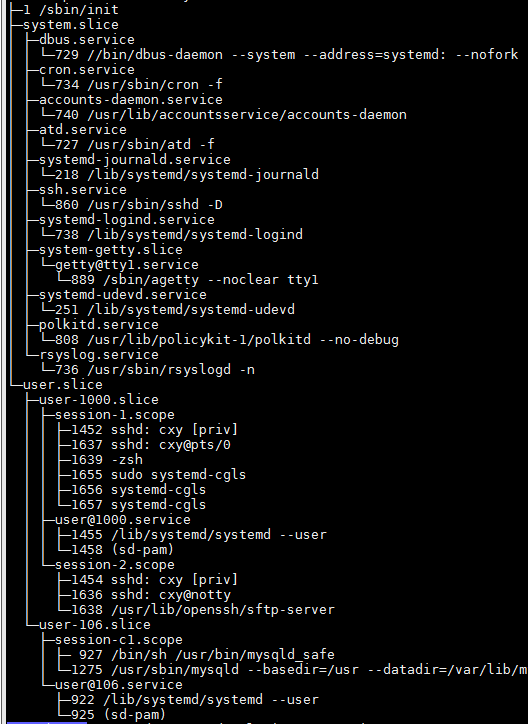

# cgroups

cgroups是Linux中用来进行资源管理的一种技术，最开始是google的工程师开发出来的，后来被merge到了Linux kernel中，其是在2.6版本的kernel中merge的。而现在的发行版使用的kernel一般都是3.x的版本，所以一般都是使用了。
在现在Linux中比较火的技术是docker，docker就十分依赖于cgroups。

在cgroups之前，对于系统中的每一个进程，系统都是平等的对待的，也就是有些进程可以使用很多的系统资源。系统的资源管理是以进程作为基本单位的。

## cgroups介绍
### cgroups的层次结构
在现在的发行版中，一般都是使用的systemd来作为系统的init程序和对系统进行管理.cgroups也是受到systemd的管理的.

cgroups使用了一个层次结构来管理系统的资源

cgroups的层次结构使用了systemd中的slice,scope,service的层次。

* service:一个service下面有一个或者是多个进程，systemd使用一个unit文件来表示这个service。

* scope:scope中的进程不是通过一个unit配置文件来启动的，而是一个进程中调用了`fork`函数出来的进程。

* slice: cgroups是一个树形结构，进程是这棵树的叶子节点，service和scope是叶子节点上面的一个分支节点，这颗树上面的其他节点就是slice节点。

默认情况下，系统会创建下面的几个slice

* -.slice 这个是cgroups这棵树的根节点
* system.slice 系统的服务都会被放在这个节点下面
* user.slice 所有用户的session都会被放在这个节点下面

所有的用户的session(就是一个登陆)都会被放在一个单独的scope下面。所有的用户都会有一个单独的slice

使用`systemd-cgls`可以得到当前cgroups的树形结构。

如上是从我运行的系统中得到的。

从上图中可以看到，所有的进程都在scope和service中，scope和service都在slice中，一个例外是init这个进程，其直接在-.slice中。
在system.slice中的都是一些service，每一个下面都是一个进程在运行。

user.slice下面有两个子节点。user-1000.slice是我们用户，usr-106.slice是mysql用户，这下面运行的程序都在一个scope中。

### cgroup subsystem
cgroup subsystem也叫做resource controller,用来表示系统中的一个单独的资源，比如说cpu的分片时间，系统的内存等等。

## 使用cgroup
### 创建cgroup
cgroup分成两类，一个是transient的，也就是瞬时的，就是想要的进程运行完了就不存在了的。
一个是persistent的，其需要编辑一个Unit文件，其会在系统启动的时候被使用。

#### 创建transient cgroup
使用systemd-run可以用来创建瞬时的cgroup

	systemd-run --unit=name --scope --slice=slice_name command

--name表示service或者scope的名字，如果不给出来的话，那么系统就会生成一个名字，一般来说，我们都会给出一个有意义的名字

--scope表示创建的进程要放到一个scope中而不是默认的service中去。一般我们都不会设置这个参数。

--slice= 表示将创建的service或者是scope放到一个指定的slice下面去。如果不指定这个选项的话，那么其会被放到system.slice下面去。如果指定的名字对应的slice是不存在的，那么其会被新建，如果存在，那么这个service或者是scope会被添加到下面。

比如我使用了--slice=cxy-test-slice，那么其会创建三个slice，cxy.slice,cxy-test.slice,cxy-test-slice.slice，因为cgroup的树形结构就是这样规定的。

后面的command就是要运行的程序了，其当然会开启一个新的进程。

#### 创建persistent cgroup
永久的cgroup需要使用一个unit配置文件来创建，然后使用

	systemctl enable
命令行来使其在系统启动的时候创建。

### 删除cgroup
对于瞬时的cgroup,如果其运行的程序会自动退出的化，那么这个程序退出了之后，这个cgroup就自动被释放了。

如果这个程序不会自动退出，比如说其实一个deamon,那么可以使用

	systemctl stop name.service

那么表示要结束的cgroup的名字。

如果一个cgroup中包含了好几个process，那么可以使用

	systemctl kill name.service --kill-who =PID,... --signal=signal

其表示kill掉一个cgroup中的指定pid的进程，而不是完全的结束一个cgroup

对于一个persisten的cgroup,需要使用

	systemctl disable name.service

这样这个service在系统启动的时候就不会启动了。
