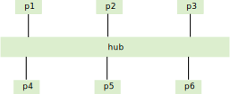
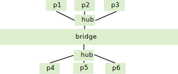
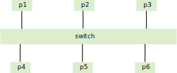

# 以太网

作为有线局域网事实上的标准,以太网是我们现在用得非常多的局域的形式.而且市面上的网卡大部分都是以太网卡,各种网络中间的设备也大部分是以太网设备.

以太网是IEEE 802.3这一组协议规定的.在TCP/IP协议协议栈中,其规定了物理层和链路层,我们最关心的还是起链路层的规定,因为其中有一个MAC协议.

另外一个使用也相当多的局域网也是IEEE制定的标准,其为802.11,这个也就是我们常说的wifi.

## 多址接入协议
以太网使用共享传输媒介的方式来进行数据的传输,意思是可以认为所有的接口都是在同一个总线上面的(实际上,以太网最开始的设计图纸上面,就是使用的总线的方式).

在共享媒介的传输中,都需要提供某种形式的多址接入控制协议,也就是常说的MAC协议.
有三种常用的MAC协议,信道划分协议,随机访问协议,轮流协议.

### 信道划分

也就是将共享信道进行某种形式的划分,这种协议在无线中使用最多. 比如常用的tdma,fdma,cdma协议,其核心思想就是将共享信道按照时间,频率,码字进行划分,每个用户(接口)使用其中的一个部分.

信道划分的优点是各个接口不会冲突,也就是他的数据传输不会和其他的接口的数据传输混在一起. 缺点是效率比较低,因为其不能保证任何时候都有数据在信道上面传输.

### 随机接入

在有线的环境中,我们一都不会使用信道划分的形式,因为其效率比较低. 在当前最成功的以太网中,就是用了csma/cd,也就是带冲突检测的载波侦听协议. 其中的cs为carrier sensing,cd为collision dection. 其包含两个重要的部分.

* 开始传输之前要先侦听信道, 也就是在没其他接口传输数据的时候才可以传输数据.
* 传输数据的时候,如果检测到碰撞,那么停止数据的传输.
如果有两个(或者更多)接口都想传输数据,如果它们都侦听到信道是空闲的,那么它们都会向信道发送数据,那么一定时间之后(就是一个接口发送的数据到了另外一个接口),接口就会检测到碰撞,它们都会停止数据传输.在等待随机的一个时间之后,这些接口又会开始信道的侦听和数据的传输.

总的来说,csma/cd是一个工作很好的有线LAN的MAC协议.

其有一个限制是必须保证所有的接口之间的距离不能太远了,因为如果太远了,那么如果真的有两个接口在同时发送数据,那么在数据发送完了之后,一个接口的数据都还没有到达另外一个接口,但是在共享的信道上,这两个数据是碰撞了的,而这个碰撞却没有被检测到,这也是为什么在以太网中,接口之间的距离不能超过100m.

### 轮训
轮训也是用在有线LAN中的一种MAC协议,起操作起来比随机访问更加复杂. 其核心思想是使用一个token,每个接口要传输数据的时候,必须得到这token.

因为现在有线局域网中以太网已近战局了统治地位,所以轮训的机制在LAN中使用的也是比较少的.

## 常用的网络设备

传统的,以太网进行数据传输的时候,其是使用组侦的方式,就是将要传输的,数据组成一个一个的frame,每个frame的大小都是有规定的.传输的时候,需要遵守CSMA/CD协议,就是不断的监听共享的链路上面是不是没有数据在传输,如果是的话,那么就发送数据.这就很有可能会同时有几个接口都发送了数据,这个时候就会发送碰撞,这种碰撞是可以被检测到的,如果发生了碰撞,那么这些接口就会使用随机回退的方式,等待一定的时间再发送数据.

以太网的这种工作方式有一个问题,就是当共享链路上面有很多的接口的时候,基本上就不能正常的发送数据了,因为总是可能会发生碰撞.

为了解决这个问题,有如下的三种常用的以太网设备(不是以太网接口)

### hub
最简单的就是一个hub,也就是集线器

其图示如上,因为我们使用的双绞线只有两个头,集线器就将所有一个LAN中的接口连接到一起来,但是我可以认为他是透明的,因为起会将接收到的任何一个包都从每一个头转发出去.所以在很大的LAN中使用集线器,这个LAN上面跑的包很多,但是其中有用的包并不多.比如上图中,p1要发送一个包到p6,集线器在收到p1传过来的包之后,会将其从p2-p6的每个头发出去,但是这些包在到达p2-p5的时候,因为这些包的目的MAC地址不是他们,所以会被丢弃.

### bridge

bridge比hub复杂了一些,其只有两个接口,可以将LAN中的接口分为两组,从一个组中的一个接口出来的包,如果其目的地址不是另一个组的,那么这包就不会被发到另外一个组中去.这样基本可以减少LAN中一半不需要被转发的包.

### switch

switch比bridge更进了一步.LAN中的每个接口都会连接到switch上面,switch只会将包转发到目的接口,其他的接口都不会转发.比如p1要发送一个数据到p6,那么数据从p1来到switch后,switch只会将这个包从连接到p6的那个接口发出去,其他的接口都不会发.这样LAN中跑的包基本都是必须要的了.

当然,对于那些目的地址是broadcast的包,switch也会将这个包从每个接口转发出去.

以前大量的使用hub和bridge是因为switch的制造成本比较高,但是现在switch的制造成本下来了,所以现在switch(交换机)在LAN中是普遍存在的.

使用交换机还有一个好处是其可以达到全双工的传输速度. 因为现在的网线使用的都是双绞线,上传和下载是走不同的线,所以在p1向p6发送数据的时候,p6也可以向p1发送数据.

