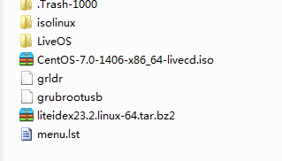

centos的安装方法
===

linux有很多的发行版，我比较喜欢稳定的版本，所以选择使用基于rhel的centos。

## 安装准备
### 下载ISO文件
首先，需要下载centos的ISO文件，可以从centos的官网下载，但是在国内，访问centos的官网非常满，所以推荐使用ustc的源。

下载的时候，有几个版本可以选择，其中DVD是推荐的，但是必须要安装之后才能使用,livecd更小一些，但是其可以不安装就体验，所以我下载的是livecd。

### grub4dos的u盘安装

#### 制作grub4dos的U盘启动盘
我不想使用刻录光盘的方式来安装，而是使用U盘安装，所以使用grub4dos，grub4dos可以将grub(1)安装在一个U盘中,具体的安装方法可以在网上看到，在安装grub4dos到U盘的时候，使用的是grubinst_gui2这个程序。安装了之后要将grub中的glrdr和menu.lst文件复制到U盘的根目录。
#### 将centos的ISO解压
将下载的ISO文件中的isolinux和liveOS两个目录解压到U盘根目录，同时将该ISO文件放到U盘根目录。此时U盘会有下面的文件。



#### 在menu.lst中添加启动项
在menu.lst中，需要如下的命令，在我安装的时候，大部分的时间都用在搜索怎么给出下面的命令了
```
title install centos 7
find --set-root /grubrootusb
kernel /isolinux/vmlinuz0 root=live:UUID=B4FE-5315 rootfstype=auto ro rd.live.image quiet  rhgb rd.luks=0 rd.md=0 rd.dm=0
initrd /isolinux/initrd0.img
```

第一句表示title的，使用过grub4dos的都知道。当开机启动加载出来grub之后，就可以看到`install centos 7`这个选项。

第二句是用来将U盘变成grub4dos操作的根目录的，我们更常见的是使用`root (hdx,y)`这个命令，但是使用`find --set-root /grubrootusb`可以避免我们去猜测U盘到底是hd几，要注意这样写必须保证我们给出的这个文件的名字是独特的。

第三句是**最重要**的一句，将centos的内核加载，实际上，当安装其他发行版的linux的时候，其他的步骤都是一样的，只是传递给内核的参数是不同的。网上有很多安装ubuntu的时候要使用的参数的例子，但是对于centos，大部分都是不对的（我在这儿用了很多的时间）。上面的参数也不是凭空给出来的，使用`isolinux`目录下面的`isolinux.cfg`给出来的。


其中的`root=live:UUID=B4FE-5315`表示的是liveos在U盘下面，这个U盘的UUID是B4FE-5315，在windows下面，使用`vol`命令就可以得到了。其他的内核参数都是固定的。


在完成了上面的设置之后，重新启动电脑，从U盘启动就可以进行centos的安装了。

