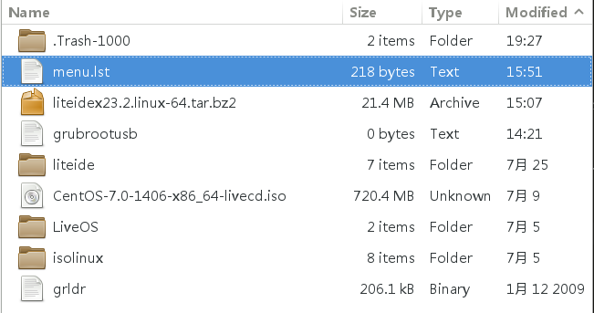

centos的安装方法
===

linux有很多的发行版，我比较喜欢稳定的版本，所以选择使用基于rhel的centos。

## 安装准备
### ISO文件
首先，需要下载centos的ISO文件，可以从centos的官网下载，但是在国内，访问centos的官网非常满，所以推荐使用ustc的源。

下载的时候，有几个版本可以选择，其中DVD是推荐的，但是必须要安装之后才能使用,livecd更小一些，但是其可以不安装就体验，所以我下载的是livecd。

### grub4dos的u盘安装

#### 1.制作grub4dos的U盘启动盘
我不想使用刻录光盘的方式来安装，而是使用U盘安装，所以使用grub4dos，grub4dos可以将grub（1）安装在一个U盘中



在menu.lst中，需要如下的命令，在我安装的时候，大部分的时间都用在搜索怎么给出下面的命令了
```
title install centos 7
find --set-root /grubrootusb
kernel /isolinux/vmlinuz0 root=live:UUID=B4FE-5315 rootfstype=auto ro rd.live.image quiet  rhgb rd.luks=0 rd.md=0 rd.dm=0
initrd /isolinux/initrd0.img
```

第一句表示title的，使用过grub4dos的都知道。

第二句是用来将U盘变成grub4dos操作的根目录的，我们更常见的是使用`root (hdx,y)`这个命令，但是使用`find --set-root /grubrootusb`可以避免我们去猜测U盘到底是hd几，要注意这样写必须保证我们给出的这个文件的名字是独特的，
