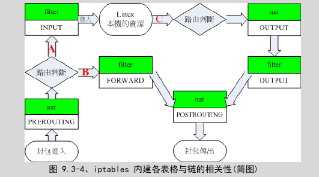

使用iptables进行防火墙和nat的管理
===

linux中使用netfilter来进行防火墙的功能,netfilter是内核的内建功能,对外linux提供了iptables
这个命令来进行管理.

iptables中包含了几个内建的table,它们为filter,nat,mangle,每个table中包含几个chain,
下图是这些chain作用的时间

一般的,我们会使用的filter中的INPUT和OUTPUT比较多,因为这两个chain是管理是否让一个package
进入系统和是否让一个package从系统发出去的.

nat这个table是用来管理网络地址转换的,如果系统中安装了虚拟机,或者是使用像docker一样的
程序来完成虚拟化功能,一般的,这些虚拟机都需要有网络连接可以使用. 那么使用在主机中使用NAT
就是最直接方便的办法了.

## 查看当前的iptable

	iptables [-t table] -L

-t后面是要查看的table,默认情况下,使用的是filter这个table, -L是list的意思

	Chain INPUT (policy ACCEPT)
	target     prot opt source               destination

	Chain FORWARD (policy ACCEPT)
	target     prot opt source               destination
	DOCKER     all  --  anywhere             anywhere
	ACCEPT     all  --  anywhere             anywhere             ctstate RELATED,ESTABLISHED
	ACCEPT     all  --  anywhere             anywhere
	ACCEPT     all  --  anywhere             anywhere

	Chain OUTPUT (policy ACCEPT)
	target     prot opt source               destination

	Chain DOCKER (1 references)
	target     prot opt source               destination

上面是在的主机上面使用这个命令得到的结果.
对于进来的数据包,因为INPUT中没有任何的rule,所以使用其默认的policy,也就是ACCEPT,让其
通过,同样的,对于出去的数据包,也是让其通过. 对于FORWARD的包,也就是这个包并不是要进入
到当前的linux主机的,有一些相应的规则.

需要注意的是,在我的主机上面运行了docker daemon,所以后面还有一个DCKER chain.

还可以使用另外一个命令来查看itables

	cxy@cxy-X9DAi:~$ sudo iptables-save -t filter
	# Generated by iptables-save v1.4.21 on Thu Apr  9 21:48:42 2015
	*filter
	:INPUT ACCEPT [12596:13026127]
	:FORWARD ACCEPT [0:0]
	:OUTPUT ACCEPT [7828:624978]
	:DOCKER - [0:0]
	-A FORWARD -o docker0 -j DOCKER
	-A FORWARD -o docker0 -m conntrack --ctstate RELATED,ESTABLISHED -j ACCEPT
	-A FORWARD -i docker0 ! -o docker0 -j ACCEPT
	-A FORWARD -i docker0 -o docker0 -j ACCEPT
	COMMIT
	# Completed on Thu Apr  9 21:48:42 2015
上面使用了itables-save命令来实现对一个table的dump操作,这个命令有点像mysql数据库的dump
操作,其输出的内容可以被放到`iptables-restore`命令来恢复.

可以看到,以`#`开始的是注释,`*filter`表示下面的命令是针对filter这个table的.
以`:`开始的是定义一个chain,可以看出,一个定义了4个chain,`:INPUT ACCEPT [12596:13026127]`
表示INPUT这个chain的默认操作是ACCEPT.

后面的四行用于向每个chain里面加入/删除/改变一个rule,这里向FORWARD chain里面加入了四条
rule.

## 修改iptable

	iptables [-AID 链名] [-io 网络接口] [-p 协议] [-s 来源IP] [-d 目的IP] -j [ACCEPT|DROP|REJECT|LOG]

上面为修改iptable的基本的语法.

-A表示在chain中增加一条rule,增加的这条rule会变成最后一条rule,比如原来有1-4这4条rule,
那么增加的rule会变成第5条.

-I和-A类似,只是增加的会变成第一条.

-D会删除一条rule.

链名为INPUT,OUTPUT,FORWARD之类的.

-i,-o指包进入和出去的网络接口,比如eth0,wlan0,也就是使用`ifconfig`命令得到的哪些接口的名字.

-p 指定匹配的协议,如果一个包是指定的协议的,那么才会匹配这个rule,有tcp,udp,icmp,all.

-s 指定这个包中的来源IP; -d表示这个包中的目的IP. 如果在前面加上`!`,表示非的意思.
比如`! -s 192.168.100.0/24`表示不是不是来自于192.168.100.*这个网段的包.

-j后面跟上的是对这个包的处理动作.

比如
	
	iptables -A INPUT -i lo -j ACCEPT
表示只要是从lo进来的包,都接受. 因为没有指定-s,-d选项,而没有指定的选项就是any的意思.

	iptables -A INPUT -i eth0 -s 192.168.100.10 -j ACCEPT
	iptables -A INPUT -i eth0 -s 192.168.100.230 -j DROP
表示从对一个IP的包拒绝,对另外一个IP的包接受.

## 针对TCP,UDP的端口进行设置
对于TCP和UDP的包,在其协议字段中,有端口的设置. 所以防火墙对于这两种协议的端口也可以设置.

> 需要注意的是,并不是所有的传输层协议都是有端口的概念的,一个很典型的就是unix socket协议,
其通过unix系统上的一个特殊的文件来标识唯一性,而不是通过端口来标识.

	[--sport 端口范围] [--dport 端口返回]
当使用这两个参数的时候,一定要同时设置-p参数,其要为tcp,udp中的一个.

	iptables -A INPUT  -p tcp --dport 21 -j DROP
要连接到这台主机的使用tcp协议,且为21号端口的包都DROP,这样默认配置的ssh就进不来了.

	iptables -A INPUT -p tcp -s 192.168.1.100.0/24 --sport 1024:65534 --dport ssh -j DROP
表示从192.168.1.100.0这个网段过来的,源端口是1024-65534,目的端口是ssh(22)的包都会被丢弃,这样这个网段
的主机就不能ssh登录了.

## 针对TCP的SYN的防火墙
TCP连接建立的时候有3次握手的过程,也就是client发送SYN包,server回复ACK+SYN,然后client再回复
ACK的连接建立过程.

### TCP连接建立过程
tcp使用三次握手来建立全双工的连接. 当然,在client想要通过TCP连接到server之前,server端必须处于
监听这个tcp端口的状态. 比如说,我们想要使用浏览器访问一个网站,那么这个网站的http服务其必须已经处于
监听tcp 80端口的状态了.

* client发送一个SYN包,也就是发送的这个TCP包中没有包含任何的数据部分,只有TCP的头部,在头部中的
SYN被置位. 此时,这个包的source port为client系统随机分配的一个端口,一般都是1024以上的端口,dst port为
80. sequence nubmer会被设置一个随机的32bit的值,比如为`A`,ACK number没有用.

* 这个包进入到server之后,操作系统会看到这个TCP包中SYN被置位了,知道这是一个发起TCP连接的请求,
所以会在系统中新建一个用于处理TCP的对象,然后发送SYN+ACK包,这个包中也是没有数据的,
其中ACK被置位,ack number为`A+1`,SYN也被置位,seq number也是一个随机的值,比如为`B`. src port为80
和dst port为client端的大于1024的那个值.

* 这个包进入到client. 首先,client看到其ACK,发现其ACK NUMBER为`A+1`,知道从 client-->server这半边的
数据发送是可以的了. 然后client会看到这个包中的SYN被置位了,表示server也想向client发送数据, client构造
一个ACK包,其中的ack number为`B+1`. 同时,client如果有数据要发送的话,也可以将数据放在包的后面,
这样seq number就需要根据数据的大小来设置了.

基于TCP连接建立的3次握手过程,可以对这个服务器实施SYN包攻击.
让很多台client(或者是同一台client)同时向一个server发起TCP连接请求,也就是发送一个SYN包,服务器
收到这个SYN包之后,必须建立一个TCP对象,然后返回一个ACK+SYN包. 这些client在接收到这些ACK+SYN包之后
并不回应ACK,而是直接丢弃,TCP有自动重传功能,所以在一定的超时之后,server又会发送这个ACK+SYN包过来,但是
client还是丢弃.

如果同时发起SYN请求的client足够多,那么server就会创建很多的tcp对象,而且会不断的发送ACK+SYN包,导致系统的
内存和网络一直都很拥堵,根本就无法服务其他正常的client的请求.

