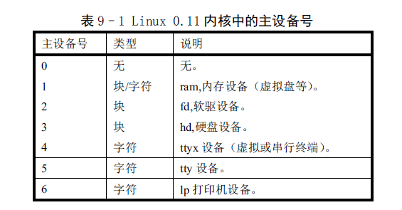

# linux-device

linux中的外部设备都有一个设备号.
设备是是一个int型的数,但是其总是整数,而且总是低16位才有值.

设备号分成两个部分,major号和minor号.同一类设备有相同的major号,这一类设备的不同设备有不同的minor号.

上图为0.11中使用的设备的主设备号.

为了从一个设备号中得到major和minor号,0.11中定义了两个宏.

    #define MAJOR(a) (((unsigned)(a))>>8)
    #define MINOR(a) ((a)&0xff)

这两个宏的操作还是很直观的.
