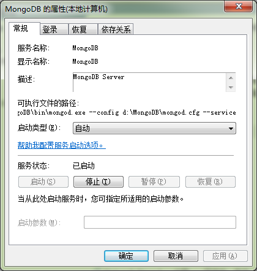

mongodb的安装
========
mongodb是比较流行的nosql，其使用的是bson的存储方式。原生的支持js的访问API，同时有很多的其他语言的绑定。
## 在windows下的安装
[官方文档](http://docs.mongodb.org/manual/tutorial/install-mongodb-on-windows/)中其实已经详细的说了在windows下面怎么安装。我这儿基本上是翻译和一些要注意的事情。

### 下载
我下载的是64位的，最好是下载msi的，但是其实zip的也是一样的。mongodb的程序是静态链接的，也就是其就是一个exe文件，没有其他的dll文件需要使用。

注意安装之后最好将文件夹改一下名字。比如我安装完了就在`D:\MongoDB`
下面

### 将mongodb注册为一个service
直接运行mongod.exe是可以的，但是更好的办法是将其注册为一个service，在命令行中运行
```	
"d:\MongoDB\bin\mongod.exe" --config "d:\MongoDB\mongod.cfg" --install
```

在文件`d:\MongoDB\mongod.cfg`中的内容是
```
logpath=E:\mongodb\log\mongo.log
dbpath=E:\mongodb\data
```
也就是指名数据库的数据放的地方和log文件的名字。

这样在`服务`中就可以看到`MongoDB`这个服务了。



可以看到，其实这个服务也是调用了mongod.exe，不过是以`--service`的方式启动的。

将其启动类型变成`自动`,那么系统启动的时候就可以启动了。