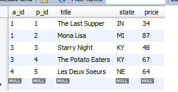
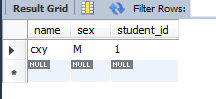
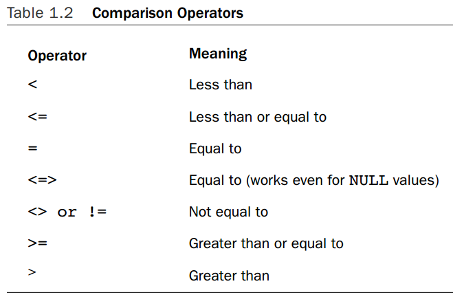

mysql的使用
========

### 创建一个用户

在创建数据库之前，需要有一个用户，这个用户一般都不是`root`，因为`root`一般只用来做数据库的管理。

要创建一个用户，首先需要在本地通过`root`用户登陆

	mysql -h localhost -u root -p

然后就可以创建用户了。	

	CREATE USER 'book'@'%' IDENTIFIED BY 'cbpass';
	GRANT ALL ON cookbook.* TO 'book'@'%';
	
这样就创建了一个用户，这个用户可以从任何的地方登陆，如果需要限制其登陆的地点，那么在`@`后面需要指定一下。
注意在创建了一个用户之后，一定要记得给这个用户一些权限，在这了，给了`book`这个用户操作`cookbook`这个数据库的所有权限。

需要注意的是怎么使用`mysql`登录一个数据库的问题。如果只是用`mysql`命令，那么一般都会得到如下的结果

	cxy@ubuntu:~$ mysql
	ERROR 1045 (28000): Access denied for user 'cxy'@'localhost' (using password: NO)

这是因为当不指定登录使用的用户和其host的时候，会使用当前系统中的用户和Host设置，在我使用的Ubuntu server中，用户为`cxy`,host设置为`localhost`，而在数据库中，这个用户是不存在的，所以当然是不可以的

正确的是如下的命令

	cxy@ubuntu:~$ mysql -u cbuser -h 192.168.0.170 -p
`-u`指定要使用的用户名，`-p`表示会提示输入密码，`-h`表示要连接到的主机。如果要连接到本机的数据库，那么可以不指名`-h`.这儿我是连接到了`192.168.0.170`上面的mysql数据库。这儿使用了默认的`3306`端口，如果要使用其他的端口，需要使用`-P 3309`之类的来指定端口。

>在连接的时候，使用`127.0.0.1`和`localhost`是有区别的。如果使用的是`localhost`，那么会使用unix socket file来进行传输，如果使用`127.0.0.1`或者是IPV6的`::1`，那么就算在本机上面，也会使用TCP/IP来进行数据的传输。

### 使用一个Option文件来指定选项
可以看到，如果每次使用mysql的时候都需要指定上面给出的所有信息，那么还是比较麻烦的。mysql可以使用一个配置文件来指定这些信息。

在Linux中，有两个地方可以有配置信息。`~/.my.cnf`是当前用户的配置信息。`/etc/mysql/my.cnf`是所有用户都会有的配置信息。因为mysql的配置信息如果有相同的，那么是后出现的优先级高，所有可以认为是当前用户的配置信息的一个section会加到了系统级的配置信息同一个section的后面变成了一个文件。

配置信息文件的给事是`ini`文件。也就是分成了几个section。每个section表示对一个程序的配置。

`[client]`这个section比较特殊，其会作用于所有的mysql的client，比如`mysql`,`mysqldump`，`mysqladmin`这些工具。

	[client]
	port		= 3306
	socket		= /var/run/mysqld/mysqld.sock
	
	[mysqldump]
	quick
	quote-names
	max_allowed_packet	= 16M
如上是`/etc/mysql/my.cnf`的一部分，表示`mysqldump`这个程序会合并client中指定的选项和mysqldump中指定的选项，如果有相同的，因为mysqldump这个section出现在后面，所有会使用mysqldump中指定的。

如果想要每次使用mysql程序的时候不再指定用户，密码之类的东西，那么可以在`~/.my.cnf`中添加如下的信息

	[mysql]
	host = localhost
	user = book
	password = book

使用

	mysql --print-defaults
可以打印出直接使用`mysql`时使用的默认选项。
	

### 创建用户要操作的数据库以及一些表
用户创建了之后，就可以用这个用户登陆的，登陆这个用户可以使用本地的`mysql`程序登陆

	mysql -h localhost -u cbuser -p
	
也可以在远程使用其他的客户端登陆，比如我就是在一个`Ubuntu server`上面安装的数据库，然后在windows上面安装了一个`workbench ce`，通过这个GUI来远程操作这个数据库。

登陆之后，需要创建`cookbook`这个数据库

	CREATE DATABASE cookbook;
	USE cookbook;
这样下面的所有操作就是在这个数据上面了。

新建一个表

	CREATE TABLE limbs (thing VARCHAR(20), legs INT, arms INT);
然后想=向这个表中添加一些数据

	INSERT INTO limbs (thing,legs,arms) VALUES('human',2,2);
	INSERT INTO limbs (thing,legs,arms) VALUES('insect',6,0);
	INSERT INTO limbs (thing,legs,arms) VALUES('squid',0,10);
	INSERT INTO limbs (thing,legs,arms) VALUES('fish',0,0);
	INSERT INTO limbs (thing,legs,arms) VALUES('centipede',100,0);
	INSERT INTO limbs (thing,legs,arms) VALUES('table',4,0);
	INSERT INTO limbs (thing,legs,arms) VALUES('armchair',4,2);
	INSERT INTO limbs (thing,legs,arms) VALUES('phonograph',0,1);
	INSERT INTO limbs (thing,legs,arms) VALUES('tripod',3,0);
	INSERT INTO limbs (thing,legs,arms) VALUES('Peg Leg Pete',1,2);
	INSERT INTO limbs (thing,legs,arms) VALUES('space alien',NULL,NULL);
这样，对于`mysql`数据的基本操作就是这样了。

## CRUD操作
使用数据库的时候最重要的操作就是CRUD操作，也就是create,retrieve,update,delete操作，其他的所有的操作要么是为了系统的安全，要么是为了更好的管理数据库。

### SELECT
mysql中的retrieve操作是统统`SELECT`完成的。

mysql是一种关系型数据库，也就是一个数据库中的很多个表配合起来才能完成我们需要的工作。

	CREATE TABLE artist
	(
	 a_id INT UNSIGNED NOT NULL AUTO_INCREMENT, # artist ID
	 name VARCHAR(30) NOT NULL,  # artist name
	PRIMARY KEY (a_id),
	 UNIQUE (name)
	);
	CREATE TABLE painting
	(
	 a_id INT UNSIGNED NOT NULL,  # artist ID
	 p_id INT UNSIGNED NOT NULL AUTO_INCREMENT, # painting ID
	 title VARCHAR(100) NOT NULL,  # title of painting
	 state VARCHAR(2) NOT NULL,  # state where purchased
	 price INT UNSIGNED,  # purchase price (dollars)
	 INDEX (a_id),
	 PRIMARY KEY (p_id)
	);
如上的两个表，一个表是表示所以的画家的，另外一个表表示作品。这两个表配合起来我们才可以知道需要的网站的信息。他们的内容如下

>需要注意的是在artist中，a_id是PK，所以其默认就是做成了index的。而在painting中，p_id是PK，但是因为a_id也会被用在jion的时候使用，所以也需要做成INDEX。

为了得到完整的信息，需要将几个表结合起来，那么就是SQL中的`join`语句，sql中join有各种join的方式。

#### inner join
inner jion就是做笛卡尔积，如果两个表做inner join，第一个表有3行，第二个表有4行，那么join起来的表就有12行，而这个表出现的方式就是对第一个表的任意一行，第二个表的所有行都添加到后面去。

inner jion起来的表会相当大，首先，如果两个表的行都比较多，那么总的行数会很多，如果两个表的列数还比较多，那么总的列数也会很多。

	select * from 
		artist inner join painting 
	order by artist.a_id;
	

上面是将`artist inner join painting `的结果，得到表有20行，每行有7列。
观察这个结果，我们会发现有些行是没有用的，只有那些`artist.a_id`和`painting.a_id`相同的行才是有意义的行。

所以对于`inner join`的结果我们一般都是会进行处理的

	select * from 
		artist inner join painting 
	where artist.a_id = painting.a_id
	order by artist.a_id;
如上，第一个可以使用的处理方法是使用`select`的`where`操作。使用where操作的过程是在inner join已经生成了上面的20行之后，将`artist.a_id = painting.a_id`的那些行滤出来。

>注意这儿的缩进方式，where这个clause是属于select的，所以我将其缩放做成了语言的。

	select * from 
		artist inner join painting 
		on artist.a_id = painting.a_id
	order by artist.a_id;
第二种方式是使用join的on，注意on是属于join的，所以和其一个缩进。

	select * from 
		artist inner join  painting 
		using(a_id)
	order by artist.a_id;
	
第三种方式使用的是join的using。

注意using是的语法中就不用指名表的名字了，其就是检查两个表的列的名字要相同。在这个情况下其会简单一些，但是如果需要更加大的一个条件，还是需要使用on。

这儿注意到使用select的where和join的On可以完成相同的事情，但是他们使用的场景是不一样的。on是用来让join起来的表满足我们的要求。而where是从这个表中选出需要的东西。

使用`select *`会将所有的列都打出来，我们可以选择需要打印的列，就是将`*`变成需要的打印的列

	select artist.name, painting.title,painting.state,painting.price from 
		artist inner join  painting 
		on artist.a_id = painting.a_id
	where painting.state = 'KY';

## 创建table相关的
### PRIMARY KEY,FOREIGN KEY,INDEX
创建table的一般的语法就不说了，下面是一些比较常用的东西。

	CREATE TABLE student
	(
	name VARCHAR(20) NOT NULL,
	sex ENUM('F','M') NOT NULL,
	student_id INT UNSIGNED NOT NULL AUTO_INCREMENT,
	PRIMARY KEY (student_id)
	) ENGINE = InnoDB;
	
	CREATE TABLE grade_event
	(
	date DATE NOT NULL,
	category ENUM('T','Q') NOT NULL,
	event_id INT UNSIGNED NOT NULL AUTO_INCREMENT,
	PRIMARY KEY (event_id)
	) ENGINE = InnoDB;

	CREATE TABLE score
	(
	student_id INT UNSIGNED NOT NULL,
	event_id INT UNSIGNED NOT NULL,
	score INT NOT NULL,
	PRIMARY KEY (event_id, student_id),
	INDEX (student_id),
	FOREIGN KEY (event_id) REFERENCES grade_event (event_id),
	FOREIGN KEY (student_id) REFERENCES student (student_id)
	) ENGINE = InnoDB;

上面说了，mysql是一个关联数据库，需要将几个数据库关联起来才可以完成一件事情。

如上的三个表关联起来可以完成一件事情。

#### PRIMARY key
PRIMARY key是一个约束条件。
约束条件的意思是这一列的取值要满足一定的条件，不能随便取值。

primary key约束的意思是这个cloumn下面的取值不可以有相同的。

一般的，所以的表都应该有一个PRIMARY KEY，因为对于每一个表，我们都是应该可以区分每一行的才可以。
可以看到，在`student`和`grade_event`中，PRIMARY KEY都只有一个column，表示没有两行的相应的id是相同的。
而在`score`中，PRIMARY KEY有两个列组成，意思是这两个值组合起来在每一行是不同的，也就是在`score`的行中，可能有两行的event_id是相同的，也可能有两行的student_id是相同的，但是不可能有两行的`student_id`和`event_id`的组合是相同的。

注意PRIMARY KEY要不同是**强制**的，如果在添加一行的时候，让PRIMARY KEY相同了，那么这个添加是不会成功的，比如当前的student中有如下的值

如果我这样添加一行

	INSERT INTO `sampdb`.`student` (`name`, `sex`, `student_id`) VALUES ('lori', 'F', '1');

那么会报错

	ERROR 1062: 1062: Duplicate entry '1' for key 'PRIMARY'
	SQL Statement:
	INSERT INTO `sampdb`.`student` (`name`, `sex`, `student_id`) VALUES ('lori', 'F', '1')
	
表示给出的PRIMARY key重复了。

#### FOREIGN key
FOREIGN key是一个约束条件，就像要求一列是`NOT NULL`的一样，要求一列是FOREIGN KEY也是让这一列可以取得值的范围变小。

FOREIGN key的意思是这一列的取值必须参照另外一个表的某一列的取值，也就是如果在参照表的那一列中没有出现的值，就不能出现在这一列中。

比如在当前的student表中有student_id=1的列，在grade_event表中也有`id`为`1`的列，现在向`score`表中插入数据
	
	INSERT INTO `sampdb`.`score` (`student_id`, `event_id`, `score`) VALUES ('2', '1', '56');

那么会有错误

	ERROR 1452: 1452: Cannot add or update a child row: a foreign key constraint fails (`sampdb`.`score`, CONSTRAINT `score_ibfk_2` FOREIGN KEY (`student_id`) REFERENCES `student` (`student_id`))
	SQL Statement:
	INSERT INTO `sampdb`.`score` (`student_id`, `event_id`, `score`) VALUES ('2', '1', '56')
	
表示插入的这一行的`student_id`的FOREIGN key约束没有满足。
因为这儿指定要插入的`student_id`为`2`，但是`student`表中没有id为2的行。

foreign key除了可以提供约束外，还对表的建立和删除的顺序有影响。

* score中REFERENCES了student和grade_event中的列，那么要新建score之前，必须保证student和grade_event是存在的。

* 要drop这些表的时候需要遵守相反的顺序。要drop student或者是grade_event，那么必须保证score被先drop了。

这两点还是比较好理解的，因为score依赖于那两个表，就像使用apt-get安装deb包一样，要安装一个包，那么必须保证其依赖的包先被安装好，不然会出问题。卸载包的时候，当然不能卸载一个其他包依赖的包，不然那么包就不能正常的工作了。

#### INDEX
index不是约束条件，其不会使得相应的列的取值范围变小。
其是让这个表给一列建立索引，这样当要用这一列来作为比较的时候，查询的速度会明显的加快。

对于PRIMARY key，其也是一个Index，但是可能只有其第一个元素才会被索引。
而对于每一个FOREIGN key，我们都应该对其索引，因为其总是会拿去做比较的。
在上面的score中，event_id是PRIMARY key的第一个，所以其会被索引了。
所以student_id需要一个单独的所有。
【实际上InnoDB是会给所有的foreign key建立索引的，但是有可能其使用的索引不是需要的，所以可以自己手动的建一个来保证。】

### NULL
在SQL中，都有NULL这个值，NULL表示的意思不存在，或者是不知道。
在新建一个表的时候要特别注意那些列可以出现null值，对于那些不能出现null值的，一定要给其NOT NULL的限制。

NULL值用在比较的时候是不能直接使用各种一般的比较运算符中的.

如上图，如果要比较一个值是不是null，只能使用`<=>`运算符，其他的比较大小的运算符对于Null是无效的，其结果也是不确定的。

对于NULL的另外一个就是关于对输出结果排序的。

	
当一行有null值的时候，如果使用升序排列，那么null的会在前面，如果使用降序排列，null的会在后面。

在president表中，death列的值可能是会有null的。现在需要对其进行输出，要求death是Null的行总是在最前面，其他的按照death的降序排列。
如果使用默认的升序，降序排列方式是达不到这个要求的

	SELECT last_name, first_name, death FROM president
	ORDER BY IF(death IS NULL,0,1), death desc;

order by后面的规则使用`,`分开，先执行第一个规则，再执行第二个规则

。。。

### 字符匹配
在查询的时候使用字符匹配是很重要的。
使用字符匹配需要一个运算符，`LIKE`，其后面跟上一个字符串，字符串中的`_`匹配任意的一个字符，而`%`匹配任意长的字符串。
它们和windows中的`?`和`*`是一个意思。

	SELECT last_name, first_name FROM president
	WHERE last_name LIKE 'W%';
	
比如上面的搜索就是要last_name是以W开头的字符串。

	SELECT last_name, first_name FROM president
	WHERE last_name LIKE '%W%';
	
而上面的表示last_name中包含W字符就可以了。

MYSQL中也支持使用正则表达式，需要使用的是`REXEXP`。

#### left join
join有几种方式，上面说的inner join是用得比较多的。

left join会保证第一个表中的每一行在join出来的表中至少出现一次。

	select * from
		student left join absence
	    using (student_id);
		
如上，absence表中只有几个student_id对应的数据。
其规则是，对student中的每一行，在生成的表中都会出现，如果后面的using/on匹配上面了absence中的一行，那么那行的数据会被添加到后面，如果一行都没有匹配上，那么absence中的列的值会是Null。

### subquery
要使用多个表来完成一件事情，除了上面介绍的使用jion的方式，还可以使用subquery的方式，subquery就是在一个query中有两个以上的select语句。

	SELECT * FROM student
	WHERE student_id NOT IN 
		(SELECT student_id FROM absence);
比如上面的语句，完成的功能就是找出那些没有缺席过的学生。第二个select语句从absence中选出所有缺席过的学生的id，第一个从student中选出那些不在这些id中的学生。

要完成这件事情，也可以使用left join.

### delete,update
相对于select来说，delete和update就简单了很多。

	delete from president where state='OH';
上面是delete的语法，其表示从president中删除行，这些行满足的条件是`state='OH'`,一般来说，使用delete的时候，都需要加上where

	delete from president;
如果直接使用delete而不加where的话，那么整个表中的内容都会不见了，这个当然不是一个好的做法。

	update student set name='George';
对于update也是，如上，这样会将student表中的所有name都变成George。所以一般都需要加上一个where.

一般的，在使用delete和update之前，都需要使用select来确定一下自己的操作影响的行会不会比自己预想的多了。