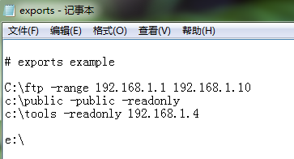
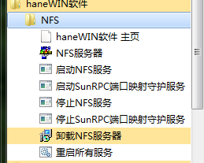

在windows中使用nfs
===

当我们在写代码的时候，经常需要在两台电脑上面跑同样的一份代码，这个时候使用nfs就非常方便了。

nfs简单的说就是让一台电脑挂载一个另外一台电脑的分区。这就需要那台电脑上面跑着一个nfs server。

在Linux中，事情会比较简单，因为可以直接安装nfs server，然后还可以直接使用mount命令来挂载。

# windows中的nfs挂载
## nfs 服务器
在windows中，除了server版本的windows，其他版本都是没有安装nfs server的，我们需要下载一个`hanwin_nfs_server`的软件，将其安装好.

在服务器页，客户端使用的字符集那儿选择windows字符集（当客户端是windows的时候），如果是Linux，那么选择utf-8.

在输出页，编辑输出表文件

前面的三排是原来就有的，我添加了`e:\`，这样`e:\`盘就可以被挂载了。

点击重启所有服务

这样就可以从客户端挂载了。

## nfs客户端
windows 7默认是有nfs的client，但是需要打开，

从`打开或关闭windows功能`中打开nfs client,这样就可以使用mount和umount命令了。

注意我使用的`\\computername\sharename`中`computername`用的ip地址，最后一个参数是一个`devicename`，要注意这个device一定不要被占用了。

这样在client中就可以直接访问了。

