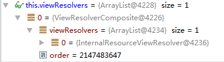
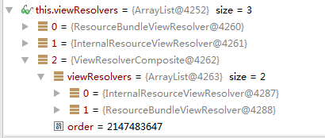

DispatcherServlet
=====

DispatcherServlet是spring mvc中最重要的一个类了。

## 使用DispatcherServlet

在/WEB-INF/web.xml中，添加如下的内容来使用DispatcherServlet。

```xml
<!-- 使用spring mvc，需要载入DispatcherServlet -->
<servlet>
    <!-- 名字为zoom,会使用zoom-servlet.xml作为其配置文件 -->
    <servlet-name>zoom</servlet-name>
    <servlet-class>org.springframework.web.servlet.DispatcherServlet</servlet-class>
    <!-- 一般来说，我们都希望DispatcherServlet直接启动 -->
    <load-on-startup>1</load-on-startup>
</servlet>

<servlet-mapping>
    <servlet-name>zoom</servlet-name>
    <url-pattern>/</url-pattern> #1
</servlet-mapping>
```

在上面的代码中，最重要的是`#1`标注的这行。


在Servlet标准中，对于`url-pattern`的优先级有如下的规定：


1. Map exact URL
1. Map wildcard paths
1. Map extensions
1. Map to the default servlet

上面的匹配优先级从高到低。

第一个精确匹配就是路强里面没有*，比如/test/cxy.html这种。直观的，这样的匹配当然应该有最高的优先级。

第二个叫做wildcard匹配，比如`/abc/*`，那么在/abc/后面的任何路径都会被匹配上。

第三个为后缀匹配，也就是给出的是`*.xxx`这种类型，那么当访问的为任何以`xxx`结尾的路径都能匹配上。

第四个为匹配到默认的DefaultServlet，其匹配的路径是`/`。

注意，在一般的servlet container中，都会有一个DefaultServlet，其匹配到默认匹配。
然后有一个用于处理jsp代码的后缀匹配。


	<servlet-mapping>
	  <servlet-name>default</servlet-name>
	  <url-pattern>/</url-pattern>
	</servlet-mapping>
	<!-- The mappings for the JSP servlet -->
	<servlet-mapping>
	  <servlet-name>jsp</servlet-name>
	  <url-pattern>*.jsp</url-pattern>
	  <url-pattern>*.jspx</url-pattern>
	</servlet-mapping>

可以看出，这两个匹配的优先级都是比较低的。

这儿最容易让人误解的是`/*`和`/`谁的优先级高。从上面的介绍可以看出，`/*`是更高的，而且其是wildcard匹配，所以如果有一个servlet匹配到`/*`，那么后面的后缀匹配和默认匹配都用不上了。

在我用spring mvc的时候，我最开始就将DispatcherServlet给映射到了`/*`上面，导致后面我想访问一个jsp文件的时候，总是有错误。
给出的Log如下的。

	15:18:32,464 DEBUG [JstlView]:166 - Forwarding to resource [/WEB-INF/jsp/products.jsp] in InternalResourceView 'products'
	在这个地方，因为DispatcherServlet被配置为要处理/*上面的请求，所以
	#1 15:18:32,464 DEBUG [DispatcherServlet]:845 - DispatcherServlet with name 'zoom' processing GET request for [/WEB-INF/jsp/products.jsp] 
	15:18:32,464 DEBUG [RequestMappingHandlerMapping]:297 - Looking up handler method for path /WEB-INF/jsp/products.jsp
	15:18:32,464 DEBUG [RequestMappingHandlerMapping]:305 - Did not find handler method for [/WEB-INF/jsp/products.jsp]
	15:18:32,465  WARN [PageNotFound]:1120 - No mapping found for HTTP request with URI [/WEB-INF/jsp/products.jsp] in DispatcherServlet with name 'zoom'
	15:18:32,465 DEBUG [DispatcherServlet]:996 - Successfully completed request
	15:18:32,466 DEBUG [DispatcherServlet]:996 - Successfully completed request
	
在上面的log中，我先访问的是/test，然后其被Forwarding到/WEB-INF/jsp/products.jsp，到这儿都是没有错误的。
但是`#1`标注的地方就开始有错误了，因为我们想要得到的结果是上面配置的jsp那个servlet因为后缀匹配匹配到了，然后来处理这个jsp文件。
但是发现又是DispatcherServlet来处理了。
原因就是现在我们配置的DispatcherServlet匹配的`/*`是wildcard的匹配，其优先级比jsp servlet的后缀匹配高，所以DispatcherServlet就来处理了，然后其又处理不了，就只能返回404了。

当将DispatcherServlet的配置为`/`之后，其优先级最低，所以jsp servlet就能处理了，最后就能得到先要的月面了。

## 在使用web mvc的时候同时要使用DefualtServlet
如果直接使用上面的DispatcherServlet的配置，那么tomcat自带的DefaultServlet就使用不了了，因为其的url-pattern被覆盖了。

DefaultServlet本身是用来进行静态的文件输出的，如果我们还想用DefaultServlet来进行静态文件的输出，那么可以进行如下的配置。

	@Configuration
	@EnableWebMvc
	public class WebConfig extends WebMvcConfigurerAdapter {
	
	    @Override
	    public void configureDefaultServletHandling(DefaultServletHandlerConfigurer configurer) {
	        configurer.enable(); #1
	    }
	
	
	    @Override
	    public void configureViewResolvers(ViewResolverRegistry registry) {
	        registry.jsp("/WEB-INF/jsp/",".jsp"); #2
	    }
	}

`#1`就表示在DispatcherServlet映射到`/`上，导致defaultServlet的配置被覆盖的情况下，将其打开。

`#2`就是配置来进行Jsp的输出的。

## webMvc config中的viewResolver
我们知道DispatcherServlet本身的默认配置是只有一个`InternalResourceViewResolver`，那么在使用webMvc config之后，这个默认配置是不是也有呢。

对web mvc使用默认的配置

	@Configuration
	@EnableWebMvc
	public class WebConfig extends WebMvcConfigurerAdapter {
	
然后在xxx-servlet.xml中没有配置任何的ViewResolver，DispatcherServlet.initViewResolvers函数运行后的viewResolvers的值
	


可以看出，默认配置下,webMvc给出了一个ViewResolverComposite,ViewResolverComposite是实现了ViewResolver接口的，其本身是一个集合，里面包含了一个InternalResourceViewResolver。

所以默认的配置下，webMvc对ViewResolver的配置也是只有一个InternalResourceViewResolver。

    @Override
    public void configureViewResolvers(ViewResolverRegistry registry) {


        InternalResourceViewResolver internalResourceViewResolver = new InternalResourceViewResolver();
        internalResourceViewResolver.setPrefix("/WEB-INF/jsp/");
        internalResourceViewResolver.setSuffix(".jsp");
        registry.viewResolver(internalResourceViewResolver);

        ResourceBundleViewResolver bundleViewResolver = new ResourceBundleViewResolver();
        registry.viewResolver(bundleViewResolver);


    }

如果我们使用configureViewResolvers函数在webmvc中配置了如上的两个ViewResolver，

	<bean id="resolver1" class="org.springframework.web.servlet.view.InternalResourceViewResolver">
        <property name="prefix" value="/WEB-INF/jsp/"/>
        <property name="suffix" value=".jsp"/>
        <property name="order" value="2"/>
    </bean>

    <bean id="resolver2" class="org.springframework.web.servlet.view.ResourceBundleViewResolver">
        <property name="order" value="1"/>
    </bean>

然后在xxx-servlet.xml中配置了如上的两个ViewResolver。



此时的viewResovler是如上的。可以看到上层一共有三个，两个是我们在xxx-servlet.xml中配置的，最后一个是webMvc生成的。
注意它们的排序是按照其order从小到大排列的。
而在这个viewResovlerComposite里面，其包含了在configureViewResolvers中配置的两个viewResolver。这个viewResovlerComposite的默认的order是最大的，所以其会排在最后一个。

更加需要注意的是，在viewResovlerComposite里面，这些viewResolver的排列顺序是**按照它们被加入的顺序的**,就是说，谁先加入，谁就会被先考察。

所以，在使用了webMvc配置的时候，我们最好还是将所有需要的viewResolver放到xxx-servlet.xml中，这样可以手动的指定它们的order，如果全部放在viewResovlerComposite里面,那么需要注意它们的放置顺序。

## ContentNegotiatingViewResolver

[这个网站](http://websystique.com/springmvc/spring-4-mvc-contentnegotiatingviewresolver-example/)给出了一个很好的例子。

在spring中，一般来说，要完成一个功能，都是有很多的方法的，找到一种适合于自己的方法就可以了。


在viewResovler中一个比较特殊的是ContentNegotiatingViewResolver,其核心的思想是，对于同一个资源，根据request中需要的不同的表现形式，选出一个合适的view，给出一个返回。

其`resolveViewName`的过程为。

根据request，使用`getMediaTypes`得到请求想要得到的media type。

request中有三个地方可以用来指定想要得到的media type，第一个是pathExtension就是请求的时候的后缀，比如/hotels.pdf，那么就表明这个request想要得到一个`application/pdf`。第二个是request parameter，比如说`/hotels?format=pdf`，也是表明要到的是`application/pdf`。第三个是request header中的Accept字段。
这三个是有优先级关系的，如果pathExtension或者是pathParameter存在的，那么就不会考察Accept了，因为它们的优先级更高。

`ContentNegotiatingViewResolver`中有三个函数由于设置，`setIgnoreAcceptHeader`可以用来设置是不是要考察Accept,默认是false，表示要考察Accept。`setFavorPathExtension`设置是不是要考察后缀，默认是true。`setFavorParameter`设置是不是要考察parameter，默认为false。

给出的默认设置还是比较好的，一般都不用改了。
在默认设置下，如果我们给出的request有后缀，那么`getMediaTypes`返回的就是只有一个media type，就是我们想要的那个。
如果没有后缀的话，那么就是Accept中指定的了。
如果是浏览器自己发出的请求，也就是我们在浏览器中输入地址的时候放出的请求，那么Accept的值就是固定的，比如在chrome中的为

	Accept:text/html,application/xhtml+xml,application/xml;q=0.9,image/webp,*/*;q=0.8

表示其可以默认可以接受5种返回的midea type，q表示其权重，权重越高，server就越优先的考虑，默认的权重是1。

得到request要返回的media type之后，`getCandidateViews`让包含的`viewResolvers`去view name进行resolve，得到所有可能的`candidateViews`。

将每一个`viewResolvers`遍历，让每一个都去`resolveViewName`，如果返回了一个View，而不是`null`的话，就加入`candidateViews`中。


然后，`getBestView`从这些`candidateViews`中找出一个最好的View返回去。

		for (MediaType mediaType : requestedMediaTypes) {
			for (View candidateView : candidateViews) {
				if (StringUtils.hasText(candidateView.getContentType())) {
					MediaType candidateContentType = MediaType.parseMediaType(candidateView.getContentType());
					if (mediaType.isCompatibleWith(candidateContentType)) {
						if (logger.isDebugEnabled()) {
							logger.debug("Returning [" + candidateView + "] based on requested media type '"
									+ mediaType + "'");
						}
						attrs.setAttribute(View.SELECTED_CONTENT_TYPE, mediaType, RequestAttributes.SCOPE_REQUEST);
						return candidateView;
					}
				}
			}
		}
如上，
对于每一个`requestedMediaTypes`，都用`candidateViews`中的每一个`View`其匹配一下，通过考察其`getContentType`函数，就知道这个`View`可以返回的media type 也就是返回的response header中的`Content-Type`字段。如果这个media type和需要的是匹配的，那么就可以了。

## 在spring中返回json
现在越来越多的应用使用的是单页面的形式，client端很多时候都是通过ajax的方式向server发出请求，然后server返回其想要的信息。
在这个过程中，request一般使用get或者是post方法，如果是get的话，需要的参数就放在parameter中，使用post的话，需要的参数就放在body中，它们使用的格式一般都是`application/x-www-form-urlencoded`。
response的body一般都使用json作为数据传输的形式。因为这种数据格式和浏览器中的js很好交互。而且相对于以前常用的xml格式，其表达更为自由。

在spring中，有两个方法完成这个事情。

第一个是使用`@ResponeBody`来标注一个handler，这样这个handler返回的值就直接进入了response body。
返回的值的类型到Json的转换会用到`HttpMessageConverter`。

    @RequestMapping(value = "/jsonMap")
    @ResponseBody
    public List<User> helloWorld() {

        List<User> users = new ArrayList<User>();
        User user = new User();
        user.setName("cxy");
        user.setPassword("cxy");

        users.add(user);
        users.add(user);
        users.add(user);
        return users;

    }

比如对于上面的handler，当我们访问`/jsonMap`的时候，会返回

	[{"name":"cxy","password":"cxy"},{"name":"cxy","password":"cxy"},{"name":"cxy","password":"cxy"}]

要得到上面的结果，需要进行如下的一些设置。

在`@Configuration`处要加上`@EnableWebMvc`，这样就会引入一些默认的`HttpMessageConverter`。

将jackson2的库加入classpath中，因为在引入`HttpMessageConverter`的时候，会根据jackson2的库是否存在来决定时候引入相应的`HttpMessageConverter`。

	14:57:04,809 DEBUG [DispatcherServlet]:845 - DispatcherServlet with name 'zoom' processing GET request for [/test/jsonMap]
	14:57:04,814 DEBUG [RequestMappingHandlerMapping]:297 - Looking up handler method for path /test/jsonMap
	14:57:04,820 DEBUG [RequestMappingHandlerMapping]:302 - Returning handler method [public java.util.List<com.justtest.controller.User> com.justtest.controller.EditPetForm.helloWorld()]
	14:57:04,820 DEBUG [DefaultListableBeanFactory]:247 - Returning cached instance of singleton bean 'editPetForm'
	14:57:04,821 DEBUG [DispatcherServlet]:931 - Last-Modified value for [/test/jsonMap] is: -1
	
	#1 14:57:04,888 DEBUG [ResponseBodyAdviceChain]:61 - Invoking ResponseBodyAdvice chain for body=[com.justtest.controller.User@17929759, com.justtest.controller.User@17929759, com.justtest.controller.User@17929759]
	14:57:04,888 DEBUG [ResponseBodyAdviceChain]:83 - After ResponseBodyAdvice chain body=[com.justtest.controller.User@17929759, com.justtest.controller.User@17929759, com.justtest.controller.User@17929759]
	
	#2 14:57:04,923 DEBUG [RequestResponseBodyMethodProcessor]:163 - Written [[com.justtest.controller.User@17929759, com.justtest.controller.User@17929759, com.justtest.controller.User@17929759]] as "application/json;charset=UTF-8" using [org.springframework.http.converter.json.MappingJackson2HttpMessageConverter@2dcdcb9d]
	
	#3 14:57:04,923 DEBUG [DispatcherServlet]:1018 - Null ModelAndView returned to DispatcherServlet with name 'zoom': assuming HandlerAdapter completed request handling
	14:57:04,924 DEBUG [DispatcherServlet]:996 - Successfully completed request
	
上面是调试的时候的log输出，可以看出，从`#1`开始，因为看到有`@ResponseBody`，所以和`ResponseBody`相关的类就在开始作用了。
最重要的是`#2`,其根据handler返回的数据类型(这儿为`List<User>`)选取了一个`HttpMessageConverter`来进行处理，这儿其选取了`MappingJackson2HttpMessageConverter`，这是因为我们给出了jackson2的jar，同时没有给出jackson2-xml的jar。
从`#3`处可以看到，因为使用了`@ResponseBody`，handler返回的值直接被`HttpMessageConverter`写到了response的body中，就不在有`ModelAndView`返回了，所有`DispatcherServlet`不会再进行viewName resolve和view render的操作了，而是直接结束了。

可以看出，使用这种方法，其过程十分的简单。
但是其有一个比较显著的缺点，如果对于每一种要返回的JSON类型，都需要定义一个这个类型。比如上面的例子，如果我想让返回的json中对一个域totalUser，用来表示总共有几个user，那么我们必须创建一个类来表示。

**这个问题的一个可能的解决办法是使用`ResponseBodyAdvice`，但是这个时候还没有看**

第二个办法是使用spring提供的`MappingJackson2JsonView`，这个方法的核心思想就是让这个`View`来将我们加入到`Model`中的内容进行输出。

首先要进行`viewResolver`的设置，因为spring本身是没有给出`MappingJackson2JsonView`对应的`ViewResolver`的（因为Spring本身看到是不知道用户要在那个地方使用这个`View`的）。
设置`MappingJackson2JsonView`有好几种方法。
其中最直观的是使用`ResourceBundleViewResolver`,如下。

	@Bean
    public ViewResolver resourceBundleViewResolver() {
        ResourceBundleViewResolver resolver = new ResourceBundleViewResolver();
        return resolver;
    }

这样，在`resources/views.properties`文件中加入

	jsonView.(class) = org.springframework.web.servlet.view.json.MappingJackson2JsonView

然后让一个handler返回的view name为`jsonView`。那么`MappingJackson2JsonView`就会去render返回的`Model`中的各个attribute了。

另外可以使用上面介绍的`contentNegotiatingViewResolver`来将`.json`后缀的给使用，这种方式配置起来麻烦一些，但是使用的时候更加简单。而且如果要扩展为支持其他的返回类型，改动也会少了很多，所以推荐使用这种方式。