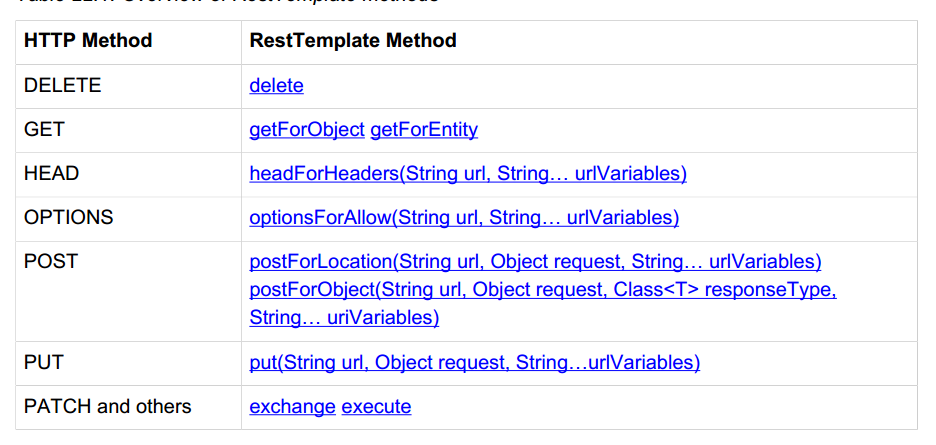

rest client
=====

使用spring，可以实现一个rest client，也就是调用其他的网站提供的rest api来完成相应的事情。

`RestTemplate`是使用spring来实现一个rest client需要使用到的核心的类。
`HttpMessageConverter`是和RestTemplate搭配使用的一个类，其会完成将http request/response和我们需要的数据类型，比如说xml,json，object之类的转换工作。

## RestTemplate
在Java中使用restful一般都是使用apache的HttpClient这个类，使用这个类的代码写起来都是比较底层的。

	String uri = "http://example.com/hotels/1/bookings";
	PostMethod post = new PostMethod(uri);
	String request = // create booking request content
	post.setRequestEntity(new StringRequestEntity(request));
	httpClient.executeMethod(post);
	if (HttpStatus.SC_CREATED == post.getStatusCode()) {
	 Header location = post.getRequestHeader("Location");
	 if (location != null) {
	 System.out.println("Created new booking at :" + location.getValue());
	 }
	}
	
比如上的代码就实现了一个rest的调用。

RestTemplate提供了一个更加高层次的来调用6个主要的http method的方法。



上图给出的就是RestTemplate给出的几个rest方法。这些方法的命名规则是，第一部分是使用http method，第二部分是要得到数据类型。比如getForObject会调用get方法，然后将得到的http response转换为一个需要的Object类型。而postForLocation会对一个指定的url进行post，将得到的response转成一个uri。如果这个request失败了，那么RestClientException会被抛出。如果不想这个异常抛出的话，那么可以将另外一个ResponseErrorHandler的实现插入到RestTemplate中。

在上面的表中,exchange和execute是其他方法的一些更一般的方法，也就是上面的方法都可以使用这两个方法来实现。
比如可以组合起来实现一个http patch。需要注意的是，底层使用的http library需要支持这些组合，JDK自己提供的HttpURLConnection就不支持patch操作，但是Apache提供的HttpClient就是支持的。

传递给这些函数的和从这些函数返回的object都会使用相应的HttpMessageConverter来进行转化(http的request和respose都是文本形式的，它们可以和java中表示的object进行转换，转换的工作就需要HttpMessageConverter来完成)，对于标准的mime的类型，RestTemplate都会默认注册的，但是我们也可以通过自己实现一些converter然后通过messageConverters来注册。

	public RestTemplate() {
		this.messageConverters.add(new ByteArrayHttpMessageConverter());
		this.messageConverters.add(new StringHttpMessageConverter());
		this.messageConverters.add(new ResourceHttpMessageConverter());
		this.messageConverters.add(new SourceHttpMessageConverter<Source>());
		this.messageConverters.add(new AllEncompassingFormHttpMessageConverter());

		if (romePresent) {
			this.messageConverters.add(new AtomFeedHttpMessageConverter());
			this.messageConverters.add(new RssChannelHttpMessageConverter());
		}
		if (jackson2XmlPresent) {
			messageConverters.add(new MappingJackson2XmlHttpMessageConverter());
		}
		else if (jaxb2Present) {
			this.messageConverters.add(new Jaxb2RootElementHttpMessageConverter());
		}
		if (jackson2Present) {
			this.messageConverters.add(new MappingJackson2HttpMessageConverter());
		}
		else if (gsonPresent) {
			this.messageConverters.add(new GsonHttpMessageConverter());
		}
	}

上面是RestTemplate的默认构造函数，可以得到默认被注册的HttpMessageConverter。其中有我们一般需要的xml和json的converter,需要注意的是，这两个converter需要我们将相应的jar文件放在classpath里面，如果使用maven的话，那么就是加入相应的依赖就可以了。

每一个method都有两种方式来给出url template，第一种就是直接列出来，第二种是使用一个map<String,?>

	public <T> T getForObject(String url, Class<T> responseType, Object... urlVariables)
	public <T> T getForObject(String url, Class<T> responseType, Map<String, ?> urlVariables)

上面是这两种方式的函数原型。下面是它们的调用方法。

    String message;
    
    RestTemplate restTemplate = new RestTemplate();
    message = restTemplate.getForObject("http://jsonplaceholder.typicode.com/posts/{id}", String.class,1);

    Map<String,Object> myMap = new HashMap<String, Object>();
    myMap.put("id",1);
    message = restTemplate.getForObject("http://jsonplaceholder.typicode.com/posts/{id}", String.class,myMap);

注意函数中使用了generic type作为参数，第一个参数表示要访问的url，第二个参数用来指定要返回的数据类型。
对于第一种函数原型，后面就是罗列出url template中的所有参数，第二种原型需要使用一个map来指定这些参数。
第一种函数原型使用起来更加简单，第二种使用起来更加复杂，但是参数设置更加直观。

要得到一个RestTemplate，我们可以使用默认的构造函数，比如上面的代码示例使用的。这个会使用标准的java.net包中的实现来发出相应的http request。
也可以使用另外的ClientHttpRequestFactory的实现。spring提供了HttpComponentsClientHttpRequestFactory这个ClientHttpRequestFactory的实现，其会使用apache httpComponent来创建http request。HttpComponentsClientHttpRequestFactory会使用org.apache.http.client.HttpClient而不是java.net中的HttpClient。

> 如果使用java.net中的实现，那么可能在得到的状态为401之类的时候，会触发异常。 所以可能的话，尽可能的使用HttpComponentsClientHttpRequestFactory。

    RestTemplate restTemplate = new RestTemplate(new HttpComponentsClientHttpRequestFactory());

要使用这个特性，只需要在创建RestTemplate的时候，使用如上的代码。**推荐使用这个库，在调试的时候，这个库会输出发送和接收到的request和response的具体的Header和body的内容，而java.net不会**

### uri
对于所有的http method，RestTemplate都可以接受一个string来表示uri或者是java.net.URI来表示uri。

当使用String来作为Uri的时候，那么其假设这个url是没有被进行urlencode的，比如下面的代码是对的

	restTemplate.getForObject("http://example.com/hotel list", String. class);
	
运行之后从Log4j中可以得到如下

	Created GET request for "http://example.com/hotel%20list"

其会被进行url编码。

如果传入的是一个进行了url编码的
	
	restTemplate.getForObject("http://example.com/hotel%20list",String.class);

会发现真正发出去的request是

	Created GET request for "http://example.com/hotel%2520list"

这个就是出现了double urlencode，这个一般都不是我们需要的样子。

### 处理request和response 的Header
使用RestTemplate提供的那几个标准的方法，我们可以处理大部分的情况。
使用这几个标准的方法的一个局限是其发送的request的头部和接收到的response的头部都是没有处理的，当然，大部分的情况下，我们都不用处理头部。
但是如果要处理头部的话，RestTemplate提供了exchange方法来处理。

下面是使用getForObject发送和返回的头部以及返回的response的body。

```
"GET /posts/1 HTTP/1.1[\r][\n]"
"Accept: text/plain, application/xml, text/xml, application/json, application/*+xml, application/*+json, */*[\r][\n]"
"Host: jsonplaceholder.typicode.com[\r][\n]"
"Connection: Keep-Alive[\r][\n]"
"User-Agent: Apache-HttpClient/4.3.6 (java 1.5)[\r][\n]"
"Accept-Encoding: gzip,deflate[\r][\n]"
"[\r][\n]"
```

```
"HTTP/1.1 200 OK[\r][\n]"
"Server: Cowboy[\r][\n]"
"Connection: keep-alive[\r][\n]"
"X-Powered-By: Express[\r][\n]"
"Vary: X-HTTP-Method-Override[\r][\n]"
"Access-Control-Allow-Origin: *[\r][\n]"
"Content-Type: application/json; charset=utf-8[\r][\n]"
"Content-Length: 292[\r][\n]"
"Etag: W/"124-3901998613"[\r][\n]"
"Date: Sat, 17 Jan 2015 13:54:12 GMT[\r][\n]"
"Via: 1.1 vegur[\r][\n]"
"[\r][\n]"
"{[\n]"
"  "userId": 1,[\n]"
"  "id": 1,[\n]"
"  "title": "sunt aut facere repellat provident occaecati excepturi optio reprehenderit",[\n]"
"  "body": "quia et suscipit\nsuscipit recusandae consequuntur expedita et cum\nreprehenderit molestiae ut ut quas totam\nnostrum rerum est autem sunt rem eveniet architecto"[\n]"
"}"
```

### http message conversion

上面介绍的各个method中,其真正的发送的http request和接收到的http response都是会被HttpMessageConverter转成相应的类型的。

从上面的RestTemplate的默认构造函数就可以看出，如果需要的jar文件都放到了classpath上面，那么默认就开启了常用的mime的转换。

在这些所有的转换中，我们最常使用的是xml和json，而现在常用的在网络中传输的数据类型是JSON，因为其是js的一种有效的数据类型，在web中使用ajax的时候，传输json比传输xml是更通用的。

	     <!--jackson2 xml & json-->
        <!--下面两个是要使用jackson2需要添加的核心库-->
        <dependency>
            <groupId>com.fasterxml.jackson.core</groupId>
            <artifactId>jackson-core</artifactId>
            <version>2.4.3</version>
        </dependency>
        <dependency>
            <groupId>com.fasterxml.jackson.core</groupId>
            <artifactId>jackson-annotations</artifactId>
            <version>2.4.3</version>
        </dependency>
        <!--如果要将object和json进行转换，使用这个-->
        <dependency>
            <groupId>com.fasterxml.jackson.core</groupId>
            <artifactId>jackson-databind</artifactId>
            <version>2.4.3</version>
        </dependency>

        <!--如果要在xml和object中进行转换，使用这个-->
        <dependency>
            <groupId>com.fasterxml.jackson.dataformat</groupId>
            <artifactId>jackson-dataformat-xml</artifactId>
            <version>2.4.3</version>
        </dependency>
        <!--end jackson2-->
		
如上，在pom.xml中加入上面的包，那么MappingJackson2HttpMessageConverter(对json)和MappingJackson2XmlHttpMessageConverter(对xml)就可以使用了。

我在使用的时候遇到的一个问题是，如果同时载入了如上的json包和xml包，那么对http request和htpp response的body的解析会使用xml的方式，因为RestTemplate在处理的时候，其是按照这些HttpMessageConverter加入的顺序进行一个一个的查看它们可不可以用来进行解析。一般的，能用json解析的，也可以使用xml解析。

一个麻烦的问题是，从RestTemplate的默认构造函数可以看出，由于解析xml的MappingJackson2XmlHttpMessageConverter是在MappingJackson2HttpMessageConverter之前被加入的，所以其中是被调用了。

解决办法有两个，一个是从pom.xml中删除xml那个jar。
这个办法并不好，因为在其他的地方我们很有可能需要使用。

第二个办法就是我们手动得添加自己需要的HttpMessageConverter，而不是其默认包含的那些。

        List<HttpMessageConverter<?>> messageConverters = new ArrayList<HttpMessageConverter<?>>();
        messageConverters.add(new MappingJackson2HttpMessageConverter());
        //messageConverters.add(new MappingJackson2XmlHttpMessageConverter());

        restTemplate.setMessageConverters(messageConverters);
		
需要的代码如上，注意这个地方为了让RestTemplate检查converter的顺序和添加的顺序一样，我们要使用ArrayList，实际上RestTemplate默认也是使用的ArrayList。
这样就总是会使用json的转换而不是xml的转换了。

需要注意的是，上面的操作会将默认添加的下面的这些HttpMessageConverter删除，如果还想要这些converter的话，那么需要自己添加回来。

		this.messageConverters.add(new ByteArrayHttpMessageConverter());
		this.messageConverters.add(new StringHttpMessageConverter());
		this.messageConverters.add(new ResourceHttpMessageConverter());
		this.messageConverters.add(new SourceHttpMessageConverter<Source>());
		this.messageConverters.add(new AllEncompassingFormHttpMessageConverter());
		


#### FormHttpMessageConverter

HttpMessageConverter做的事情是针对http request和http response的body的，对于FormHttpMessageConverter，其可以处理的media type为
application/x-www-form-urlencoded(可以进行读写操作)和 multipart/form-data(只能进行写操作)

其类的定义如下

	public class FormHttpMessageConverter implements HttpMessageConverter<MultiValueMap<String, ?>> {

可以看出，这个converter完成的事情就是将一个java中的MultiValueMap<String, ?>和media type为上面两种的进行转换。具体的，在http request中，一个MultiValueMap<String, ?>的java object会被转成http request中对应的字符串表示，而在response中，得到