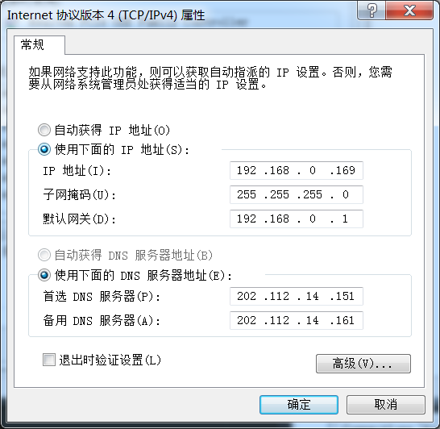
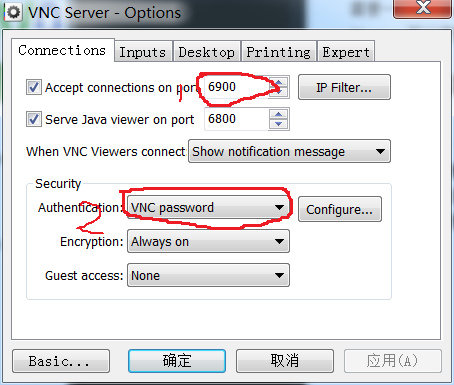
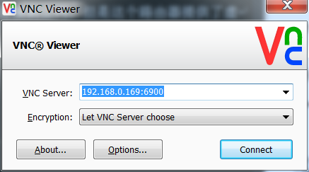

windows和linux中使用VNC
===

有些时候我们也想通过远程桌面连接到windows，linux桌面，它们都有有自带的远程桌面，但是使用VNC（贝尔实验室开发的标准）是一个更好的选择。

VNC有很多的免费的实现，但是使用商业的realvnc是一个更好的选择。在linux下面，有免费的tigervnc可以使用。

realvnc的官网上面有windows是linux的rpm的安装包可以下载。

其中包含两个部分，一个是vnc server，一个vnc viewer，其中viewer是免费的，server需要一个license，但是网上有很多的现成的license可以使用。

## 安装
windows的安装很直观，直接安装就是了。

linux安装的时候要注意将已有的vnc给卸载了,不然安装的时候会提示冲突了。

```
# yum remove tigervnc tigervnc-server
```

win和linux下面的realvnc都提供了可视化的界面。

## 在路由器后面使用vnc server

### 配置
我面临的情况是，我使用的win和linux电脑在一个局域网里面，通过路由器连接到公网，但是这个路由器提供了虚拟服务员的功能。

+ 将电脑的IP地址分配变成手动的，就是要指定一个特定的IP，如果下面（最好在路由器中进行固定的IP分配，这儿我没有做，因为这个路由器上面链接电脑不多，大的IP地址不会被用到）。下图是win的，linux的类似。



+ 在路由器的设置中完成端口映射，可以看到，这儿linux的IP是`192.168.0.159`，暴露了`5900`，win的IP是`192.168.0.169`,暴露了`6900`


+ 打开vnc server，有**两个**地方需要设置，第一个是默认的端口使用的是vnc的5900，但是在这个局域网中，我还有一台linux主机也要被远程登陆，其使用的是`5900-5999`（从上面的图中可以看到），所以改成了6900。第二个是登陆的认证方式，windows下面使用的是`windows password`，改成使用`vnc password`。linux下面就直接使用unix password.



### 使用vnc viewer访问该server

#### 在内网中

如果找内网中，那么访问的时候就直接访问内网的IP就可以了，注意一定要加上端口号。



#### 在外网中
如果在外网中，那么上面的网址就要变成路由器的WAN口的地址。